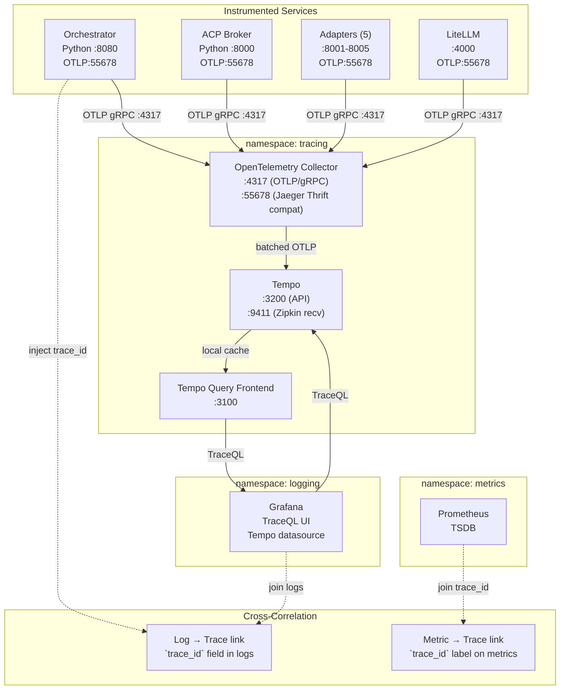

# Homelab Distributed Tracing (Tempo + OpenTelemetry + Grafana)

> All scripts and manifests will live in `~/src/home_infra/tracing/`

## Status

### Completed
- [x] Deploy stack: `./install.sh`
- [x] All validation tests passing (27/27)
- [x] Grafana Tempo datasource configured (uid: `tempo-datasource`, URL: `http://tempo.tracing.svc.cluster.local:3200`)
- [x] External access working: LAN port 31902, Tailscale NodePort 32305
- [x] Stack deployed: Tempo v2.9.0, OTel Collector v0.118.0

### Remaining
- [x] Validate teardown/reinstall reproducibility (3 destructive cycles — all 27/27 passed)
- [ ] Instrument dark-factory orchestrator + adapters
- [ ] Instrument LiteLLM proxy
- [ ] Validate end-to-end trace flow (trace from request → agent → LLM)

### Bug Fixes (from architect review)
- [x] Fixed selector mismatch in nodeport manifest
- [x] Fixed localhost curl calls in scripts (use cluster-internal URLs)
- [x] Fixed test.sh `set -e` arithmetic bug (`((PASSED++))` → `PASSED=$((PASSED + 1))`)
- [x] Added 16 missing tests (27 total now)
- [x] Renamed `opentelemetry-config.py` to `opentelemetry_config.py`
- [x] Created `grafana-datasource.yaml` for idempotent datasource configuration

---

## Stack

| Component | Role | Helm Chart | Chart Version | App Version | Notes |
|---|---|---|---|---|---|
| **Grafana Tempo** | Distributed tracing backend (storage + query) | grafana/tempo | 0.19.0 | 2.7.4 | Single-binary, filesystem storage, S3-compatible (MinIO) optional |
| **OpenTelemetry Collector** | Trace aggregation + batching | open-telemetry/opentelemetry-collector | 0.118.0 | 0.118.0 | Receives OTLP, batches, exports to Tempo |
| **Tempo Query Frontend** | Query caching + split-by-date | grafana/tempo-query-frontend | 0.19.0 | 2.7.4 | Optional but recommended for performance |
| **Grafana** | Trace UI + Tempo datasource integration | Already deployed in `logging` ns | — | — | Add Tempo datasource via API |

> Tempo over Jaeger rationale: Tight Grafana integration, 1/3 the resource footprint, simpler architecture (no Cassandra/ScyllaDB), and native support for OpenTelemetry protocol. Jaeger requires JAEGER_AGENT + COLLECTOR + QUERY + storage backend (Cassandra/ES). Tempo is storage-agnostic and uses RocksDB + filesystem for home lab simplicity.

---

## Architecture



### Data Flow

1. **Trace generation**: Instrumented services (orchestrator, broker, adapters, LiteLLM) use OpenTelemetry SDK to create traces
2. **Batching**: Each service batches spans locally and pushes to OpenTelemetry Collector (not directly to Tempo)
3. **Aggregation**: Otel Collector batches, applies sampling, and forwards to Tempo
4. **Storage**: Tempo stores traces in compressed format on filesystem (or PVC)
5. **Query**: Grafana queries Tempo via TraceQL, displays trace timeline with span details
6. **Correlation**: Trace IDs propagate through logs and metrics for unified debugging

### Why Otel Collector as intermediary?

Unifies collection (like Alloy does for metrics):
* Services push to one endpoint (`otel-collector:4317`), not multiple backends
* Centralized batching, sampling, and attribute enrichment
* Easy to swap backends later (e.g., Tempo → Jaeger, Tempo → Honeycomb)
* Resource usage: ~50MB RAM, ~2% CPU under typical home lab load

---

## Tempo vs Jaeger Decision Matrix

| Factor | Tempo | Jaeger | Winner |
|---|---|---|---|
| **Grafana Integration** | Native (single UI, TraceQL, cross-correlation) | Via plugin, separate UI | **Tempo** |
| **Storage Complexity** | Filesystem (or S3) | Cassandra / Elasticsearch required | **Tempo** |
| **Resource Overhead** | ~50MB RAM, ~100MB disk baseline | ~150MB RAM + Cassandra (200MB+) | **Tempo** |
| **Protocol Support** | OTLP native, OpenTelemetry first-class | Jaeger Thrift legacy, OTLP via collector | **Tempo** |
| **Query Language** | TraceQL (powerful, PromQL-like) | Tag-based + duration filters | **Tempo** |
| **Trace Retention** | Configurable per-day chunks | Depends on storage backend | **Tie** |
| **Home Lab Fit** | Single binary, no external deps | Multi-component, operational overhead | **Tempo** |

### Verdict: Tempo is the pragmatic choice

For a home lab with Grafana already in use, Tempo offers:
1. **1/3 the resource footprint** of a Jaeger+Cassandra stack
2. **Zero external dependencies** (no Cassandra maintenance)
3. **TraceQL** — PromQL-like query language for trace filtering
4. **Cross-correlation** — click from trace → logs → metrics in Grafana
5. **OpenTelemetry native** — no Jaeger Thrift conversion needed

---

## Namespace & Port Allocation

| Service | Namespace | Type | Port | Purpose |
|---|---|---|---|---|
| otel-collector | tracing | ClusterIP | 4317 | OTLP/gRPC receiver |
| otel-collector | tracing | ClusterIP | 55678 | Jaeger Thrift HTTP (legacy compat) |
| tempo | tracing | ClusterIP | 3200 | Tempo API + TraceQL |
| tempo | tracing | LoadBalancer | 31902 | LAN access to Tempo |
| tempo | tracing | NodePort | 32305 | Tailscale serve endpoint |
| query-frontend | tracing | ClusterIP | 3100 | Query frontend caching |

**Tailscale service:** `svc:tempo` at `https://tempo.tailc98a25.ts.net` via `127.0.0.1:32305`

**Port chosen to avoid conflicts:**
* Logging: 31900 (loki-external), 32300 (grafana-tailscale), 32301 (loki-tailscale)
* Metrics: 31901 (prometheus-external), 32302 (prometheus-tailscale)
* **Tracing:** 31902 (tempo-external), 32305 (tempo-tailscale)

---

## Observability Integration

### Tempo self-monitoring

Tempo exposes its own metrics at `http://tempo:3200/metrics` (Prometheus format).

| Metric | Description |
|---|---|
| `tempo_compound_compactor_compactions_total` | Number of compaction cycles |
| `tempo_ingest_spans_total` | Spans ingested |
| `tempo_query_requests_total` | TraceQL queries executed |

Alloy ConfigMap will scrape the Tempo metrics endpoint (same pattern as existing `litellm`, `dark-factory` blocks).

### Grafana datasources

After install, Grafana will have:
* **Tempo** datasource (url: `http://tempo.tracing.svc.cluster.local:3200`)
* **TraceQL query editor** built-in
* **Cross-datasource correlation**: Click a trace → see related logs (by `trace_id`) → see related metrics (by `trace_id` label)

### Trace propagation

Services must propagate `trace_id` and `span_id` across:
* **HTTP requests**: `traceparent` header (W3C Trace Context)
* **Logging**: Include `trace_id` in structured log entries
* **Metrics**: Include `trace_id` label on timed operations

---

## Instrumentation Strategy

### Dark Factory Services (Python)

The orchestrator and ACP broker use Python with `prometheus_client`. We add OpenTelemetry alongside:

```python
# In orchestrator/main.py
from opentelemetry import trace, context
from opentelemetry.sdk.trace import TracerProvider
from opentelemetry.sdk.trace.export import BatchSpanProcessor
from opentelemetry.exporter.otlp.proto.grpc.trace_exporter import OTLPSpanExporter
from opentelemetry.instrumentation.fastapi import FastAPIInstrumentor
from opentelemetry.instrumentation.redis import RedisInstrumentor
from opentelemetry.instrumentation.sqlalchemy import SQLAlchemyInstrumentor

# Initialize tracer
trace.set_tracer_provider(TracerProvider())
tracer = trace.get_tracer(__name__)

# Export to OTel Collector
exporter = OTLPSpanExporter(endpoint="otel-collector.tracing.svc:4317", insecure=True)
trace.get_tracer_provider().add_span_processor(BatchSpanProcessor(exporter))

# Auto-instrument FastAPI
FastAPIInstrumentor.instrument_app(app)

# Manual spans for critical paths
async def process_task(task: Task):
    with tracer.start_as_current_span("process_task") as span:
        span.set_attribute("task_type", task.type)
        span.set_attribute("worker_id", task.worker_id)
        
        # Decorate the decomposition step
        with tracer.start_as_current_span("decompose_task"):
            subtasks = await decompose(task)
        
        # Decorate routing decision
        with tracer.start_as_current_span("route_subtask"):
            for sub in subtasks:
                worker = route_to_worker(sub)
                span.set_attribute(f"subtask_{sub.id}_worker", worker.id)
```

**Key libraries:**
* `opentelemetry-api` — Core API
* `opentelemetry-sdk` — SDK implementation
* `opentelemetry-exporter-otlp-proto-grpc` — OTLP/gRPC exporter
* `opentelemetry-instrumentation-fastapi` — Auto-instrument FastAPI/Starlette
* `opentelemetry-instrumentation-redis` — Auto-instrument Redis client
* `opentelemetry-instrumentation-sqlalchemy` — Auto-instrument DB queries

### Dark Factory Services (Node.js adapters)

Node-based adapters (OpenCode, OpenHands, Codex, Claude Code, Qwen Code) use the OTel Node SDK:

```javascript
// In adapter/src/tracing.ts
import { NodeTracerProvider } from '@opentelemetry/sdk-trace-node'
import { OTLPTraceExporter } from '@opentelemetry/exporter-trace-otlp-grpc'
import { SimpleSpanProcessor } from '@opentelemetry/sdk-trace-base'
import { registerInstrumentations } from '@opentelemetry/instrumentation'
import { HttpInstrumentation } from '@opentelemetry/instrumentation-http'
import { ExpressInstrumentation } from '@opentelemetry/instrumentation-express'

// Initialize
const provider = new NodeTracerProvider()
provider.addSpanProcessor(new SimpleSpanProcessor(new OTLPTraceExporter({
  url: 'http://otel-collector.tracing.svc:4317'
})))
provider.register()

// Auto-instrument HTTP/Express
registerInstrumentations({
  instrumentations: [
    new HttpInstrumentation(),
    new ExpressInstrumentation()
  ]
})
```

### LiteLLM Proxy (Python)

LiteLLM can be instrumented similarly:

```python
# Patch LiteLLM completion calls with tracing
from opentelemetry import trace

tracer = trace.get_tracer("litellm")

async def custom_completion(model: str, messages: list):
    with tracer.start_as_current_span("llm_completion") as span:
        span.set_attribute("llm.model", model)
        result = await litellm.completion(model, messages)
        span.set_attribute("llm.usage.total_tokens", result.usage.total_tokens)
        span.set_attribute("llm.duration_ms", result.duration_ms)
        return result
```

Alternatively, use LiteLLM's built-in telemetry: set `LITELLM_TRACING=otel` to enable automatic OpenTelemetry instrumentation.

### Manual instrumentation vs auto-instrumentation

| Type | When to use | Coverage |
|---|---|---|
| **Auto** (FastAPI, Express, Redis, SQLAlchemy) | HTTP servers, DB clients, HTTP clients | Request lifecycle, DB queries, external calls |
| **Manual** (business logic) | Task processing, routing, agent orchestration | Domain-specific spans with semantic attributes |

**Recommendation:** Combine both. Auto-instrumentation gives you the plumbing (HTTP, DB) with zero code changes. Manual instrumentation adds context-specific spans (e.g., `process_task`, `route_subtask`, `decompose`) that show the actual business flow.

---

## Grafana Dashboard Plan

**Dashboard UID:** `tracing-overview`

**Panel categories:**

| Row | Panel | TraceQL Query | Description |
|---|---|---|---|
| **Overview** | Total traces (1h) | `sum(traces_total)` | Rate of trace ingestion |
| **Overview** | Span duration P50/P95/P99 | `histogram_quantile(0.95, duration_bucket)` | Latency distribution |
| **Overview** | Error rate | `sum(status="error") / sum(status="ok")` | Failed traces / total |
| **Services** | Traces by service | `count(traces) by (service)` | Per-service trace volume |
| **Services** | Duration by service | `avg(duration) by (service)` | Per-service latency |
| **Dark Factory** | Task processing duration | `duration{service="orchestrator", operation="process_task"}` | End-to-end task time |
| **Dark Factory** | Subtask routing latency | `duration{service="broker", operation="route_subtask"}` | Router decision time |
| **Dark Factory** | Agent span count | `count(spans) by (agent, worker_id)` | Spans per agent run |
| **Tracing Stack** | Tempo ingest rate | `tempo_ingest_spans_total` | Spans ingested by Tempo |
| **Tracing Stack** | Query rate | `tempo_query_requests_total` | TraceQL queries per sec |

**TraceQL examples (TraceQL is Tempo's query language, similar to PromQL):**

```traceql
# All traces from the last hour
{}

# Traces with errors
{status="error"}

# Traces from orchestrator with duration > 5s
{service="orchestrator"} | duration > 5s

# Spans matching a specific operation
{operation="process_task", task_type="code-gen"}

# Subsequent span filtering (like a pipeline)
{} | {service="orchestrator"} | {operation="route_subtask"}

# Find traces containing a specific attribute
{worker_id="cc-sonnet"}
```

---

## Deploy / Teardown

```bash
cd ~/src/home_infra/tracing

# Full install ( Tempo + Otel Collector + Grafana datasource)
./install.sh

# Dry run
./install.sh --dry-run

# Run validation tests
./test.sh

# Read-only diagnostics
./diag.sh

# Soft teardown (preserves PVC data)
./uninstall.sh

# Full teardown (deletes PVC, namespace, Grafana datasource)
./uninstall.sh --delete-data --delete-namespace --force
```

---

## Repo Layout

```
home_infra/tracing/
├── install.sh                          # Deploy Tempo + Otel Collector + Grafana datasource
├── uninstall.sh                        # Tear down (--delete-data --delete-namespace --force)
├── test.sh                             # Validation tests (see Test Suite)
├── diag.sh                             # Read-only diagnostics
│
├── manifests/
│   ├── tempo-values.yaml               # Tempo Helm values (single-binary, filesystem)
│   ├── otel-collector-values.yaml      # Otel Collector Helm values (ClusterIP)
│   ├── tempo-nodeport.yaml             # tempo-external LoadBalancer (:31902)
│   ├── tempo-tailscale-nodeport.yaml   # tempo-tailscale NodePort (:32305)
│   └── grafana-datasource.yaml         # Tempo datasource (for Grafana API)
│
├── instrument/
│   ├── python/
│   │   ├── opentelemetry-config.py     # Common tracer setup (import in main.py)
│   │   └── requirements-otel.txt       # opentelemetry-* dependencies
│   └── nodejs/
│       ├── tracing.ts                  # Common tracer setup (import in adapter)
│       └── package-otel.json           # @opentelemetry/* dependencies
│
└── docs/
    ├── instrumentation-guide.md        # Step-by-step instrumenting services
    ├── traceql-cheatsheet.md           # TraceQL query reference
    └── grafana-trace-viewer.md         # Using Grafana's trace viewer
```

---

## Test Suite (Planned)

| Category | Count | What's Validated |
|---|---|---|
| **Prerequisites** | 2 | `kubectl`, `helm`, `curl` available; cluster reachable |
| **K8s Resources** | 6 | Namespace, PVCs bound, Deployments (tempo, otel-collector, query-frontend), Services (ClusterIP + LoadBalancer + NodePort) |
| **Helm Versions** | 3 | tempo, otel-collector, tempo-query-frontend pinned versions |
| **Tempo** | 4 | Pod Running+Ready, /metrics endpoint, /ready endpoint, version check |
| **Otel Collector** | 3 | Pod Running+Ready, /metrics endpoint, OTLP receiver listening on :4317 |
| **Tempo API** | 3 | GET /ready returns 200, GET /loki/api/v1/query returns JSON, GET /api/traces/<id> works |
| **Grafana Datasource** | 3 | Tempo datasource configured, URL correct, TraceQL query returns data |
| **Tailscale** | 3 | svc:tempo registered, NodePort reachable, external query works |
| **Total** | **27** | |

---

## Teardown / Reinstall Validation Plan

```bash
cd ~/src/home_infra/tracing

# Destructive cycle (repeat 3 times):
./uninstall.sh --delete-data --delete-namespace --force
# Verify: namespace, PVCs, ConfigMap patches, Grafana datasource all gone

./install.sh
# Verify: all tests pass (27/27)
```

---

## Open Questions

### Q1 — Tempo storage class (blocking)

What StorageClass should Tempo use for its PVC? Options:

* **Default StorageClass** (`local-path` from k3s) — simplest, data on local disk
* **HostPath** — explicit control over data directory (e.g., `/var/lib/tempo`)
* **MinIO S3** — external object storage (requires MinIO or external S3)

**Recommended:** Local filesystem (default k3s `local-path`). Home lab simplicity.

**Run to check:**
```bash
kubectl get storageclass
kubectl get pvc -A  # see current PVC storage classes
```

### Q2 — Otel Collector mode (advisory)

Otel Collector can run in multiple modes:

* **DaemonSet** — one collector per node (good for node-level metrics, not traces)
* **Deployment** — centralized collector pool (recommended for traces)
* **Sidecar** — per-app sidecar (overhead, only for isolation)

**Recommended:** Deployment with 1 replica (Home lab: no HA needed).

### Q3 — Sampling rate (advisory)

Should we configure sampling in Otel Collector? Options:

* **Always sample** — 100% of traces (highest fidelity, most storage)
* **Tail-based sampling** — sample based on criteria (e.g., errors, slow requests)
* **Head-based sampling** — probabilistic (e.g., 10% of all traces)

**Recommended:** 100% sampling for home lab (storage is cheap, debugging fidelity is high).

---

## Prerequisites

1. **Nothing** — `install.sh` creates all namespaces, CRDs, and resources.

---

## Possible Enhancements

| Enhancement | Priority | Notes |
|---|---|---|
| **Tempo S3 backend (MinIO)** | Medium | Move from filesystem to S3-compatible object storage for durability |
| **Tail-based sampling** | Medium | Sample only errors + slow traces after initial debug period |
| **Grafana Alerting on traces** | Low | Alert on error spikes or latency SLO breaches |
| **Cross-correlation dashboards** | Medium | Unified view: trace → logs → metrics in one panel |
| **Service mesh integration** | Low | Auto-instrument services via Istio/Linkerd sidecars |
| **Trace retention policy** | Low | Configurable per-service retention (e.g., 7d for most, 30d for critical) |

---

## Troubleshooting

### Tempo API returns 500

```
HTTP/500 Internal Server Error
{"error": "failed to read from storage"}
```

**Cause:** Tempo PVC not mounted or filesystem corruption.

**Fix:**
```bash
kubectl get pvc -n tracing
kubectl describe pvc tempo-server -n tracing  # check mount path
kubectl logs -n tracing deploy/tempo --tail=50  # check Tempo logs
```

### Otel Collector not receiving spans

```
# No traces appearing in Tempo
```

**Cause:** Service is pushing to wrong endpoint or port.

**Fix:**
```bash
# Check service env vars
kubectl exec -n dark-factory deploy/orchestrator -- printenv | grep -i otel

# Verify Otel Collector listener
kubectl port-forward svc/otel-collector 4317:4317 -n tracing
# From another terminal:
curl -v http://localhost:4317  # should show connection refused (gRPC), not 404
```

### Grafana shows "No traces found"

```
# Query returns empty result
```

**Cause 1:** Tempo datasource not configured.

**Fix:**
```bash
# Check Grafana datasources
kubectl exec -n logging deploy/grafana -- ./bin/grafana-cli datasources list

# Re-run install.sh to configure datasource
cd ~/src/home_infra/tracing && ./install.sh
```

**Cause 2:** No spans ingested in selected time range.

**Fix:**
```bash
# Check Tempo ingest
curl http://10.0.0.7:31902/metrics | grep tempo_ingest_spans_total
# If zero, check that instrumented services are running
```

---

## See Also

- [[Metrics]] — Prometheus + Alloy base stack; Tempo complements this for traces
- [[Logging]] — Grafana instance where Tempo datasource will be added
- [[Dark Software Factory]] — Services that will be instrumented (orchestrator, broker, adapters)
- [[LiteLLM]] — Will be instrumented for LLM call tracing
- [[Kubernetes]] — k3s cluster where tracing stack is deployed

---

## Implementation Plan

### Phase 1: Prerequisites check and repo scaffold (1-2 hours)

1. Verify cluster StorageClass
2. Create `tracing/` directory in `home_infra/`
3. Scaffold directory structure (manifests/, instrument/, docs/)
4. Create base manifest files (tempo-values.yaml, otel-collector-values.yaml, nodeport manifests)

### Phase 2: install.sh and uninstall.sh (2-3 hours)

1. implement install.sh:
   - Prerequisites check (kubectl, helm, cluster)
   - Create `tracing` namespace
   - Deploy Tempo Helm release
   - Deploy Otel Collector Helm release
   - Create LoadBalancer + NodePort services
   - Configure Grafana Tempo datasource via API
2. implement uninstall.sh:
   - Delete Helm releases (reverse order: otel-collector → tempo)
   - Delete namespace
   - Validate no residue
3. Support flags: --dry-run, --no-tests, --delete-data, --delete-namespace, --force

### Phase 3: test.sh (2 hours)

1. Implement all 27 tests in categories:
   - Prerequisites (2 tests)
   - K8s Resources (6 tests)
   - Helm Versions (3 tests)
   - Tempo (4 tests)
   - Otel Collector (3 tests)
   - Tempo API (3 tests)
   - Grafana Datasource (3 tests)
   - Tailscale (3 tests)

### Phase 4: diag.sh (1 hour)

1. Capture Tempo state (pods, services, PVC, ConfigMaps)
2. Capture Otel Collector state
3. Capture Grafana datasource config
4. Recent events + logs
5. Connectivity probes

### Phase 5: Instrumentation guides (2-3 hours)

1. Document Python instrumentation (orchestrator, broker)
2. Document Node.js instrumentation (adapters)
3. Create reusable tracer setup modules (`instrument/python/opentelemetry-config.py`)
4. Create TraceQL cheatsheet

### Phase 6: teardown/reinstall validation (1 hour × 3 cycles)

1. Destructive cycle 1: uninstall --delete-data --delete-namespace --force → install → test
2. Destructive cycle 2: repeat
3. Destructive cycle 3: repeat
4. Record results in Status section

---

## Port Allocations

| Service | Type | Port | Purpose |
|---|---|---|---|
| tempo-external | LoadBalancer | 31902 | LAN access to Tempo |
| tempo-tailscale | NodePort | 32305 | Tailscale serve endpoint |

Cross-reference against existing:
* Logging: 31900 (loki-external), 32300 (grafana-tailscale), 32301 (loki-tailscale)
* Metrics: 31901 (prometheus-external), 32302 (prometheus-tailscale)
* **Tracing: 31902, 32305 — no conflicts**
