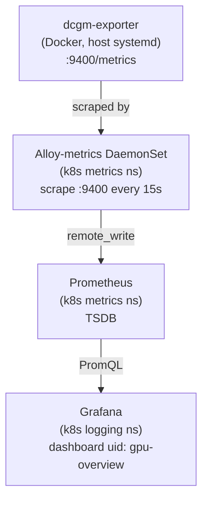

# GPU Monitoring (DCGM Exporter + Grafana)

> Scripts and manifests: `~/src/home_infra/metrics/gpu/`  
> Extends the base metrics stack — see [[Metrics]]. Grafana lives in the logging namespace — see [[Logging]].

## Status
- [x] Configure NVIDIA Docker runtime (`nvidia-ctk`)
- [x] Deploy dcgm-exporter as host systemd service (Docker-based, port 9400)
- [x] Patch Alloy ConfigMap to scrape DCGM endpoint
- [x] GPU metrics flowing into Prometheus (both GPUs)
- [x] Grafana "GPU Overview" dashboard live — uid `gpu-overview`
- [x] 38/38 validation tests passing
- [x] Profiling metrics available (tensor cores, DRAM active, FP16 active)

---

## Hardware

| Index | Model | VRAM | Compute Cap. | Driver |
|---|---|---|---|---|
| GPU 0 | NVIDIA RTX PRO 6000 Blackwell Workstation Edition | 97,887 MiB (~96 GB) | SM 12.0 | 580.126.09 |
| GPU 1 | NVIDIA RTX PRO 6000 Blackwell Workstation Edition | 97,887 MiB (~96 GB) | SM 12.0 | 580.126.09 |

---

## Architecture



**Why host systemd + Docker instead of a k8s DaemonSet?**  
k3s is not configured with the NVIDIA device plugin (`nvidia.com/gpu` resource) and the NVIDIA container runtime is not wired into containerd. Running dcgm-exporter as a Docker container on the host with the NVIDIA runtime sidesteps both requirements — nvidia-container-toolkit handles GPU access, and Alloy scrapes the host over the network exactly like any other target.

---

## Fresh Install (after reimage)

### 1. Host prerequisites

These must be present on the host OS before running `install.sh`. They are **not** installed by the script.

```bash
# NVIDIA drivers (should already be installed — verify)
nvidia-smi

# Docker
sudo apt-get install -y docker.io
sudo systemctl enable --now docker

# nvidia-container-toolkit (gives Docker the NVIDIA runtime)
# Add NVIDIA repo if not already present:
curl -fsSL https://nvidia.github.io/libnvidia-container/gpgkey \
  | sudo gpg --dearmor -o /usr/share/keyrings/nvidia-container-toolkit-keyring.gpg
curl -s -L https://nvidia.github.io/libnvidia-container/stable/deb/nvidia-container-toolkit.list \
  | sed 's#deb https://#deb [signed-by=/usr/share/keyrings/nvidia-container-toolkit-keyring.gpg] https://#g' \
  | sudo tee /etc/apt/sources.list.d/nvidia-container-toolkit.list
sudo apt-get update
sudo apt-get install -y nvidia-container-toolkit

# Confirm
nvidia-ctk --version
docker --version
```

> The base metrics stack ([[Metrics]]) must also be deployed before GPU monitoring — it provides the Prometheus and Alloy infrastructure that GPU monitoring extends.

### 2. Run the install script

```bash
cd ~/src/home_infra/metrics/gpu
./install.sh
# Will prompt for sudo password once upfront, then run fully automated
```

**What install.sh does, in order:**

| Step | Action | Idempotent? |
|---|---|---|
| 1 | Check prerequisites (nvidia-smi, docker, kubectl, cluster reachable) | — |
| 2 | Configure NVIDIA Docker runtime (`nvidia-ctk runtime configure --runtime=docker`) | ✅ skipped if already done |
| 3 | Pull DCGM exporter image (`nvcr.io/nvidia/k8s/dcgm-exporter:4.2.3-4.1.3-ubuntu22.04`) | ✅ no-op if cached |
| 4 | Smoke-test GPU access via Docker (both GPUs visible) | — |
| 5 | Install `/etc/dcgm-exporter/dcgm-metrics.csv` + systemd unit, start service | ✅ overwrites with latest |
| 6 | Wait up to 90s for `:9400/metrics` to respond | — |
| 7 | Patch Alloy ConfigMap with GPU scrape block | ✅ skipped if already present |
| 8 | Restart Alloy DaemonSet, wait for rollout | — |
| 9 | Wait up to 3 min for GPU metrics to appear in Prometheus | — |
| 10 | Upload "GPU Overview" dashboard to Grafana via API | ✅ deletes + re-uploads |
| 11 | Validate 5 key panel queries return data via Grafana proxy API | — |
| 12 | Run full `test.sh` (38 tests) | — |

### 3. Verify

```bash
# All 38 tests should pass
./test.sh

# Spot-check raw metrics
curl http://localhost:9400/metrics | grep DCGM_FI_DEV_GPU_UTIL

# Grafana dashboard
# https://grafana.tailc98a25.ts.net/d/gpu-overview
# Login: admin / <see k8s secret below>
kubectl get secret grafana -n logging -o jsonpath='{.data.admin-password}' | base64 -d
```

---

## Day-to-Day Operations

### Script reference

```bash
cd ~/src/home_infra/metrics/gpu

# Full install / re-install (idempotent)
./install.sh

# Re-upload Grafana dashboard only (no service restarts)
./install.sh --dashboard-only

# Run all 38 validation tests
./test.sh

# Full teardown (removes service + Alloy config + Grafana dashboard)
./uninstall.sh

# Teardown but keep the Grafana dashboard
./uninstall.sh --keep-dashboard
```

### Service management

```bash
# Service status
systemctl status dcgm-exporter
journalctl -u dcgm-exporter -f
journalctl -u dcgm-exporter -n 50        # last 50 lines

# Docker container (dcgm-exporter runs inside Docker)
sudo docker ps | grep dcgm-exporter
sudo docker logs dcgm-exporter
sudo docker logs dcgm-exporter --tail 50

# Restart service
sudo systemctl restart dcgm-exporter

# Raw metrics endpoint
curl http://localhost:9400/metrics
curl http://localhost:9400/metrics | grep DCGM_FI_DEV_GPU_UTIL
curl http://localhost:9400/metrics | grep DCGM_FI_DEV_GPU_TEMP
```

### Grafana dashboard

| | |
|---|---|
| **URL** | https://grafana.tailc98a25.ts.net/d/gpu-overview |
| **User** | `admin` |
| **Password** | `kubectl get secret grafana -n logging -o jsonpath='{.data.admin-password}' \| base64 -d` |

To reset/rebuild the dashboard without touching the service:
```bash
./install.sh --dashboard-only
```

---

## Teardown & Reinstall

### Teardown

```bash
cd ~/src/home_infra/metrics/gpu

# Remove everything (service + Alloy config + Grafana dashboard)
./uninstall.sh

# Remove service + Alloy config, keep Grafana dashboard
./uninstall.sh --keep-dashboard
```

> Script runs as normal user and will prompt for sudo password once upfront for the systemd/Docker steps.

**What uninstall.sh does:**
1. `sudo systemctl stop dcgm-exporter` + `sudo systemctl disable`
2. `sudo docker stop dcgm-exporter` + `sudo docker rm`
3. Removes `/etc/systemd/system/dcgm-exporter.service`
4. Removes `/etc/dcgm-exporter/` config directory
5. Strips the GPU scrape block from the Alloy ConfigMap (kubectl — runs as your user)
6. Restarts Alloy DaemonSet and waits for rollout
7. Deletes the `gpu-overview` dashboard from Grafana via API (unless `--keep-dashboard`)

> Prometheus metric data survives teardown and expires naturally per the 15-day retention policy.

**Verify after teardown:**

```bash
# Service should be gone
systemctl status dcgm-exporter   # expected: inactive or not found

# Container should be gone
sudo docker ps | grep dcgm        # expected: no output

# GPU scrape block should be removed from Alloy config
kubectl get configmap alloy-metrics-config -n metrics \
  -o jsonpath='{.data.config\.alloy}' | grep -c dcgm  # expected: 0

# Alloy DaemonSet should still be running (base metrics stack untouched)
kubectl get daemonset alloy-metrics -n metrics         # expected: AVAILABLE=1
```

### Reinstall

```bash
./install.sh    # fully idempotent — safe to re-run at any time
```

**Cycle test** (teardown + reinstall round-trip):

```bash
cd ~/src/home_infra/metrics/gpu
./uninstall.sh
# verify: systemctl status dcgm-exporter → inactive, docker ps → no dcgm, configmap → no dcgm block
./install.sh
./test.sh   # all 38 tests should pass
```

---

## Debugging

### dcgm-exporter won't start

```bash
journalctl -u dcgm-exporter -n 50
sudo docker logs dcgm-exporter
```

**Common causes:**

| Symptom | Cause | Fix |
|---|---|---|
| `wrong number of fields` in logs | Comma inside a help_text field in `dcgm-metrics.csv` | Remove the comma from the offending line — the DCGM CSV parser treats commas as field separators even inside descriptions |
| `NVIDIA runtime not found` | Docker daemon doesn't have nvidia runtime configured | `sudo nvidia-ctk runtime configure --runtime=docker && sudo systemctl restart docker` |
| Port 9400 not responding after 90s | Container still initializing or crashed | Check `sudo docker logs dcgm-exporter` — DCGM initialization takes ~10s on first start |
| `nvidia-smi` fails | Driver not loaded | `sudo modprobe nvidia` or reboot |

### No GPU metrics in Prometheus

```bash
# Check Alloy config has the GPU scrape block
kubectl get configmap alloy-metrics-config -n metrics -o yaml | grep dcgm

# Check Alloy is scraping successfully
kubectl port-forward svc/alloy-metrics 12345:12345 -n metrics
# Open http://localhost:12345 → check Components → prometheus.scrape.dcgm

# Query Prometheus directly
kubectl port-forward svc/prometheus-server 9090:80 -n metrics
# Open http://localhost:9090 → query: DCGM_FI_DEV_GPU_UTIL
```

### Grafana panel shows "No data"

PCIe panels specifically — these GPUs expose `DCGM_FI_PROF_PCIE_TX_BYTES` (profiling counters, bytes) not `DCGM_FI_DEV_PCIE_TX_THROUGHPUT` (device counters, KB/20ms). If the dashboard gets out of sync, re-upload it:

```bash
./install.sh --dashboard-only
```

For any other "No data" panel, verify the metric exists at the source:
```bash
curl http://localhost:9400/metrics | grep <METRIC_NAME>
```

---

## Gotchas

| Issue | Detail |
|---|---|
| **dcgm-metrics.csv comma rule** | No commas in the `help_text` (3rd column). The DCGM CSV parser is strict — a comma inside a description is treated as a 4th field, crashing the exporter with `wrong number of fields`. |
| **PCIe metric naming** | RTX PRO 6000 Blackwell exposes `DCGM_FI_PROF_PCIE_TX_BYTES` / `DCGM_FI_PROF_PCIE_RX_BYTES` (profiling, bytes) not `DCGM_FI_DEV_PCIE_TX_THROUGHPUT` (device, KB/20ms). Dashboard uses the correct prof variant. |
| **Profiling metrics on RTX cards** | `DCGM_FI_PROF_*` metrics (tensor, DRAM active, FP16) work on the RTX PRO 6000 Blackwell — confirmed. On consumer GeForce cards they would be unavailable. |
| **Docker group not active** | The `melody` user is in the `docker` group but a re-login is needed for that to take effect. Scripts use `sudo docker ...` to avoid this — no re-login required. |
| **DCGM image version** | Pinned to `nvcr.io/nvidia/k8s/dcgm-exporter:4.2.3-4.1.3-ubuntu22.04`. This bundles DCGM 4.1.3 which supports Blackwell SM 12.0. Do not change to `latest` without testing. |
| **sudo prompt** | `install.sh` calls `sudo -v` once upfront to cache credentials, then uses `sudo` only for: `nvidia-ctk runtime configure`, `systemctl restart docker`, writing to `/etc/dcgm-exporter/`, and writing to `/etc/systemd/system/`. |

---

## DCGM Metrics Reference

### Hardware metrics (available on all NVIDIA GPUs)

| Metric | Type | Unit | Description |
|---|---|---|---|
| `DCGM_FI_DEV_GPU_UTIL` | gauge | % | SM (shader/compute) utilization |
| `DCGM_FI_DEV_MEM_COPY_UTIL` | gauge | % | Memory copy engine utilization |
| `DCGM_FI_DEV_ENC_UTIL` | gauge | % | Hardware video encoder utilization |
| `DCGM_FI_DEV_DEC_UTIL` | gauge | % | Hardware video decoder utilization |
| `DCGM_FI_DEV_SM_CLOCK` | gauge | MHz | Streaming Multiprocessor clock |
| `DCGM_FI_DEV_MEM_CLOCK` | gauge | MHz | Memory clock |
| `DCGM_FI_DEV_APP_SM_CLOCK` | gauge | MHz | Target application SM clock |
| `DCGM_FI_DEV_APP_MEM_CLOCK` | gauge | MHz | Target application memory clock |
| `DCGM_FI_DEV_FB_FREE` | gauge | MiB | Framebuffer memory free |
| `DCGM_FI_DEV_FB_USED` | gauge | MiB | Framebuffer memory used |
| `DCGM_FI_DEV_FB_TOTAL` | gauge | MiB | Framebuffer memory total |
| `DCGM_FI_DEV_FB_RESERVED` | gauge | MiB | Framebuffer memory reserved by driver |
| `DCGM_FI_DEV_GPU_TEMP` | gauge | °C | GPU die temperature |
| `DCGM_FI_DEV_MEM_MAX_OP_TEMP` | gauge | °C | Maximum operating temp for memory |
| `DCGM_FI_DEV_GPU_MAX_OP_TEMP` | gauge | °C | Maximum operating temp for GPU |
| `DCGM_FI_DEV_FAN_SPEED` | gauge | % | Fan speed as % of maximum |
| `DCGM_FI_DEV_POWER_USAGE` | gauge | W | Current power draw |
| `DCGM_FI_DEV_POWER_MGMT_LIMIT` | gauge | W | Configured power limit |
| `DCGM_FI_DEV_POWER_MGMT_LIMIT_MAX` | gauge | W | Maximum allowed power limit |
| `DCGM_FI_DEV_TOTAL_ENERGY_CONSUMPTION` | counter | mJ | Total energy consumed since boot |
| `DCGM_FI_DEV_PCIE_TX_THROUGHPUT` | counter | KB/20ms | PCIe TX (older/datacenter cards) |
| `DCGM_FI_DEV_PCIE_RX_THROUGHPUT` | counter | KB/20ms | PCIe RX (older/datacenter cards) |
| `DCGM_FI_DEV_ECC_DBE_VOL_TOTAL` | counter | — | Double-bit volatile ECC errors |
| `DCGM_FI_DEV_ECC_SBE_VOL_TOTAL` | counter | — | Single-bit volatile ECC errors |

### Profiling metrics (confirmed working on RTX PRO 6000 Blackwell)

| Metric | Type | Unit | Description |
|---|---|---|---|
| `DCGM_FI_PROF_GR_ENGINE_ACTIVE` | gauge | fraction 0–1 | Fraction of time graphics engine is active |
| `DCGM_FI_PROF_SM_ACTIVE` | gauge | fraction 0–1 | Fraction of time ≥1 warp active on any SM |
| `DCGM_FI_PROF_SM_OCCUPANCY` | gauge | fraction 0–1 | Fraction of max warps that are resident |
| `DCGM_FI_PROF_PIPE_TENSOR_ACTIVE` | gauge | fraction 0–1 | Tensor core utilization |
| `DCGM_FI_PROF_DRAM_ACTIVE` | gauge | fraction 0–1 | Memory interface bandwidth utilization |
| `DCGM_FI_PROF_PIPE_FP64_ACTIVE` | gauge | fraction 0–1 | FP64 pipe utilization |
| `DCGM_FI_PROF_PIPE_FP32_ACTIVE` | gauge | fraction 0–1 | FP32 pipe utilization |
| `DCGM_FI_PROF_PIPE_FP16_ACTIVE` | gauge | fraction 0–1 | FP16 pipe utilization |
| `DCGM_FI_PROF_PCIE_TX_BYTES` | counter | bytes | PCIe TX total (RTX PRO 6000 uses this, not DEV variant) |
| `DCGM_FI_PROF_PCIE_RX_BYTES` | counter | bytes | PCIe RX total (RTX PRO 6000 uses this, not DEV variant) |

> Full field list at: `~/src/home_infra/metrics/gpu/manifests/dcgm-metrics.csv`

---

## Dashboard Panels

| Row | Panel | PromQL | Visualization |
|---|---|---|---|
| **Overview** | GPU 0 Utilization % | `DCGM_FI_DEV_GPU_UTIL{gpu="0"}` | Stat (color background) |
| **Overview** | GPU 1 Utilization % | `DCGM_FI_DEV_GPU_UTIL{gpu="1"}` | Stat |
| **Overview** | GPU 0 Memory Used % | `DCGM_FI_DEV_FB_USED{gpu="0"} / DCGM_FI_DEV_FB_TOTAL{gpu="0"} * 100` | Gauge |
| **Overview** | GPU 1 Memory Used % | same for gpu="1" | Gauge |
| **Overview** | GPU 0 Temperature | `DCGM_FI_DEV_GPU_TEMP{gpu="0"}` | Stat (green < 70°C, yellow < 80°C, red > 90°C) |
| **Overview** | GPU 1 Temperature | same for gpu="1" | Stat |
| **Overview** | GPU 0 Power Draw | `DCGM_FI_DEV_POWER_USAGE{gpu="0"}` | Stat |
| **Overview** | GPU 1 Power Draw | same for gpu="1" | Stat |
| **Compute** | GPU Utilization % | `DCGM_FI_DEV_GPU_UTIL` (both) | Time series |
| **Compute** | SM Clock | `DCGM_FI_DEV_SM_CLOCK * 1e6` (MHz → Hz for unit display) | Time series |
| **Compute** | Mem Copy Engine | `DCGM_FI_DEV_MEM_COPY_UTIL` (both) | Time series |
| **Memory** | Memory Used (MiB) | `DCGM_FI_DEV_FB_USED` (both) | Time series |
| **Memory** | Memory Free (MiB) | `DCGM_FI_DEV_FB_FREE` (both) | Time series |
| **Memory** | Memory Clock | `DCGM_FI_DEV_MEM_CLOCK * 1e6` | Time series |
| **Thermal & Power** | Temperature °C | `DCGM_FI_DEV_GPU_TEMP` (both) | Time series |
| **Thermal & Power** | Power Draw + Limit | `DCGM_FI_DEV_POWER_USAGE`, `DCGM_FI_DEV_POWER_MGMT_LIMIT` | Time series |
| **Thermal & Power** | Fan Speed % | `DCGM_FI_DEV_FAN_SPEED` (both) | Time series |
| **PCIe** | TX Throughput | `rate(DCGM_FI_PROF_PCIE_TX_BYTES{gpu="0"}[5m])` | Time series (bytes/s) |
| **PCIe** | RX Throughput | `rate(DCGM_FI_PROF_PCIE_RX_BYTES{gpu="0"}[5m])` | Time series (bytes/s) |
| **AI/ML Profiling** | Tensor Core Active | `DCGM_FI_PROF_PIPE_TENSOR_ACTIVE` (both) | Time series (fraction) |
| **AI/ML Profiling** | DRAM Active | `DCGM_FI_PROF_DRAM_ACTIVE` (both) | Time series |
| **AI/ML Profiling** | FP16 Pipe Active | `DCGM_FI_PROF_PIPE_FP16_ACTIVE` (both) | Time series |
| **AI/ML Profiling** | Graphics Engine Active | `DCGM_FI_PROF_GR_ENGINE_ACTIVE` (both) | Time series |
| **Details** | GPU Inventory | `DCGM_FI_DEV_GPU_TEMP` (instant, labels as columns) | Table |

---

## Test Suite (38 tests)

```bash
cd ~/src/home_infra/metrics/gpu
./test.sh
```

| Section | Tests | What's checked |
|---|---|---|
| **Prerequisites** | 4 | nvidia-smi works, GPU count = 2, Docker running, NVIDIA runtime in Docker |
| **dcgm-exporter Service** | 3 | systemd service active, Docker container running, HTTP 200 on :9400 |
| **Metrics Content** | 10 | 4 core metrics present, both GPUs indexed, temperature 10–110°C, power > 5W, memory 0–97887 MiB, profiling availability |
| **Alloy Integration** | 5 | ConfigMap has GPU block, port 9400 referenced, DaemonSet 1/1 ready, Alloy /-/ready, scrape batches forwarded |
| **Prometheus Data** | 5 | 2 series for DCGM_FI_DEV_GPU_UTIL, 7 core metrics present, data age < 120s, GPU 0 and GPU 1 temps |
| **Grafana Dashboard** | 11 | uid `gpu-overview` exists, title correct, ≥ 15 panels, 8 panel PromQL queries return real values |

---

## Repo Layout

```
home_infra/metrics/gpu/
├── install.sh                    # Full install + idempotent re-install
│                                 #   --dashboard-only  re-upload Grafana dashboard only
├── uninstall.sh                  # Full teardown
│                                 #   --keep-dashboard  leave Grafana dashboard intact
├── test.sh                       # 38 end-to-end validation tests
│                                 #   --namespace <ns>  (default: metrics)
│                                 #   --dcgm-port <n>   (default: 9400)
└── manifests/
    ├── dcgm-exporter.service     # systemd unit — Docker-based, NVIDIA runtime
    ├── dcgm-metrics.csv          # DCGM field list (⚠ no commas in help text)
    └── alloy-gpu-snippet.alloy   # Alloy scrape block appended to ConfigMap at install
```

---

## See Also

- [[Metrics]] — base Prometheus + Alloy stack (must be deployed first)
- [[Logging]] — Grafana instance used for dashboards lives here
