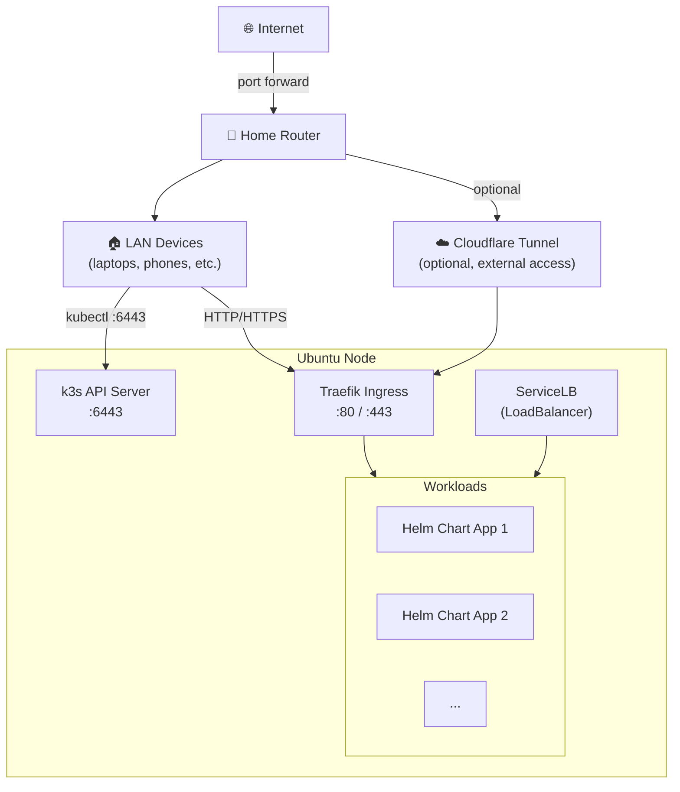

# Homelab Kubernetes (k3s)

## Network Architecture



---

## Install Plan

### 1. Install k3s

```bash
curl -sfL https://get.k3s.io | sh -
```

Verify the node is ready:

```bash
sudo k3s kubectl get nodes
```

---

### 2. Configure kubeconfig

Copy the kubeconfig and set correct permissions so you can use `kubectl` without sudo:

```bash
mkdir -p ~/.kube
sudo cp /etc/rancher/k3s/k3s.yaml ~/.kube/config
sudo chown $USER:$USER ~/.kube/config
```

---

### 3. Access cluster from other machines on LAN

On the Ubuntu node, get its LAN IP:

```bash
ip a | grep inet
```

On a remote machine, copy over the kubeconfig and replace `127.0.0.1` with the node's LAN IP:

```bash
scp melody@<node-ip>:~/.kube/config ~/.kube/config
# then edit ~/.kube/config and replace 127.0.0.1 with <node-ip>
```

Test remote access:

```bash
kubectl get nodes
```

---

### 4. Install Helm

```bash
curl https://raw.githubusercontent.com/helm/helm/main/scripts/get-helm-3 | bash
```

Verify:

```bash
helm version
```

---

### 5. Ingress (Traefik — built in)

Traefik is installed automatically. Verify it's running:

```bash
kubectl get pods -n kube-system | grep traefik
kubectl get svc -n kube-system | grep traefik
```

To use it, create an `Ingress` resource pointing to your service — Traefik will route traffic based on hostname or path.

---

### 6. External Access (Optional)

**Option A — Cloudflare Tunnel** (no port forwarding needed):
```bash
# Install cloudflared, then:
cloudflared tunnel create homelab
cloudflared tunnel route dns homelab <your-domain>
cloudflared tunnel run homelab
```

**Option B — Router port forward**
- Forward ports `80` and `443` on your router to `<node-ip>`

---

## Status
- [ ] Install k3s on Ubuntu node
- [ ] Configure kubeconfig
- [ ] Verify remote kubectl access from LAN
- [ ] Install Helm
- [ ] Deploy first Helm chart
- [ ] Verify Traefik ingress is working
- [ ] Set up external access (Cloudflare Tunnel or port forward)
