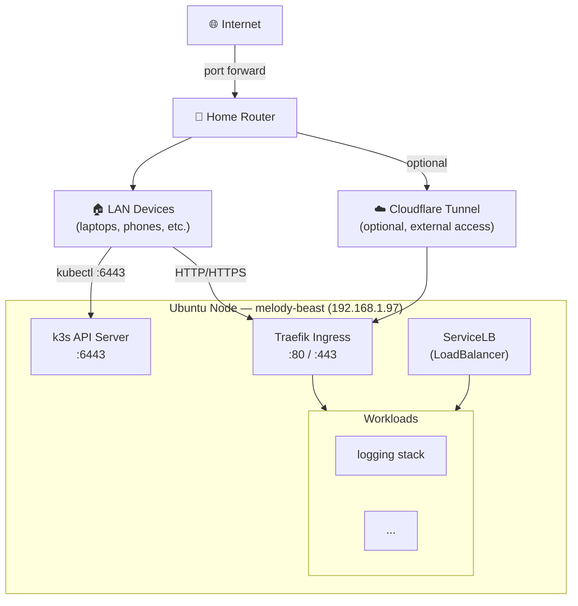

# Homelab Kubernetes (k3s)

## Status
- [x] Install k3s on Ubuntu node
- [x] Configure kubeconfig
- [x] Fix kubeconfig permissions (no sudo needed)
- [x] Install Helm
- [x] Deploy first Helm chart (logging stack)
- [ ] Verify remote kubectl access from LAN
- [ ] Set up external access (Cloudflare Tunnel or port forward)
- [ ] Verify Traefik ingress is working end-to-end

---

## Cluster Info

| Property | Value |
|---|---|
| Node | `melody-beast` |
| IP | `192.168.1.97` |
| k3s version | `v1.34.6+k3s1` |
| Role | `control-plane` |
| Ingress | Traefik (built-in) |
| Storage | local-path-provisioner (built-in) |
| LB | ServiceLB / klipper-lb (built-in) |

---

## Network Architecture



---

## Quick Commands

```bash
# Check cluster
kubectl get nodes
kubectl get pods -A

# Get kubeconfig (if permissions reset)
sudo cp /etc/rancher/k3s/k3s.yaml ~/.kube/config
sudo chown $USER:$USER ~/.kube/config
export KUBECONFIG=~/.kube/config
```

---

## Install Steps (completed)

### 1. Install k3s

```bash
curl -sfL https://get.k3s.io | sh -
```

### 2. Configure kubeconfig

```bash
mkdir -p ~/.kube
sudo cp /etc/rancher/k3s/k3s.yaml ~/.kube/config
sudo chown $USER:$USER ~/.kube/config
echo 'export KUBECONFIG=~/.kube/config' >> ~/.bashrc && source ~/.bashrc
```

### 3. Install Helm

```bash
curl https://raw.githubusercontent.com/helm/helm/main/scripts/get-helm-3 | bash
```

### 4. Access from other LAN machines

On the remote machine:
```bash
scp melody@192.168.1.97:~/.kube/config ~/.kube/config
# Edit ~/.kube/config and replace 127.0.0.1 with 192.168.1.97
kubectl get nodes
```

---

## External Access (Optional)

**Option A — Cloudflare Tunnel** (no port forwarding needed):
```bash
cloudflared tunnel create homelab
cloudflared tunnel route dns homelab <your-domain>
cloudflared tunnel run homelab
```

**Option B — Router port forward**
- Forward ports `80` and `443` on your router to `192.168.1.97`
