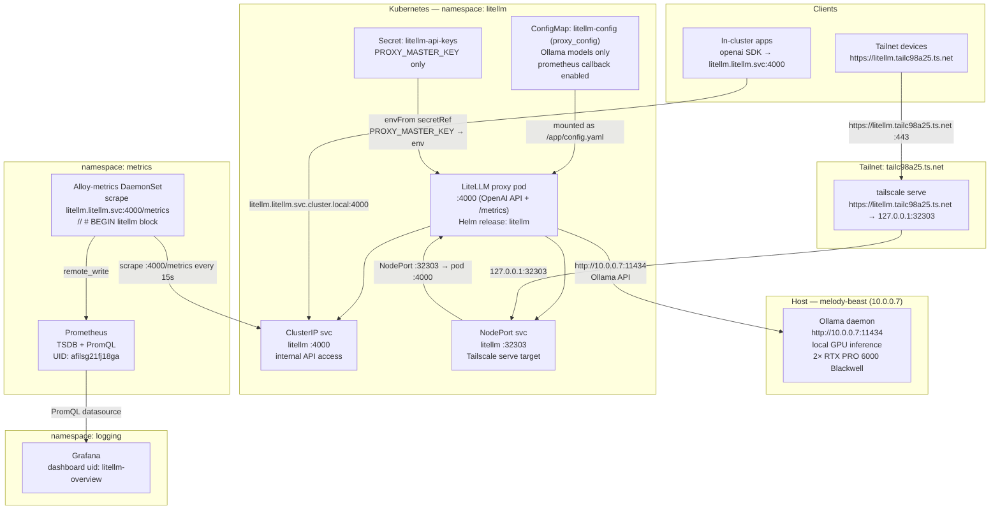

# Homelab LiteLLM

> All scripts and manifests live in `~/src/home_infra/litellm/`

## Status

- [x] Deploy stack: `./install.sh`
- [x] All 44 tests passing (Ollama-only scope, end-to-end chat completion verified)
- [x] OpenAI-compatible API responds at NodePort 32303 (smoke: `curl /health/readiness`)
- [x] Ollama backend reachable — 9 models served (qwen3-coder-next, qwen3.5:122b/27b/9b, qwq:32b, devstral-small-2:24b, gemma3:27b, gemma4:31b, gpt-oss:120b)
- [x] Prometheus metrics endpoint `/metrics` returns valid Prometheus format
- [x] Alloy scrape block `// # BEGIN litellm` patched into `alloy-metrics-config`
- [x] Grafana dashboard uid `litellm-overview` provisioned
- [ ] LiteLLM accessible on tailnet via `https://litellm.tailc98a25.ts.net` (manual: `sudo tailscale serve`)
- [x] Validate teardown/reinstall reproducibility — 1 full destructive cycle (data + namespace + DB schema), 44/44
- [x] PostgreSQL backend integrated — Prisma schema applied, admin UI enabled for key/team/budget management

---

## Stack

| Component | Role | Deploy Method | Version | Notes |
|---|---|---|---|---|
| **LiteLLM proxy** | OpenAI-compatible API gateway, routes to local Ollama | Helm chart (OCI) | `1.82.3` (appVersion `v1.82.3`) | OCI chart: `oci://docker.litellm.ai/berriai/litellm-helm`; image `ghcr.io/berriai/litellm:main-v1.82.3` |
| **Prometheus** | Metrics storage + PromQL engine | Already deployed in `metrics` ns | — | Alloy scrapes LiteLLM `/metrics` and remote_writes |
| **Grafana Alloy** | Scraper — adds LiteLLM as a new target | Already deployed as `alloy-metrics` in `metrics` ns | — | ConfigMap `alloy-metrics-config` patched with `// # BEGIN litellm` block |
| **Grafana** | Dashboard visualization | Already deployed in `logging` ns | — | Dashboard uid `litellm-overview` from LiteLLM GitHub `dashboard_v2/grafana_dashboard.json`; Prometheus datasource UID `afilsg21fj18ga` |

> **Helm chart decision:** The official LiteLLM Helm chart is published as an OCI artifact at `oci://docker.litellm.ai/berriai/litellm-helm`. The chart natively supports mounting a `proxy_config` block as a ConfigMap, injecting entire k8s Secrets as environment variables via `environmentSecrets`, resource limits, liveness/readiness/startup probes, and NodePort services — all required features are available with no workarounds. Raw manifests are not needed. Chart version `1.82.3` is the latest stable as of 2026-04-15 (`helm show chart oci://docker.litellm.ai/berriai/litellm-helm`).

> **LiteLLM image:** `ghcr.io/berriai/litellm:main-v1.82.3` — pinned to the stable release tag. Do not use `main-latest` in production; it is a floating tag. The Helm chart image tag defaults to `main-<appVersion>` which resolves to `main-v1.82.3`.

> **PostgreSQL backend:** LiteLLM uses the existing PostgreSQL instance in the home lab (`postgresql.postgresql.svc.cluster.local:5432/homelab`). The Prisma schema is applied on first deploy via `prisma db push`. This enables the admin UI for managing virtual keys, teams, budgets, and viewing usage analytics. The database contains 30+ LiteLLM tables including `LiteLLM_VerificationToken` (virtual keys), `LiteLLM_TeamTable`, `LiteLLM_UserTable`, `LiteLLM_BudgetTable`, and audit logs.

> **Prometheus metrics:** LiteLLM exposes a built-in `/metrics` endpoint at port 4000 when `callbacks: ["prometheus"]` is set in the proxy config. No separate exporter pod is needed.

> **Grafana dashboard:** The official LiteLLM dashboard (`dashboard_v2/grafana_dashboard.json` from BerriAI/litellm GitHub, original uid `be059pwgrlg5cf`) is a Prometheus-based dashboard titled "LiteLLM Prod v2". It shows proxy-level request rate, failure rate, latency, and LLM API metrics. No community grafana.com dashboard with significant downloads exists for LiteLLM Prometheus metrics; the official GitHub dashboard is the correct source. The UID will be overridden to `litellm-overview` and the datasource UID patched to `afilsg21fj18ga` at install time.

---

## Architecture



### Data Flow

1. **LiteLLM proxy** starts with `/app/config.yaml` mounted from the `litellm` Helm-managed ConfigMap
2. `proxy_config.model_list` defines model aliases — 9 Ollama models all routed to `http://10.0.0.7:11434`
3. `PROXY_MASTER_KEY` is injected as an environment variable via `envFrom: secretRef: litellm-api-keys` — never embedded in the ConfigMap
4. In-cluster clients call `litellm.litellm.svc.cluster.local:4000` with `Authorization: Bearer <PROXY_MASTER_KEY>`
5. External (tailnet) clients call `https://litellm.tailc98a25.ts.net` via Tailscale serve → NodePort 32303 → pod port 4000
6. **Ollama access:** Ollama runs on the host at `http://localhost:11434`. From inside k3s pods, the node IP `10.0.0.7` is used directly (CoreDNS `NodeHosts` maps `melody-beast` → `10.0.0.7`; the proxy config uses the raw IP for reliability). This is the idiomatic approach for single-node k3s where host services are accessed via node IP.
7. Alloy scrapes `litellm.litellm.svc.cluster.local:4000/metrics` every 15s and remote_writes to Prometheus
8. **Prometheus metrics** are enabled by including `"prometheus"` in `litellm_settings.callbacks` in `proxy_config.yaml`

---

## LiteLLM Configuration

### proxy_config.yaml (mounted as ConfigMap)

```yaml
model_list:
  - model_name: qwen3-coder-next
    litellm_params:
      model: ollama/qwen3-coder-next:latest
      api_base: http://10.0.0.7:11434
  - model_name: qwen3.5:122b
    litellm_params:
      model: ollama/qwen3.5:122b-a10b
      api_base: http://10.0.0.7:11434
  - model_name: qwen3.5:27b
    litellm_params:
      model: ollama/qwen3.5:27b
      api_base: http://10.0.0.7:11434
  - model_name: qwen3.5:9b
    litellm_params:
      model: ollama/qwen3.5:9b
      api_base: http://10.0.0.7:11434
  - model_name: qwq:32b
    litellm_params:
      model: ollama/qwq:32b
      api_base: http://10.0.0.7:11434
  - model_name: devstral-small-2:24b
    litellm_params:
      model: ollama/devstral-small-2:24b
      api_base: http://10.0.0.7:11434
  - model_name: gemma3:27b
    litellm_params:
      model: ollama/gemma3:27b
      api_base: http://10.0.0.7:11434
  - model_name: gemma4:31b
    litellm_params:
      model: ollama/gemma4:31b
      api_base: http://10.0.0.7:11434
  - model_name: gpt-oss:120b
    litellm_params:
      model: ollama/gpt-oss:120b
      api_base: http://10.0.0.7:11434

general_settings:
  master_key: os.environ/PROXY_MASTER_KEY

litellm_settings:
  callbacks:
    - prometheus
```

> `os.environ/KEY_NAME` is LiteLLM's syntax for reading an environment variable. Only `PROXY_MASTER_KEY` is required. The ConfigMap is non-sensitive and can be stored in git.

> **Adding more providers later:** Add a new entry to `model_list` in `litellm-values.yaml` and run `helm upgrade` (or re-run `install.sh`). For external API keys, add them to the `litellm-api-keys` secret and reference via `os.environ/KEY_NAME` in `litellm_params.api_key`.

### Secret: `litellm-api-keys`

| Key | Value | Source |
|---|---|---|
| `PROXY_MASTER_KEY` | LiteLLM master key — see [[Teardown Reinstall Validation - LiteLLM#Credentials Reference]] | Set by user before install |
| `DATABASE_URL` | PostgreSQL connection string — see [[Teardown Reinstall Validation - LiteLLM#Credentials Reference]] | Set by user before install |

The secret is created by `install.sh` from env vars. It is **never** created by the Helm chart. `install.sh` upserts `DATABASE_URL` into existing secrets on reinstall so the key is always present. Both keys are mounted into the pod via `environmentSecrets: [litellm-api-keys]` (Helm `envFrom.secretRef`) — values are not visible in `kubectl get deployment`.

### Rotating the Master Key

```bash
NEW_KEY=$(openssl rand -hex 20 | sed 's/^/sk-homelab-/')
kubectl patch secret litellm-api-keys -n litellm \
  --type merge \
  -p "{\"data\":{\"PROXY_MASTER_KEY\":\"$(echo -n "${NEW_KEY}" | base64 -w0)\"}}"
kubectl rollout restart deployment/litellm -n litellm
kubectl rollout status deployment/litellm -n litellm --timeout=120s
echo "New key: ${NEW_KEY}"
# Update [[Teardown Reinstall Validation - LiteLLM#Credentials Reference]] with new key
```

### Database Connection

`DATABASE_URL` is stored in the `litellm-api-keys` secret and injected via `environmentSecrets`. The Prisma schema (57 tables) is applied automatically on first deploy via `prisma db push`. On reinstall, `prisma db push` without `--accept-data-loss` is used — it will fail explicitly if a schema change would destroy data, rather than silently wiping it.

### K8s Resource Requests/Limits

| Resource | Request | Limit | Rationale |
|---|---|---|---|
| CPU | `200m` | `2000m` | LiteLLM is a Python proxy; CPU spikes occur during request parsing. 2 cores limit avoids starving other workloads |
| Memory | `512Mi` | `2Gi` | LiteLLM startup loads large Python dependency graph (openai, anthropic, prometheus_client, prisma, etc.); 2Gi limit required — observed OOM at 512Mi on v1.82.3 |

### Health Probes

| Probe | Path | Initial Delay | Period | Failure Threshold | Notes |
|---|---|---|---|---|---|
| Startup | `/health/readiness` | 0s | 10s | 30 | Up to 5min for slow startup (Prisma, workers) |
| Liveness | `/health/liveliness` | 0s | 10s | 3 | Kills and restarts unhealthy pod |
| Readiness | `/health/readiness` | 0s | 10s | 3 | Removes pod from service endpoints when not ready |

### Helm values summary (`litellm-values.yaml`)

```yaml
image:
  repository: ghcr.io/berriai/litellm
  tag: "main-v1.82.3"
  pullPolicy: IfNotPresent

environmentSecrets: []         # no external API keys needed for Ollama-only config

db:
  deployStandalone: false
  useExisting: false

service:
  type: NodePort
  port: 4000
  nodePort: 32303

resources:
  requests:
    cpu: 200m
    memory: 512Mi
  limits:
    cpu: 2000m
    memory: 2Gi

proxy_config:
  model_list: ...              # inline proxy_config.yaml content
  general_settings:
    master_key: os.environ/PROXY_MASTER_KEY
  litellm_settings:
    callbacks:
      - prometheus
```

> The Helm chart renders `proxy_config` from `values.yaml` into a ConfigMap named `litellm-config`. The chart creates a NodePort service but does **not** expose the `nodePort` value via values — `install.sh` patches it to 32303 post-deploy via `kubectl patch svc`.

---

## Namespace & Port Allocation

| Service | Namespace | Type | Port | NodePort | Purpose |
|---|---|---|---|---|---|
| litellm | litellm | NodePort | 4000 | **32303** | Proxy API + `/metrics` — Tailscale serve target |
| litellm | litellm | ClusterIP | 4000 | — | In-cluster access (same service, ClusterIP also created) |

> NodePort 32303 is chosen as the next sequential allocation after 32302 (prometheus-tailscale). No conflicts with existing allocations.

**Complete port allocation registry (do not reuse):**

| Port | Service | Type |
|---|---|---|
| 31900 | loki-external | LoadBalancer |
| 31901 | prometheus-external | LoadBalancer |
| 32300 | grafana-tailscale | NodePort |
| 32301 | loki-tailscale | NodePort |
| 32302 | prometheus-tailscale | NodePort |
| **32303** | **litellm-tailscale** | **NodePort** |

---

## Tailscale Access

```bash
# One-time Tailscale serve setup (run on melody-beast host)
sudo tailscale serve --service=svc:litellm --https=443 127.0.0.1:32303

# Verify
sudo tailscale serve status

# Access URL (after Tailscale admin approval)
# https://litellm.tailc98a25.ts.net
```

> As with other Tailscale services in this cluster, the `serve` command is imperative and must be re-run after a full node reimage. It persists across restarts once configured. Admin approval at `login.tailscale.com/admin/machines` is required the first time a new service is registered on a machine.

---

## Accessing LiteLLM

**In-cluster (primary access pattern)**
```
http://litellm.litellm.svc.cluster.local:4000
```

**Admin UI (with database backend)**
```
http://localhost:32303/ui/
```

**Get the master key from k8s secret**
```bash
kubectl get secret litellm-api-keys -n litellm \
  -o jsonpath="{.data.PROXY_MASTER_KEY}" | base64 -d; echo
```

**Tailnet access**
```
https://litellm.tailc98a25.ts.net
```

**Test the API**
```bash
MASTER_KEY=$(kubectl get secret litellm-api-keys -n litellm \
  -o jsonpath="{.data.PROXY_MASTER_KEY}" | base64 -d)

# List available models
curl -s https://litellm.tailc98a25.ts.net/v1/models \
  -H "Authorization: Bearer ${MASTER_KEY}" | python3 -m json.tool

# Send a request to Ollama via LiteLLM
curl -s https://litellm.tailc98a25.ts.net/v1/chat/completions \
  -H "Authorization: Bearer ${MASTER_KEY}" \
  -H "Content-Type: application/json" \
  -d '{"model": "ollama/llama3.2", "messages": [{"role": "user", "content": "Say hello"}]}'
```

**Using with OpenAI-compatible SDKs**
```python
import openai

client = openai.OpenAI(
    base_url="http://litellm.litellm.svc.cluster.local:4000",
    api_key="sk-homelab-...",   # PROXY_MASTER_KEY
)

response = client.chat.completions.create(
    model="ollama/llama3.2",
    messages=[{"role": "user", "content": "Hello"}]
)
```

---

## Admin UI & Key Management

With PostgreSQL backend enabled, you can manage virtual keys, teams, and budgets via the admin UI or CLI.

### Admin UI

**URL:** `http://localhost:32303/ui/`

**Login:** Use your PROXY_MASTER_KEY

Features:
- Generate virtual keys with budget limits
- Create teams and manage team membership  
- View usage analytics and spend tracking
- Manage users and budgets

See `UI_GUIDE.md` for detailed usage instructions.

### Generate Virtual Keys (CLI)

```bash
cd ~/src/home_infra/litellm

# Generate a key with alias, budget, and duration
./generate-key.sh my-app 10 7d

# Output: sk-<random-key> (copy immediately!)
```

The generated key can be used with any OpenAI-compatible client:
```python
client = openai.OpenAI(
    base_url="http://litellm.litellm.svc.cluster.local:4000",
    api_key="sk-<the-virtual-key>",
)
```

---

## Deploy / Teardown

```bash
cd ~/src/home_infra/litellm

# Install LiteLLM (proxy + observability + Grafana dashboard); runs 42 tests on success
./install.sh

# Dry run (prints what would be done)
./install.sh --dry-run

# Run tests standalone (42 tests)
./test.sh

# Smoke test only (fast — 5 tests)
./test.sh --smoke-test

# Diagnose (read-only state snapshot)
./diag.sh

# Tear down (keep namespace and secret)
./uninstall.sh --force

# Tear down completely (removes namespace, secret, Alloy block, Grafana dashboard)
./uninstall.sh --delete-namespace --force

# Full wipe including PostgreSQL tables (57 LiteLLM tables — all virtual keys, spend logs, budgets)
./uninstall.sh --delete-namespace --delete-data --force
```

> **`--delete-data`** drops the entire `public` schema in PostgreSQL (`DROP SCHEMA public CASCADE`) which removes all 57 LiteLLM tables. Use this when you want a truly clean reinstall with no leftover keys or spend history. After this, `install.sh` will recreate the schema from scratch via `prisma db push`.

---

## Repo Layout

```
home_infra/litellm/
├── install.sh                          # Idempotent deploy: Helm chart + secret + Alloy patch + dashboard; runs test.sh
├── uninstall.sh                        # Teardown (--delete-namespace --force); residue check
├── test.sh                             # 42 tests across 14 categories; --smoke-test flag
├── diag.sh                             # Read-only diagnostics: pod state, /metrics sample, Alloy, Prometheus, Grafana
└── manifests/
    ├── litellm-values.yaml             # Helm values: image, service NodePort 32303, resources, proxy_config, environmentSecrets
    └── proxy-config.yaml               # Standalone copy of proxy_config for reference (rendered into ConfigMap by Helm)
```

> Note: `proxy_config` is embedded in `litellm-values.yaml` under the `proxy_config:` key. The Helm chart renders it into the `litellm` ConfigMap. A standalone `proxy-config.yaml` is kept as a reference copy for human readability and diff tracking.

> Note: The `litellm-api-keys` Secret is **not** stored in the repo. It is created by `install.sh` from environment variables exported on the host before running the script. See Prerequisites.

---

## Observability

### Metrics approach

LiteLLM's built-in Prometheus integration is used — no separate exporter pod is needed. The `/metrics` endpoint at port 4000 is enabled by adding `callbacks: ["prometheus"]` to `litellm_settings` in `proxy_config.yaml`.

**Scrape method:** Alloy ConfigMap patch (same pattern as Redis and PostgreSQL). ServiceMonitor CRD is not present in this cluster.

**Prometheus datasource UID:** `afilsg21fj18ga` (verified from Grafana API as of 2026-04-15).

### Grafana dashboard

**Source:** `BerriAI/litellm` GitHub repo, `cookbook/litellm_proxy_server/grafana_dashboard/dashboard_v2/grafana_dashboard.json` — official Prometheus-based dashboard. Original uid `be059pwgrlg5cf`, overridden to `litellm-overview`.

**Key panels:**
- Proxy Requests per Second (success + failure)
- Proxy Failure Responses / Second by Exception Class
- Proxy Average & Median Response Latency (seconds)
- LLM API Metrics (x-ratelimit-remaining-requests/tokens)
- Requests per Second by Key Alias and Team Alias

**No community Grafana.com dashboard exists** for LiteLLM Prometheus metrics with meaningful download counts. The dashboards at grafana.com/grafana/dashboards/24055 and 24064 are Azure Monitor-based and not applicable.

### Key metrics

| Metric | PromQL | Panel |
|---|---|---|
| Request rate (success) | `rate(litellm_proxy_total_requests_metric[5m])` | Time series |
| Request rate (failures) | `rate(litellm_proxy_failed_requests_metric[5m])` | Time series |
| Latency (p50) | `histogram_quantile(0.5, rate(litellm_request_total_latency_metric_bucket[5m]))` | Time series |
| LLM API latency | `rate(litellm_llm_api_latency_metric_sum[5m]) / rate(litellm_llm_api_latency_metric_count[5m])` | Time series |
| Token usage | `rate(litellm_total_tokens_metric[5m])` | Time series |
| Deployment failures | `rate(litellm_deployment_failure_responses[5m])` | Time series |

---

## Test Suite (44 tests)

| Category | Count | What's Validated |
|---|---|---|
| **Prerequisites** | 4 | `helm`, `kubectl`, `curl`, `python3` available |
| **Namespace** | 1 | Namespace `litellm` exists |
| **Helm Release** | 2 | Release `litellm` exists; pinned at chart version `1.82.3` |
| **Deployment** | 3 | Deployment exists; ≥1 ready replica; uses `ghcr.io/berriai/litellm` image |
| **Pod Health** | 3 | Pod phase = Running; Ready = True; restartCount ≤ 2 |
| **Secret** | 3 | `litellm-api-keys` exists; has `PROXY_MASTER_KEY` key; value non-empty |
| **ConfigMap** | 2 | `litellm-config` ConfigMap exists; contains `prometheus` callback |
| **Services** | 3 | Service `litellm` exists; type = NodePort; nodePort = 32303 |
| **Proxy API** | 9 | `/health/readiness` 200; `/health/liveliness` 200; `/v1/models` ≥9 models; `qwen3-coder-next` present; `gemma4:31b` present; unauthenticated returns 401; `POST /v1/chat/completions` returns 200; response has non-empty content |
| **Metrics Endpoint** | 4 | `/metrics` returns data (follows 307 redirect with `-L`); valid Prometheus format (`# HELP` lines); `process_virtual_memory_bytes` present; `litellm_` prefix metrics present |
| **Alloy ConfigMap** | 2 | `alloy-metrics-config` contains `// # BEGIN litellm`; block has `job_name = "litellm"` |
| **Prometheus Ingestion** | 3 | Prometheus API reachable; `litellm` job present in label values (Alloy remote_write confirmed); `up{job="litellm"} = 1` |
| **Tailscale NodePort** | 3 | NodePort 32303 HTTP 200; `svc.nodePort = 32303`; Tailscale check (soft — warns if not configured) |
| **Grafana Dashboard** | 3 | Dashboard `litellm-overview` exists; UID matches; version set |

> **Total: 44 tests**

> **Chat completion test note:** Uses `gemma3:27b` (non-thinking model). The qwen3.5 and qwq models are thinking models — with low `max_tokens` budgets they consume all tokens for internal reasoning and return empty `content`. Use non-thinking models (`gemma3:27b`, `gemma4:31b`, `devstral-small-2:24b`) when a text response is required without special handling.

### Smoke test subset (`--smoke-test` flag, 5 tests)

1. Pod Running + Ready (`1/1`)
2. `GET /health/readiness` returns HTTP 200 (via port-forward to pod :4000)
3. `GET /v1/models` returns at least one model (authenticated with master key)
4. `GET /metrics` returns valid Prometheus format (`# HELP` lines)
5. Grafana dashboard uid `litellm-overview` exists

---

## Teardown / Reinstall Validation Plan

No PVC is used (LiteLLM is stateless), so all 3 cycles are destructive.

```bash
cd ~/src/home_infra/litellm

# Destructive cycle (repeat 3 times):
./uninstall.sh --delete-namespace --force
# Residue check output should show:
#   - namespace "litellm" gone
#   - Helm release "litellm" gone
#   - Secret "litellm-api-keys" gone (namespace deleted)
#   - Alloy ConfigMap has no "// # BEGIN litellm" block
#   - Grafana dashboard "litellm-overview" returns 404

# Re-create the secret env var (prerequisite for install.sh):
export PROXY_MASTER_KEY="sk-homelab-..."

./install.sh   # 42/42 tests must pass
```

**Results:**

| Cycle | Date | Teardown clean | Tests | Notes |
|---|---|---|---|---|
| 1 | 2026-04-16 | ✅ | 44/44 | Full destructive: `--delete-namespace --delete-data`; all 57 DB tables dropped and recreated; 11 bugs found and fixed |

> Full bug log: [[Teardown Reinstall Validation - LiteLLM]]

---

## Prerequisites

1. **Environment variable set before running `install.sh`:** The install script reads one env var to create the `litellm-api-keys` Secret:
   ```bash
   export PROXY_MASTER_KEY="sk-homelab-<your-random-string>"
   ```
   This is the auth token clients use when calling the proxy. Generate with `openssl rand -hex 16`.

2. **Ollama running on host:** Ollama must be listening at `http://10.0.0.7:11434`. Verify with `curl http://10.0.0.7:11434/api/tags`. The Ollama models referenced in `proxy_config.yaml` (`llama3.2`, `gemma3`) should be pulled before first use: `ollama pull llama3.2`.

3. **Tailscale serve (one-time):** After `install.sh`, run on the host:
   ```bash
   sudo tailscale serve --service=svc:litellm --https=443 127.0.0.1:32303
   ```
   Then approve the service at `login.tailscale.com/admin/machines`.

4. **OCI Helm registry reachable:** `install.sh` pulls `oci://docker.litellm.ai/berriai/litellm-helm`. Verify with: `helm show chart oci://docker.litellm.ai/berriai/litellm-helm`. Outbound HTTPS to `docker.litellm.ai` must be allowed.

5. **Metrics stack deployed:** Alloy-metrics DaemonSet and Prometheus must be running in the `metrics` namespace. Grafana must be running in the `logging` namespace. Verified by `install.sh` at startup.

6. **`kubectl`, `helm`, `curl`, `python3`** installed on the host running `install.sh`.

---

## Possible Enhancements

| Enhancement | Priority | Notes |
|---|---|---|
| SQLite persistence (request logs) | High | Set `DATABASE_URL=sqlite:///./litellm.db` and mount a PVC; enables spend tracking, key management, usage logs |
| PostgreSQL backend | Medium | Use the existing `homelab` PostgreSQL instance; enables full LiteLLM database features (teams, virtual keys, audit log) |
| Virtual key management | Medium | With a database backend, issue per-app API keys with budget limits; use `litellm.tailc98a25.ts.net/ui` admin panel |
| Alerting rules | Medium | Alert on `litellm_proxy_failed_requests_metric > 0.1/s` or latency p95 > 10s; requires Alertmanager |
| Redis caching | Low | `cache: true` in litellm_settings + Redis backend for semantic caching of LLM responses |
| Load balancing across Ollama models | Low | Multiple `model_name` entries for same model across different `api_base` endpoints |
| Rate limiting | Low | `max_budget` and `tpm_limit` per virtual key in the database mode |
| Tracing (Langfuse / OTLP) | Low | Add `langfuse` or `otel` to callbacks; pairs with a Tempo/Jaeger deployment |
| Multiple Ollama model entries | Low | Add entries for all pulled Ollama models dynamically; currently hardcoded to `llama3.2` and `gemma3` |
| Network policy | Low | Restrict `litellm` namespace egress to Ollama host IP and known provider CIDRs |

---

## Troubleshooting

### LiteLLM pod in CrashLoopBackOff on startup

```
litellm-<hash>   0/1   CrashLoopBackOff   3   2m
```

**Cause 1:** `proxy_config.yaml` has a syntax error, or a model references an `api_base` that is unreachable at startup (e.g. Ollama not running).
**Fix:**
```bash
kubectl logs deployment/litellm -n litellm --previous
# Look for: "Invalid proxy_config.yaml" or "Connection refused"
# Fix the values.yaml proxy_config block and re-run install.sh
```

**Cause 2:** `litellm-api-keys` Secret was not created before `helm upgrade --install` ran.
**Fix:**
```bash
kubectl get secret litellm-api-keys -n litellm
# If missing: export the three env vars and re-run install.sh
```

### `/metrics` endpoint returns 404 or no LiteLLM metrics

```
404 Not Found
# or: only Go/process metrics, no litellm_* metrics
```

**Cause:** `callbacks: ["prometheus"]` not present in `proxy_config.yaml`. LiteLLM only exposes custom metrics when the prometheus callback is explicitly registered.
**Fix:**
```bash
kubectl get configmap litellm-config -n litellm -o jsonpath='{.data.config\.yaml}'
# Verify "prometheus" appears under litellm_settings.callbacks
# If missing: fix litellm-values.yaml and re-run install.sh (helm upgrade)
```

### Ollama requests return `{"error": "Connection refused"}` or 502

```json
{"error": {"message": "Connection refused", "type": "internal_server_error"}}
```

**Cause:** LiteLLM cannot reach Ollama at `http://10.0.0.7:11434`. Either Ollama is not running, or the node IP changed.
**Fix:**
```bash
# From the host, verify Ollama is up:
curl http://10.0.0.7:11434/api/tags

# From inside the pod, verify network reachability:
kubectl exec -n litellm deploy/litellm -- curl -sf http://10.0.0.7:11434/api/tags

# If the node IP changed (DHCP), update proxy_config in litellm-values.yaml and re-run install.sh
kubectl get nodes -o jsonpath='{.items[0].status.addresses[?(@.type=="InternalIP")].address}'
```

### Prometheus has no `litellm_*` metrics after install

```
# GET /api/v1/query?query=litellm_proxy_total_requests_metric returns empty result
```

**Cause 1:** Alloy ConfigMap was not patched (sentinel block missing).
**Fix:**
```bash
kubectl get configmap alloy-metrics-config -n metrics \
  -o jsonpath='{.data.config\.alloy}' | grep "BEGIN litellm"
# If missing: re-run install.sh or manually patch
```

**Cause 2:** Alloy did not restart after the ConfigMap patch.
**Fix:**
```bash
kubectl rollout restart daemonset/alloy-metrics -n metrics
kubectl rollout status daemonset/alloy-metrics -n metrics --timeout=120s
```

**Cause 3:** No requests have been sent through LiteLLM yet — the counter metric will be absent (not zero) until at least one request is processed.
**Fix:** Send a test request and wait one scrape interval (15s):
```bash
MASTER_KEY=$(kubectl get secret litellm-api-keys -n litellm \
  -o jsonpath="{.data.PROXY_MASTER_KEY}" | base64 -d)
kubectl port-forward svc/litellm 14000:4000 -n litellm &
curl -s http://localhost:14000/v1/models -H "Authorization: Bearer ${MASTER_KEY}"
kill %1
```

### `GET /v1/models` returns 401 Unauthorized

**Cause:** The `PROXY_MASTER_KEY` env var was not injected from the secret, or the secret key name is wrong.
**Fix:**
```bash
kubectl get secret litellm-api-keys -n litellm \
  -o jsonpath='{.data}' | python3 -c "import sys,json,base64; d=json.load(sys.stdin); [print(k) for k in d]"
# Should show: PROXY_MASTER_KEY
# Verify env var is present in pod:
kubectl exec -n litellm deploy/litellm -- env | grep PROXY_MASTER_KEY
```

### Grafana dashboard panels show "No data"

**Cause 1:** Datasource UID mismatch — dashboard was not patched with the correct Prometheus datasource UID.
**Fix:**
```bash
# Verify the datasource UID in Grafana
kubectl exec -n logging deploy/grafana -- \
  wget -qO- "http://localhost:3000/api/datasources" 2>/dev/null | \
  python3 -c "import sys,json; [print(d['name'], d['uid']) for d in json.load(sys.stdin)]"
# Compare against the UID patched into the dashboard during install.sh
```

**Cause 2:** No LiteLLM requests have been made yet — counters start from zero and are absent from Prometheus until the first request.
**Fix:** Send test traffic and wait 30–60s for first scrape.

### NodePort 32303 not reachable from host

```
curl: (7) Failed to connect to localhost port 32303
```

**Cause:** The Helm chart's service was created with type `ClusterIP` (not `NodePort`), or the `nodePort` field was not set.
**Fix:**
```bash
kubectl get svc litellm -n litellm -o jsonpath='{.spec.type}' ; echo
kubectl get svc litellm -n litellm -o jsonpath='{.spec.ports[0].nodePort}' ; echo
# If type is ClusterIP or nodePort is empty, check litellm-values.yaml:
#   service.type: NodePort
#   service.nodePort: 32303
# Re-run: helm upgrade --install ... with corrected values
```

---

## See Also

- [[Metrics]] — Prometheus + Alloy base stack; Alloy ConfigMap patched by this project
- [[Logging]] — Grafana instance where the `litellm-overview` dashboard lives
- [[Redis]] — If Redis caching is enabled in LiteLLM (future enhancement)
- [[Postgres]] — If PostgreSQL backend is enabled for LiteLLM key/team management (future enhancement)
- [[Redis Metrics]] — Reference implementation for Alloy ConfigMap patch and Grafana API dashboard upload
- [[Postgres Metrics]] — Second reference implementation; same patterns
- [[Overview]] — Homelab overview; add LiteLLM to services list after deployment
