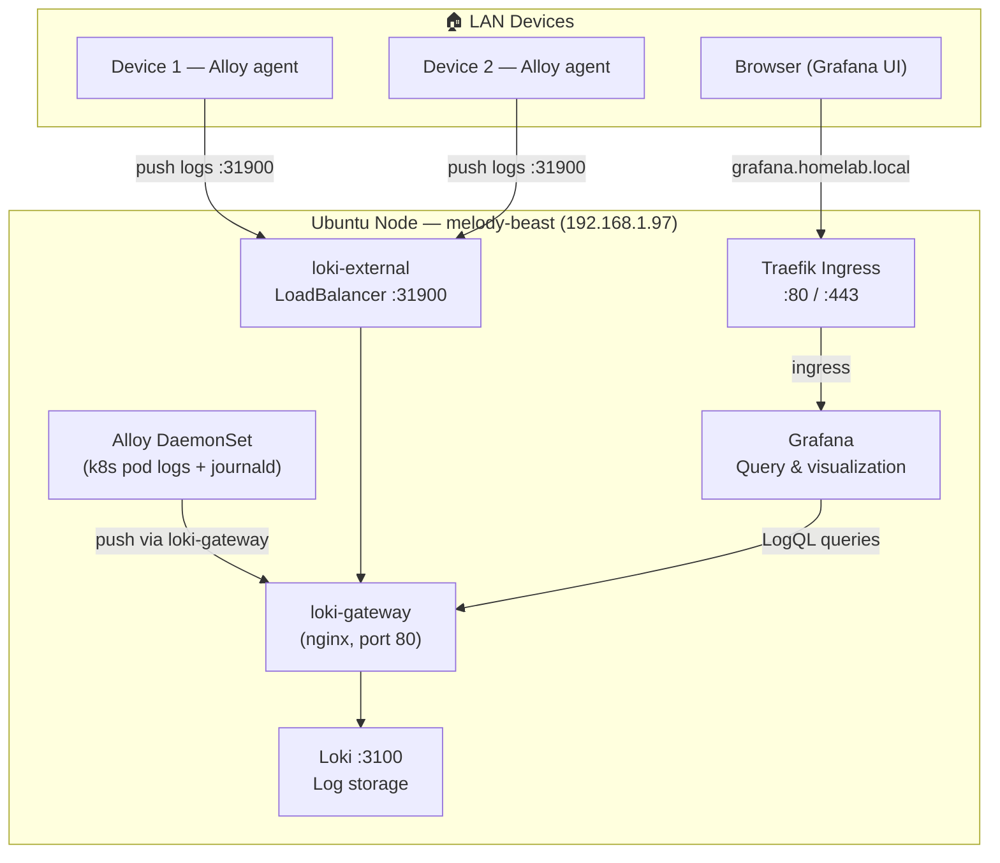

# Homelab Logging (Loki + Alloy + Grafana)

> All scripts and manifests live in `~/src/home_infra/logging/`

## Status
- [x] Deploy stack: `./install.sh`
- [x] All 24 validation tests passing
- [x] Confirm in-cluster logs flowing (Alloy → Loki)
- [x] Grafana accessible and Loki datasource connected
- [ ] Add `grafana.homelab.local` to `/etc/hosts` on LAN machines
- [ ] Install Alloy agent on remote LAN devices
- [ ] Build first log dashboard

---

## Stack

| Component | Role | Helm Chart | Chart Version | App Version |
|---|---|---|---|---|
| **Loki** | Log storage & query engine | grafana/loki | 6.55.0 | v3.7.1 |
| **Grafana Alloy** | Log collector (k8s + remote devices) | grafana/alloy | 1.7.0 | v1.15.0 |
| **Grafana** | Dashboards & LogQL UI | grafana/grafana | 10.5.15 | — |

> Alloy is the supported successor to Promtail, which reached EOL in March 2026.

---

## Architecture



---

## What's Being Ingested

Alloy collects logs from all pods across all namespaces automatically.

Currently flowing (as of setup):

| Namespace | Pods |
|---|---|
| `kube-system` | coredns, traefik, local-path-provisioner, metrics-server, svclb-* |
| `logging` | loki-0, loki-gateway, loki-canary, loki-chunks-cache, loki-results-cache, alloy, grafana |

Any new workload deployed to the cluster will be picked up automatically.

---

## Accessing Grafana

**Option A — Hostname (recommended)**

Add to `/etc/hosts` on your machine:
```
192.168.1.97  grafana.homelab.local
```
Then open: `http://grafana.homelab.local`

**Option B — Port forward (no /etc/hosts needed)**
```bash
kubectl port-forward svc/grafana 3000:80 -n logging
```
Then open: `http://localhost:3000`

**Credentials**
```bash
# Get admin password
kubectl get secret --namespace logging grafana \
  -o jsonpath="{.data.admin-password}" | base64 --decode; echo
```
Username: `admin`

---

## Querying Logs

Open Grafana → **Explore** (compass icon) → select **Loki** datasource

```logql
# All logs in the logging namespace
{namespace="logging"}

# All logs in kube-system
{namespace="kube-system"}

# Logs from a specific pod
{pod="traefik-c5c8bf4ff-kg4rt"}

# Filter for errors across all pods
{namespace="logging"} |= "error"

# Logs from a remote device (once Alloy agent is installed)
{host="my-device"}
{job="journal", host="my-device"}
```

---

## Deploy / Teardown

```bash
cd ~/src/home_infra/logging

# Install
./install.sh

# Install with custom options
./install.sh --loki-storage-size 20Gi --grafana-host grafana.homelab.local

# Run tests standalone
./test.sh

# Tear down (keeps PVC data)
./uninstall.sh

# Tear down completely (deletes all data)
./uninstall.sh --delete-data --delete-namespace --force
```

---

## Adding a Remote Device

Copy and run the Alloy agent installer on any Debian/Ubuntu device on the LAN:

```bash
scp ~/src/home_infra/logging/scripts/install-alloy-agent.sh user@<device>:~/
ssh user@<device> sudo bash install-alloy-agent.sh --loki-url http://192.168.1.97:31900
```

| Flag | Default | Description |
|---|---|---|
| `--loki-url` | *(required)* | Loki push endpoint |
| `--hostname` | system hostname | Label applied to all logs from this device |

To remove Alloy from a remote device:
```bash
scp ~/src/home_infra/logging/scripts/uninstall-alloy-agent.sh user@<device>:~/
ssh user@<device> sudo bash uninstall-alloy-agent.sh
```

---

## Repo Layout

```
home_infra/logging/
├── install.sh                        # Deploy full stack (runs tests on completion)
├── uninstall.sh                      # Tear down (--delete-data --delete-namespace --force)
├── test.sh                           # 24 validation tests
├── manifests/
│   ├── loki-values.yaml              # Loki Helm values (single-binary, filesystem storage)
│   ├── alloy-config.yaml             # Alloy River config (pod + journal logs)
│   ├── alloy-values.yaml             # Alloy Helm values (DaemonSet)
│   ├── loki-nodeport.yaml            # loki-external LoadBalancer service (:31900)
│   └── grafana-ingress.yaml          # Grafana Traefik ingress
└── scripts/
    ├── install-alloy-agent.sh        # Install Alloy on a remote device
    └── uninstall-alloy-agent.sh      # Remove Alloy from a remote device
```
