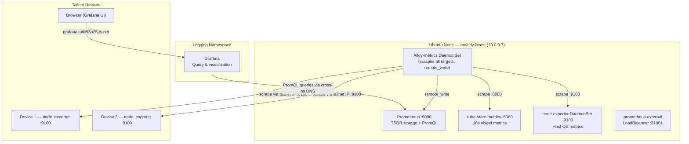

# Homelab Metrics (Prometheus + Alloy + Grafana)

> All scripts and manifests will live in `~/src/home_infra/metrics/`

## Status
- [x] Deploy stack: `./install.sh`
- [x] All 36 validation tests passing
- [x] Confirm in-cluster metrics flowing (Alloy → Prometheus)
- [x] Grafana accessible with Prometheus datasource connected
- [x] Prometheus exposed on LAN as `http://10.0.0.7:31901`
- [ ] Prometheus exposed on tailnet as `https://prometheus.tailc98a25.ts.net` — run `tailscale/apply.sh`, then approve at login.tailscale.com/admin/machines
- [ ] Install node_exporter on remote tailnet devices
- [x] Validate teardown/reinstall reproducibility (6 cycles, 0 failures) — see [[Teardown Reinstall Validation]]
- [x] Validate metric persistence across non-destructive teardown/reinstall
- [ ] Build first metrics dashboard

---

## Stack

| Component | Role | Helm Chart | Notes |
|---|---|---|---|
| **Prometheus** | Metrics storage + PromQL engine | prometheus-community/prometheus | Single-server mode, filesystem TSDB |
| **Grafana Alloy** | Metrics scraper (k8s + remote devices) | grafana/alloy | Separate release `alloy-metrics` in metrics namespace |
| **kube-state-metrics** | K8s object metrics (pods, deployments, nodes) | prometheus-community/kube-state-metrics | Standalone (not Prometheus subchart) |
| **node_exporter** | Host hardware & OS metrics | prometheus-community/prometheus-node-exporter | DaemonSet in k8s; systemd service on remote devices |
| **Grafana** | Dashboards & PromQL UI | Already deployed in `logging` ns | Add Prometheus as cross-namespace datasource |

> Chart versions will be pinned at implementation time via `helm search repo`. All subcharts in the Prometheus chart (alertmanager, kube-state-metrics, node-exporter, pushgateway) are disabled; components are deployed as independent Helm releases for version control.

---

## Architecture



### Data Flow

1. **Alloy-metrics** (DaemonSet in `metrics` ns) scrapes all targets:
   - In-cluster: node-exporter, kube-state-metrics, kubelet, cAdvisor
   - Remote: node_exporter on tailnet devices (via tailnet IP)
2. Alloy does `remote_write` to Prometheus server
3. Prometheus stores metrics in TSDB (PVC-backed)
4. Grafana queries Prometheus via cross-namespace DNS (`prometheus-server.metrics.svc.cluster.local:80`)

**Why Alloy as scraper (not Prometheus built-in scrape):** Unifies the collection layer with the logging stack. Alloy handles discovery, relabeling, and remote device scraping centrally. Prometheus acts purely as storage + query engine.

---

## Namespace & Port Allocation

| Service | Type | Port | Purpose |
|---|---|---|---|
| prometheus-external | LoadBalancer | 31901 | LAN access to Prometheus |
| prometheus-tailscale | NodePort | 32302 | Tailscale serve endpoint |
| node_exporter | DaemonSet / systemd | 9100 | Standard node_exporter port |
| kube-state-metrics | ClusterIP | 8080 | Internal only (scraped by Alloy) |

**Tailscale service:** `svc:prometheus` at `https://prometheus.tailc98a25.ts.net` via `127.0.0.1:32302`

> Ports chosen to avoid conflict with logging: 31900 (loki-external), 32300 (grafana-tailscale), 32301 (loki-tailscale).

---

## Accessing Prometheus

**Option A — Tailscale (recommended)**

Open: `https://prometheus.tailc98a25.ts.net`

**Option B — LAN**

`http://10.0.0.7:31901`

**Option C — Port forward (no setup needed)**
```bash
kubectl port-forward svc/prometheus-server 9090:80 -n metrics
```
Then open: `http://localhost:9090`

---

## Grafana Integration

Reuses the existing Grafana in the `logging` namespace — no separate Grafana deployment.

- `install.sh` adds a "Prometheus" datasource via the Grafana HTTP API
- Datasource URL: `http://prometheus-server.metrics.svc.cluster.local:80`
- Idempotent: checks if datasource exists before creating, updates if URL changed

**PromQL Query Examples:**
```promql
# CPU usage per pod
rate(container_cpu_usage_seconds_total[5m])

# Memory usage per node
node_memory_MemTotal_bytes - node_memory_MemAvailable_bytes

# All k8s pods
kube_pod_info

# Check scrape targets are up
up

# Disk usage on host
node_filesystem_avail_bytes{mountpoint="/"}
```

---

## Deploy / Teardown

```bash
cd ~/src/home_infra/metrics

# Install
./install.sh

# Install with custom options
./install.sh --prometheus-storage-size 20Gi --retention 30d

# Run tests standalone
./test.sh

# Tear down (keeps PVC data)
./uninstall.sh

# Tear down completely (deletes all data)
./uninstall.sh --delete-data --delete-namespace --force
```

---

## Adding a Remote Device

Install node_exporter on any Linux device on the tailnet:

```bash
scp ~/src/home_infra/metrics/scripts/install-metrics-agent.sh user@<device>:~/
ssh user@<device> sudo bash install-metrics-agent.sh [--hostname <name>]
```

| Flag | Default | Description |
|---|---|---|
| `--hostname` | system hostname | Label applied to metrics from this device |
| `--listen-address` | `:9100` | Address node_exporter listens on |
| `--version` | pinned | node_exporter version to install |

After installing, add the device's tailnet IP to the Alloy scrape targets in `manifests/alloy-metrics-config.yaml` and re-run `./install.sh` (the configChecksum annotation triggers an Alloy pod restart).

To remove node_exporter from a remote device:
```bash
scp ~/src/home_infra/metrics/scripts/uninstall-metrics-agent.sh user@<device>:~/
ssh user@<device> sudo bash uninstall-metrics-agent.sh
```

---

## Repo Layout

```
home_infra/metrics/
├── install.sh                              # Deploy full stack (runs tests on completion)
├── uninstall.sh                            # Tear down (--delete-data --delete-namespace --force)
├── test.sh                                 # 37+ validation tests
├── manifests/
│   ├── prometheus-values.yaml              # Prometheus Helm values (single-server, TSDB)
│   ├── alloy-metrics-config.yaml           # Alloy ConfigMap (scrape + remote_write pipelines)
│   ├── alloy-metrics-values.yaml           # Alloy Helm values (DaemonSet)
│   ├── kube-state-metrics-values.yaml      # kube-state-metrics Helm values
│   ├── node-exporter-values.yaml           # node_exporter DaemonSet Helm values
│   ├── prometheus-nodeport.yaml            # prometheus-external LoadBalancer (:31901)
│   └── prometheus-tailscale-nodeport.yaml  # Prometheus NodePort for tailscale serve (:32302)
└── scripts/
    ├── install-metrics-agent.sh            # Install node_exporter on a remote device
    └── uninstall-metrics-agent.sh          # Remove node_exporter from a remote device
```

---

## Test Suite (37+ tests)

| Category | Count | What's Validated |
|---|---|---|
| **K8s Resources** | 6 | Namespace, PVC bound, ConfigMap, prometheus-external service, ServiceAccount, ClusterRoleBinding |
| **Helm Versions** | 4 | prometheus, alloy-metrics, kube-state-metrics, node-exporter pinned versions |
| **Prometheus** | 4 | Pod ready, /-/ready, TSDB status, write+query round-trip |
| **Alloy** | 3 | DaemonSet N/N ready, containers ready, /-/ready |
| **kube-state-metrics** | 3 | Pod ready, /metrics endpoint, kube_pod_info in Prometheus |
| **node_exporter** | 3 | DaemonSet N/N ready, /metrics endpoint, node_cpu_seconds_total in Prometheus |
| **Metrics Pipeline** | 4 | Scrape targets up (KSM, node_exporter, kubelet/cAdvisor), up{} target count |
| **Grafana** | 4 | Datasource configured, URL correct, datasource reachable, PromQL returns data |
| **Networking** | 3 | LoadBalancer IP assigned, endpoint healthy, LAN query via external IP:31901 |
| **Tailscale** | 3 | svc:prometheus registered, endpoint correct, NodePort reachable |

```bash
./test.sh                    # Run 34 tests (namespace metrics, port 31901)
sudo ./test.sh               # Run 37 tests (adds Tailscale config checks)
```

---

## Teardown / Reinstall Validation Plan

### Destructive (3 cycles)
```bash
./uninstall.sh --delete-data --delete-namespace --force
# Verify: namespace, PVCs, clusterrole, clusterrolebinding all gone
./install.sh
./test.sh  # All tests pass
```

### Non-destructive (3 cycles)
```bash
./uninstall.sh --force
# Verify: PVC prometheus-server preserved and Bound
./install.sh
./test.sh  # All tests pass
# Verify: historical metrics survived (query for data older than reinstall)
```

---

## Prerequisites (before autonomous execution)

1. **Tailscale service approval:** After install creates `svc:prometheus`, approve at `login.tailscale.com/admin/machines` (one-time, cannot be automated)
2. **Remote device access:** Provide list of tailnet devices to monitor (hostnames/IPs) and SSH access for installing node_exporter
3. **Nothing else** — all helm repos, namespaces, and k8s resources are created by the scripts

---

## Possible Enhancements

| Enhancement | Priority | Notes |
|---|---|---|
| Install node_exporter on tailnet devices | High | Scripts will exist, just needs deployment per device |
| Build Grafana metrics dashboards | Medium | Node overview, k8s cluster, per-pod resource usage |
| Alerting rules | Medium | Alertmanager not deployed yet; add when alerting project starts |
| Metric retention tuning | Low | Default 15d; adjust based on disk usage over time |
| Recording rules | Low | Pre-compute expensive PromQL queries for dashboard performance |
| Remote device Alloy push (alternative to pull) | Low | For devices behind NAT or with unstable tailnet; extend existing Alloy agent config |
