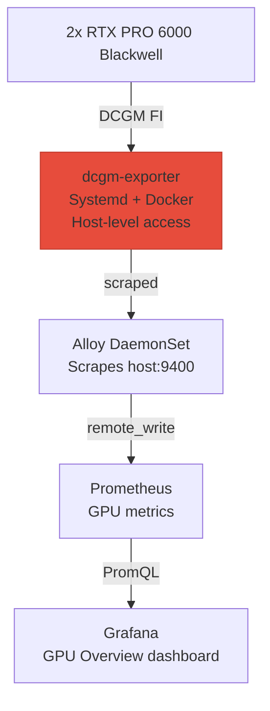
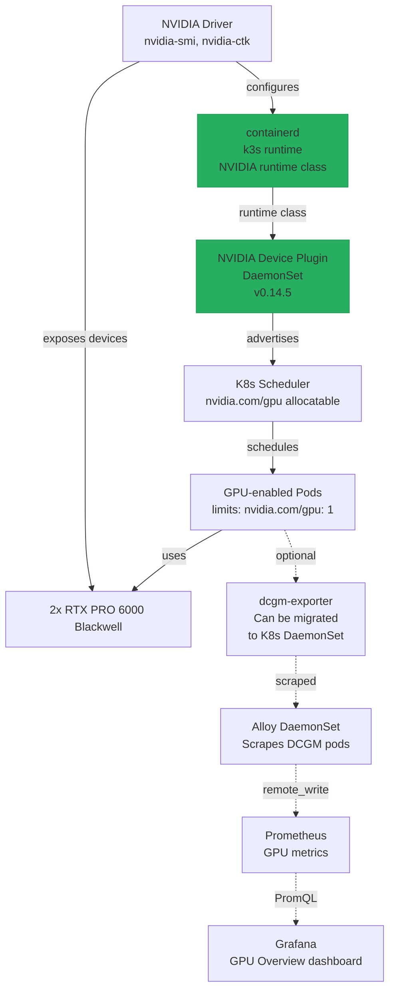

# NVIDIA Device Plugin for k3s

> Scripts and manifests: `~/src/home_infra/k8s-nvidia-device-plugin/`  
> Enables Kubernetes-native GPU scheduling with `nvidia.com/gpu` resource requests  
> Complements [[GPU Monitoring]] (DCGM exporter) — device plugin enables scheduling, DCGM enables metrics

## Status

- [ ] Research k3s/containerd NVIDIA runtime integration
- [ ] Configure containerd with NVIDIA runtime class
- [ ] Deploy NVIDIA Device Plugin DaemonSet via Helm
- [ ] Validate GPU resource allocatable (`kubectl describe node`)
- [ ] Smoke test GPU pods with CUDA image
- [ ] Update [[GPU Monitoring]] to use K8s-native DCGM exporter (optional future enhancement)
- [ ] Document GPU workload examples (training, inference, rendering)

---

## Architecture

### Current Setup: Host-Based Monitoring Only



**Limitation**: Kubernetes cannot schedule GPU workloads. DCGM exporter runs at host level — no `nvidia.com/gpu` scheduler awareness.

### Target Setup: Native K8s GPU Support



**Benefits**:
- Kubernetes can schedule GPU workloads with `resources.limits.nvidia.com/gpu: 1`
- GPU pods can run DCGM exporter natively (no host systemd service)
- Multi-tenant GPU access with proper isolation
- Standard K8s GPU workflow compatible with Argo Workflows, Kubeflow, etc.

---

## Prerequisites

### 1. NVIDIA Drivers (already installed)

```bash
nvidia-smi
# Should show both RTX PRO 6000 GPUs
```

### 2. NVIDIA Container Toolkit (already installed)

```bash
nvidia-ctk --version
# Should be installed system-wide
```

### 3. Docker NVIDIA Runtime (already configured)

```bash
sudo docker info 2>/dev/null | grep -q "nvidia"
# GPU Monitoring project configured this
```

### 4. containerd NVIDIA Runtime (TO BE CONFIGURED)

**Critical**: k3s uses containerd, not Docker. Need to configure NVIDIA runtime in containerd config.

```bash
# Check current containerd config (k3s-managed)
sudo cat /var/lib/rancher/k3s/agent/etc/containerd/config.toml | grep -A5 "nvidia"
```

If empty or missing, must add NVIDIA runtime configuration before device plugin will work.

---

## containerd Configuration

### Option A: k3s Drop-in Config (Recommended)

k3s manages `/var/lib/rancher/k3s/agent/etc/containerd/config.toml` directly, so use a drop-in config:

```bash
# Create drop-in directory
sudo mkdir -p /var/lib/rancher/k3s/agent/etc/containerd/
sudo nano /var/lib/rancher/k3s/agent/etc/containerd/nvidia-runtime.toml
```

**Add NVIDIA runtime configuration** (content TBD — research required):

```toml
[plugins."io.containerd.runtime.v1.linux".runtimes.nvidia]
runtime_type = "io.containerd.runc.v2"
runtime_engine = ""
runtime_root = ""
[plugins."io.containerd.runtime.v1.linux".runtimes.nvidia.options]
BinaryName = ""
ContainerdPath = ""
Debug = false
Experimental = false
NoNewKeyring = false
OomScoreAdj = -999
Privileged = true
ReadOnly = false
SystemdCgroup = false
```

Then restart k3s:

```bash
sudo systemctl restart k3s
```

### Option B: k3s Environment Variable

Set `ENV` in `/etc/systemd/system/k3s.service.d/env.conf`:

```bash
K3S_CONTAINERD_CONFIG_PATH=/etc/containerd/config.toml
```

Then create full containerd config with NVIDIA runtime (more complex, overrides k3s defaults).

### Option C: Verify nvidia-ctk Already Configured containerd

```bash
# nvidia-ctk may have already configured containerd during GPU Monitoring setup
nvidia-ctk runtime configure --runtime=containerd
# Check if this was already done
```

---

## Deployment

### 1. Deploy NVIDIA Device Plugin

**Option A: Helm Chart (Recommended)**

```bash
cd ~/src/home_infra/k8s-nvidia-device-plugin

helm repo add nvdp https://nvidia.github.io/k8s-device-plugin
helm repo update

helm install nvidia-device-plugin nvdp/nvidia-device-plugin \
  --namespace kube-system \
  --set failOnInitError=false \
  --set config.detect.deviceListStrategy=envvar \
  --version 0.14.5
```

**Option B: Manifest Directly**

```bash
kubectl create -f https://raw.githubusercontent.com/NVIDIA/k8s-device-plugin/v0.14.5/nvidia-device-plugin.yml
```

**Why `failOnInitError=false`**: Home lab nodes may have race conditions between driver init and plugin startup on boot. Allows plugin to retry instead of crash-looping.

### 2. Verify Installation

```bash
# Check device plugin pods are running
kubectl get pods -n kube-system | grep nvidia-device-plugin

# Verify node has GPU allocatable resources
kubectl describe node melody-beast | grep -A10 Allocatable
# Should show: nvidia.com/gpu: 2

# Check device plugin logs
kubectl logs -n kube-system -l app=nvidia-device-plugin --tail 20
```

---

## Validation

### 1. Smoke Test: Run GPU Pod

```bash
# Deploy a test container that uses NVIDIA CUDA
kubectl run gpu-test \
  --namespace default \
  --image=nvidia/cuda:12.0-base-ubuntu22.04 \
  --restart=Never \
  --resources=limits=nvidia.com/gpu=1 \
  -- nvidia-smi

# Wait for pod to complete
kubectl wait --for=condition=complete pod/gpu-test --timeout=120s

# Check output
kubectl logs gpu-test
# Should show nvidia-smi output with one GPU visible
```

### 2. Test GPU Isolation

```bash
# Deploy two pods, each requesting one GPU
kubectl run gpu-test-0 --image=nvidia/cuda:12.0-base-ubuntu22.04 \
  --restart=Never --resources=limits=nvidia.com/gpu=1 -- nvidia-smi -L &
kubectl run gpu-test-1 --image=nvidia/cuda:12.0-base-ubuntu22.04 \
  --restart=Never --resources=limits=nvidia.com/gpu=1 -- nvidia-smi -L

# Each pod should see a different GPU
kubectl logs gpu-test-0
kubectl logs gpu-test-1
```

### 3. Test GPU Workload (Optional)

```bash
# Run a simple CUDA benchmark
kubectl run cuda-benchmark \
  --image=nvidia/samples:cupti-sample-banding-cuda12.0.0-ubuntu22.04 \
  --restart=Never \
  --resources=limits=nvidia.com/gpu=1
```

---

## Teardown

### Remove Device Plugin

```bash
# Via Helm
helm uninstall nvidia-device-plugin -n kube-system

# Via manifest
kubectl delete -f https://raw.githubusercontent.com/NVIDIA/k8s-device-plugin/v0.14.5/nvidia-device-plugin.yml
```

### Revert containerd Changes (if applied)

```bash
# If drop-in config was added
sudo rm /var/lib/rancher/k3s/agent/etc/containerd/nvidia-runtime.toml
sudo systemctl restart k3s
```

---

## Integration with GPU Monitoring

**After device plugin is working**, consider migrating DCGM exporter to a K8s-native approach:

### Current (Host-Based)

```
/etc/systemd/system/dcgm-exporter.service
  └─ docker run --runtime=nvidia --gpus all
```

### Future (K8s-Based)

```yaml
apiVersion: v1
kind: Pod
metadata:
  name: dcgm-exporter
spec:
  containers:
  - name: dcgm-exporter
    image: nvcr.io/nvidia/k8s/dcgm-exporter:4.2.3-4.1.3-ubuntu22.04
    resources:
      limits:
        nvidia.com/gpu: 1  # <-- Native GPU scheduling
```

**Benefits**:
- Single deployment model (all in K8s)
- Better integration with K8s lifecycle management
- Can deploy one DCGM exporter per GPU for granular metrics

---

## Use Cases

### 1. ML Training Workloads

```yaml
apiVersion: v1
kind: Pod
metadata:
  name: pytorch-training
spec:
  containers:
  - name: trainer
    image: pytorch/pytorch:2.0.0-cuda11.7-cudnn8-runtime
    resources:
      limits:
        nvidia.com/gpu: 1
    command: ["python", "training_script.py"]
```

### 2. GPU Rendering (Blender, etc.)

```yaml
apiVersion: v1
kind: Pod
metadata:
  name: blender-render
spec:
  containers:
  - name: blender
    image: blenderfoundation/blender:latest
    resources:
      limits:
        nvidia.com/gpu: 1
```

### 3. AI Inference Server

```yaml
apiVersion: v1
kind: Pod
metadata:
  name: tensorrt-inference
spec:
  containers:
  - name: inference
    image: nvcr.io/nvidia/tensorrt:23.04-py3
    resources:
      limits:
        nvidia.com/gpu: 1
```

---

## Troubleshooting

### Device Plugin Pod CrashLoopBackOff

```bash
# Check logs
kubectl logs -n kube-system -l app=nvidia-device-plugin --previous

# Common causes:
# - containerd not configured with NVIDIA runtime
# - NVIDIA drivers not loaded
# - GPU not visible to containerd
```

### No `nvidia.com/gpu` in Node Allocatable

```bash
# Verify device plugin is running
kubectl get pods -n kube-system -o wide | grep nvidia-device-plugin

# Check node labels
kubectl describe node melody-beast | grep -A20 "Capacity"
kubectl describe node melody-beast | grep -A20 "Allocatable"

# Device plugin should advertise nvidia.com/gpu: 2
```

### GPU Pod Stays in Pending

```bash
# Check events
kubectl describe pod <gpu-pod>

# Likely causes:
# - Insufficient nvidia.com/gpu resource (all GPUs in use)
# - Node taints/not ready
# - Device plugin not advertising GPUs
```

### nvidia-smi Shows No GPUs Inside Container

```bash
# Check container runtime
kubectl get pod <gpu-pod> -o jsonpath='{.spec.runtimeClassName}'
# Should be: nvidia (if using runtime class)

# Verify container can access /dev/nvidia*
kubectl exec <gpu-pod> -- ls -la /dev/nvidia*
# Should show /dev/nvidia0, /dev/nvidia1, etc.

# If missing, containerd NVIDIA runtime not configured correctly
```

---

## Testing & Validation Plan

Following the same rigorous testing as other homelab projects:

### Test Categories

| Category | Tests | What's Validated |
|----------|-------|-----------------|
| **Prerequisites** | 4 | nvidia-smi works, nvidia-ctk installed, containerd config, k3s cluster |
| **Device Plugin** | 4 | DaemonSet deployed, pods ready, node allocatable shows GPUs, no errors in logs |
| **GPU Scheduling** | 4 | Pod with GPU request schedules, nvidia-smi works inside pod, GPU isolation between pods, cleanup |
| **Integration** | 2 | DCGM exporter still works, metrics flow to Prometheus |
| **Workload Tests** | 2 | CUDA sample runs, multi-GPU scheduling |

**Total**: 16 tests minimum

### Validation Commands

```bash
./test.sh                    # Run all validation tests
./test.sh --quick            # Run prerequisite + device plugin tests only
./test.sh --smoke-test       # Test single GPU pod deployment
```

---

## Repo Layout

```
home_infra/k8s-nvidia-device-plugin/
├── install.sh                      # Deploy device plugin + configure containerd
│                                   #   --skip-containerd-config (if already configured)
│                                   #   --helm-chart-version (default: 0.14.5)
├── uninstall.sh                    # Remove device plugin (keeps containerd config)
│                                   #   --revert-containerd (also remove containerd changes)
├── test.sh                         # 16+ validation tests
│                                   #   --quick (prerequisites only)
│                                   #   --smoke-test (single GPU pod test)
├── manifests/
│   ├── nvidia-device-plugin-values.yaml  # Helm values customization
│   └── containerd-nvidia-runtime.toml    # containerd drop-in config
└── examples/
    ├── gpu-test-pod.yaml             # Simple GPU test pod
    ├── pytorch-training.yaml         # ML training example
    └── tensorrt-inference.yaml       # AI inference example
```

---

## See Also

- [[GPU Monitoring]] — DCGM exporter for GPU metrics (can coexist or be migrated)
- [[Metrics]] — Prometheus + Grafana stack for monitoring
- [[Logging]] — Centralized logging for GPU workloads
- [NVIDIA Device Plugin Documentation](https://github.com/NVIDIA/k8s-device-plugin)
- [NVIDIA Container Toolkit](https://docs.nvidia.com/datacenter/cloud-native/container-toolkit/install-guide.html)
