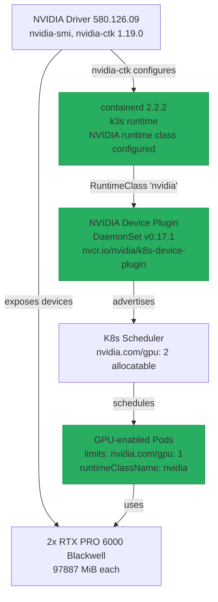

# NVIDIA Device Plugin for k3s

> Scripts and manifests: `~/src/home_infra/k8s-nvidia-device-plugin/`  
> Enables Kubernetes-native GPU scheduling with `nvidia.com/gpu` resource requests  
> Complements [[GPU Monitoring]] (DCGM exporter) — device plugin enables scheduling, DCGM enables metrics

## Status

- [x] Research k3s/containerd NVIDIA runtime integration
- [x] Configure containerd with NVIDIA runtime class
- [x] Deploy NVIDIA Device Plugin DaemonSet via Helm
- [x] Validate GPU resource allocatable (`kubectl describe node`)
- [x] Smoke test GPU pods with CUDA image
- [x] GPU isolation test (2 pods → 2 distinct GPUs confirmed by UUID)
- [ ] Update [[GPU Monitoring]] to use K8s-native DCGM exporter (optional future enhancement)
- [ ] Document GPU workload examples (training, inference, rendering)

---

## Architecture



---

## Prerequisites

All already satisfied on `melody-beast`:

| Prerequisite | Check | Notes |
|---|---|---|
| NVIDIA drivers | `nvidia-smi` shows 2x RTX PRO 6000 | Driver 580.126.09 |
| nvidia-ctk | `nvidia-ctk --version` | v1.19.0 |
| Docker service | `systemctl is-active docker` | Running |
| k3s | `systemctl is-active k3s` | Running |
| kubectl | `kubectl cluster-info` | k3s-bundled v1.34.6 |
| Helm | `helm version` | v3.20.1 |
| containerd NVIDIA runtime | `sudo grep nvidia /var/lib/rancher/k3s/agent/etc/containerd/config.toml` | Already configured by nvidia-ctk |

---

## containerd Configuration

k3s on this machine uses containerd 2.2.2, which uses the **v2 CRI plugin path**.  
nvidia-ctk has already written the runtime config into config.toml:

```toml
[plugins.'io.containerd.cri.v1.runtime'.containerd.runtimes.'nvidia']
  runtime_type = "io.containerd.runc.v2"
[plugins.'io.containerd.cri.v1.runtime'.containerd.runtimes.'nvidia'.options]
  BinaryName = "/usr/bin/nvidia-container-runtime"
```

> **Important**: The plugin path is `io.containerd.cri.v1.runtime` — NOT the old `io.containerd.runtime.v1.linux` or `io.containerd.grpc.v1.cri`. k3s + containerd 2.x uses this path. The drop-in file in `manifests/containerd-nvidia-runtime.toml` is a reference but is not applied — nvidia-ctk writes directly to config.toml.

The install script checks for this with `sudo grep` (config.toml is root-owned).

---

## Node Labeling Requirement

The v0.17.1 Helm chart sets a `nodeAffinity` that requires **one of**:

- `feature.node.kubernetes.io/pci-10de.present: "true"` — set by Node Feature Discovery (NFD)
- `feature.node.kubernetes.io/cpu-model.vendor_id: NVIDIA` — set by NFD
- `nvidia.com/gpu.present: "true"` — set manually or by GPU Operator

NFD is **not installed** in this cluster. `install.sh` sets the label manually:

```bash
kubectl label node melody-beast nvidia.com/gpu.present=true --overwrite
```

Without this label, `desiredNumberScheduled: 0` — the DaemonSet creates zero pods and `helm upgrade --install --wait` returns success vacuously (0/0 = ready). This is silent and hard to diagnose without checking the DaemonSet directly.

---

## Deployment

### One-shot install

```bash
cd ~/src/home_infra/k8s-nvidia-device-plugin
sudo ./setup-permissions.sh   # one-time: sudoers + Claude Code settings
./install.sh 2>&1 | tee install.log
```

### What install.sh does

1. Checks prerequisites (nvidia-smi, nvidia-ctk, docker, k3s, kubectl, helm)
2. Checks containerd config has nvidia (uses `sudo grep` — config.toml is root-owned)
3. Labels the node `nvidia.com/gpu.present=true`
4. Applies `manifests/nvidia-runtimeclass.yaml` (RuntimeClass `nvidia`)
5. `helm upgrade --install` with `--wait --timeout 120s`
6. Validates pods ready + node allocatable GPUs == 2
7. Smoke tests a GPU pod
8. Runs full `test.sh`

### Key Helm values (`manifests/nvidia-device-plugin-values.yaml`)

```yaml
image:
  repository: "nvcr.io/nvidia/k8s-device-plugin"   # NOT docker.io — moved to NGC
  tag: "v0.17.1"
  pullPolicy: "IfNotPresent"

failOnInitError: false      # allows retry on boot race conditions
runtimeClassName: "nvidia"  # device plugin pods use the nvidia OCI runtime
```

---

## Validation

### Run full test suite

```bash
cd ~/src/home_infra/k8s-nvidia-device-plugin
./test.sh
```

Expected output (23 tests including vLLM, 0 failures):

```
  ── Prerequisites ──
    ✓ nvidia-smi available and functional
    ✓ GPU count: 2 (expected 2)
    ✓ nvidia-ctk available
    ✓ Docker active
    ✓ k3s active
    ✓ Kubernetes reachable
    ✓ Helm available
    ✓ containerd configured with NVIDIA runtime

  ── Device Plugin ──
    ✓ Helm release 'nvidia-device-plugin' installed
    ✓ RuntimeClass 'nvidia' exists
    ✓ Device plugin pods ready: 1/1
    ✓ Device plugin logs clean
    ✓ Device plugin reports successful GPU registration
    ✓ Node allocatable GPUs: 2 (expected 2)

  ── GPU Scheduling ──
    ✓ GPU pod scheduled and completed
    ✓ GPU detected in container
    ✓ nvidia-smi works in container

  ── GPU Isolation ──
    ✓ Both GPU pods completed
    ✓ Each pod got a distinct GPU (different UUIDs confirmed)

  ── Integration with GPU Monitoring ──
    ✓ DCGM exporter still running
    ✓ DCGM metrics endpoint responding

  ── vLLM Inference ──
    ✓ vLLM server ready (model loaded)
    ✓ vLLM inference returned a completion ("text":" blue.\nI'm not sure if")

  Results: 23 passed, 0 failed, 0 warnings
```

Skip vLLM (e.g. if image not yet pulled and you need a fast check):

```bash
./test.sh --skip-vllm
```

Override the model (default: `facebook/opt-125m`):

```bash
./test.sh --vllm-model Qwen/Qwen2.5-0.5B
```

**What the vLLM test does:**

1. Deploys `vllm/vllm-openai:latest` as a pod with `runtimeClassName: nvidia` and `nvidia.com/gpu: 1`; `--max-model-len 512` and `--gpu-memory-utilization 0.3` keep memory footprint minimal (other processes like DCGM consume ~41 GiB on GPU 0; default utilization of 0.9 would try to claim 85 GiB and fail)
2. Waits up to 10 min for pod to reach `Running` (covers image pull on first run)
3. Polls pod logs for `Application startup complete` — the definitive signal that the model is loaded and the server is accepting requests (up to 5 min)
4. Runs `POST /v1/completions` via `kubectl exec` inside the pod (avoids port-forward, which dies immediately if nothing is listening on the port yet)
5. Passes if the response contains `"text"`; prints the generated tokens
6. Cleans up the pod on exit regardless of outcome

> **Why `kubectl exec` instead of port-forward**: `kubectl port-forward` connects once at startup — if vLLM hasn't bound the port yet it exits immediately and doesn't retry. `kubectl exec` runs in the container's own network namespace where `localhost:8000` is always correct once the server is up.

> **Why `facebook/opt-125m`**: 125 M parameters, ~250 MB download, loads in seconds on GPU. Small enough to be a reliable smoke test without burning time or VRAM.

### GPU pod spec — required fields

Test pods and any GPU workload must specify **both**:

```bash
# kubectl run (for quick tests)
kubectl run gpu-test --namespace default \
  --image=nvidia/cuda:12.8.1-base-ubuntu22.04 --restart=Never \
  --overrides='{"spec":{"runtimeClassName":"nvidia","containers":[{"name":"gpu-test","image":"nvidia/cuda:12.8.1-base-ubuntu22.04","command":["nvidia-smi"],"resources":{"limits":{"nvidia.com/gpu":"1"}}}]}}'
```

```yaml
# Pod/Deployment manifest
spec:
  runtimeClassName: nvidia          # must be set — uses nvidia-container-runtime
  containers:
  - name: my-gpu-app
    image: ...
    resources:
      limits:
        nvidia.com/gpu: "1"         # allocates one GPU
```

> **Why runtimeClassName is required**: containerd has nvidia configured as a *named* runtime, not the default. Without `runtimeClassName: nvidia`, the pod uses plain runc, which does not inject GPU devices or nvidia-smi from the host. The `base` CUDA image does not include nvidia-smi — it is injected by nvidia-container-runtime from the host driver.

> **Why kubectl `--limits` / `--resources` flags don't work**: kubectl v1.34.6 (k3s-bundled) has removed these flags from `kubectl run`. Use `--overrides` with the full container spec JSON instead.

---

## Teardown

```bash
cd ~/src/home_infra/k8s-nvidia-device-plugin
./uninstall.sh

# To also revert containerd config:
./uninstall.sh --revert-containerd
```

Teardown removes: Helm release, RuntimeClass, device plugin pods.  
Does NOT remove: node label `nvidia.com/gpu.present=true` (hardware fact, safe to keep), containerd config (unless `--revert-containerd`).

---

## Diagnosis

```bash
./diag.sh 2>&1
```

Captures: driver state, services, containerd config, k3s cluster, RuntimeClass, Helm release, device plugin pods + logs (last 30 lines), node GPU capacity/allocatable, recent warning events, any leftover gpu-test pods.

---

## Troubleshooting

### DaemonSet shows `desiredNumberScheduled: 0`

```bash
kubectl get daemonset nvidia-device-plugin -n kube-system
# status.desiredNumberScheduled: 0
```

**Cause**: Node missing `nvidia.com/gpu.present=true` label — chart v0.17.1 requires it (or NFD labels).  
**Fix**: `kubectl label node melody-beast nvidia.com/gpu.present=true --overwrite`

### `ErrImagePull` on device plugin pod

```
Failed to pull image "docker.io/nvidia/k8s-device-plugin:v0.17.1": not found
```

**Cause**: NVIDIA moved to `nvcr.io` — `docker.io/nvidia/k8s-device-plugin` doesn't have v0.17.1.  
**Fix**: `image.repository: "nvcr.io/nvidia/k8s-device-plugin"` in values.yaml.

### GPU pod `nvidia-smi: command not found`

```
OCI runtime create failed: exec: "nvidia-smi": executable file not found in $PATH
```

**Cause**: Pod using default runc instead of nvidia-container-runtime. CUDA `base` image doesn't include nvidia-smi — it must be injected by the nvidia OCI runtime from the host.  
**Fix**: Add `runtimeClassName: nvidia` to the pod spec.

### GPU pod stays `Pending`

```bash
kubectl describe pod <gpu-pod>
# Events: 0/1 nodes have sufficient nvidia.com/gpu
```

**Cause A**: Device plugin not running — check `kubectl get pods -n kube-system -l app.kubernetes.io/name=nvidia-device-plugin`.  
**Cause B**: Race condition — plugin just started, `nvidia.com/gpu` not yet in allocatable. Wait 10–15s.  
**Fix**: Verify `kubectl describe node melody-beast | grep nvidia.com/gpu` shows `2`.

### `configure_containerd` shows "Could not auto-configure"

**Cause**: `nvidia-ctk runtime configure` needs write access to config.toml (root-owned). But config.toml likely already has nvidia configured from a prior run.  
**Check**: `sudo grep nvidia /var/lib/rancher/k3s/agent/etc/containerd/config.toml`  
**Action**: If nvidia is present, pass `--skip-containerd-config` to install.sh. The warning is benign.

### `grep -c` syntax error in scripts

```
[[: 0\n0: syntax error in expression
```

**Cause**: `grep -c` exits 1 with 0 matches → `|| echo "0"` fires → variable gets `"0\n0"`.  
**Fix**: Use `{ grep -c ... || true; }` with `${var:-0}`.

### Device plugin pods not ready immediately after `helm --wait`

```
✘ Device plugin pods not ready (0/1)
```

**Cause**: `helm upgrade --install --wait` returns once the DaemonSet object is created, but the pod may still be scheduling or starting. `validate_device_plugin()` checking pod readiness immediately after can see 0/1 before the pod is Ready.  
**Fix**: Both `install.sh` and `test.sh` now poll pod readiness with a 60-second retry loop (5-second intervals) rather than a one-shot check.

### `nvidia.com/gpu` not in node allocatable immediately after pod becomes Ready

```
✗ Node doesn't advertise nvidia.com/gpu resources — device plugin may not have discovered GPUs
```

**Cause**: The device plugin registers with kubelet via gRPC *after* the pod becomes Ready. Kubelet then updates node Allocatable resources — this propagation takes 10–30 seconds. One-shot checks during this window always fail.  
**Fix**: Both `install.sh` and `test.sh` now poll `kubectl describe node` for `nvidia.com/gpu` with a 60-second retry loop before failing.

### vLLM `Engine core initialization failed` — GPU memory

```
RuntimeError: Engine core initialization failed. See root cause above. Failed core proc(s): {}
ValueError: Free memory on device cuda:0 (53.76/94.97 GiB) is less than desired GPU memory utilization (0.9, 85.47 GiB)
```

**Cause**: vLLM defaults to `--gpu-memory-utilization 0.9`, reserving 90% of GPU VRAM for the KV cache. On this machine, DCGM and other processes consume ~41 GiB on GPU 0, leaving ~54 GiB free. 90% of 97 GiB (~85 GiB) exceeds available memory.  
**Fix**: The vLLM test pod args include `--gpu-memory-utilization 0.3`, reserving only ~28 GiB — well within free memory and more than enough for `facebook/opt-125m` (0.24 GiB model weights).

---

## Versions

| Component | Version | Notes |
|---|---|---|
| Helm chart | `0.17.1` | Latest stable as of 2026-04-13 |
| Device plugin image | `nvcr.io/nvidia/k8s-device-plugin:v0.17.1` | nvcr.io (not docker.io) |
| CUDA test image | `nvidia/cuda:12.8.1-base-ubuntu22.04` | Latest 12.x patch; Blackwell requires 12.6+ |
| nvidia-ctk | `1.19.0` | Installed on host |
| NVIDIA driver | `580.126.09` | Installed on host |

---

## Repo Layout

```
home_infra/k8s-nvidia-device-plugin/
├── install.sh                      # Full install: containerd check, node label, RuntimeClass, Helm, smoke test
│                                   #   --skip-containerd-config  (skip containerd check)
│                                   #   --helm-chart-version 0.17.1
├── uninstall.sh                    # Removes Helm release + RuntimeClass
│                                   #   --revert-containerd  (also removes containerd nvidia config + restarts k3s)
├── test.sh                         # 23 validation tests across 6 sections (vLLM included by default)
│                                   #   --smoke-test        (GPU scheduling only, skip prerequisites + device plugin)
│                                   #   --gpu-count N       (default 2)
│                                   #   --skip-vllm         (skip vLLM inference test)
│                                   #   --vllm-model MODEL  (default: facebook/opt-125m)
├── diag.sh                         # Read-only snapshot of all state — share output for debugging
├── setup-permissions.sh            # One-time: sudoers drop-in + Claude Code settings.local.json
└── manifests/
    ├── nvidia-device-plugin-values.yaml  # Helm values (image, runtimeClassName, resources)
    ├── nvidia-runtimeclass.yaml          # RuntimeClass 'nvidia' → handler: nvidia
    └── containerd-nvidia-runtime.toml   # Reference config (not applied — nvidia-ctk writes config.toml directly)
```

---

## See Also

- [[GPU Monitoring]] — DCGM exporter for GPU metrics
- [[Metrics]] — Prometheus + Grafana stack
- [[Logging]] — Centralized logging
- [[Teardown Reinstall Validation]] — Test cycle results
- [NVIDIA Device Plugin GitHub](https://github.com/NVIDIA/k8s-device-plugin)
- [NVIDIA NGC: k8s-device-plugin](https://catalog.ngc.nvidia.com/orgs/nvidia/containers/k8s-device-plugin)
