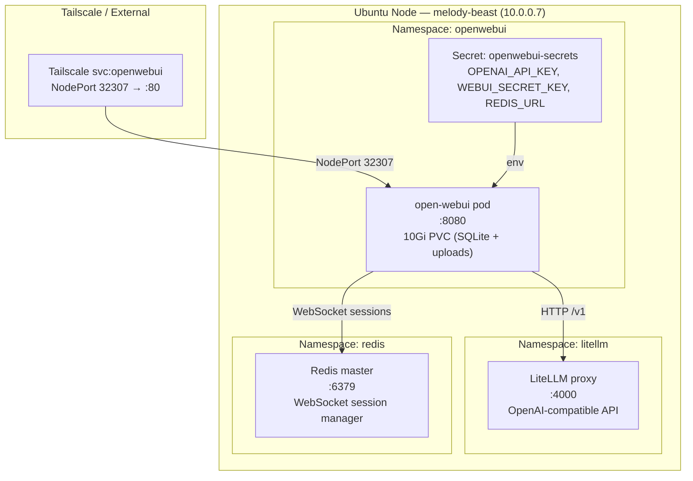

# Open WebUI

> All scripts and manifests live in `~/src/home_infra/openwebui/`

## Status

**Deployed 2026-05-17. Chart: `open-webui/open-webui` 14.5.0. App: 0.9.5.**

- [x] Deploy Open WebUI via Helm
- [x] Wire LiteLLM as OpenAI-compatible backend
- [x] Configure cluster Redis for WebSocket support
- [x] Expose on NodePort 32307
- [x] Register `openwebui.tailc98a25.ts.net` via Tailscale serve
- [ ] Validate teardown/reinstall reproducibility

---

## Stack

| Component | Role | Deploy Method | App Version |
|---|---|---|---|
| **Open WebUI** | Browser-based LLM chat UI | Helm `open-webui/open-webui` | 0.9.5 |
| **LiteLLM** | OpenAI-compatible API backend (pre-existing) | Pre-existing in-cluster | — |
| **Redis** | WebSocket session manager (pre-existing) | Pre-existing in-cluster | — |

Bundled Ollama, Pipelines, and Tika sub-charts are all disabled — Ollama is served via LiteLLM.

---

## Architecture



---

## Namespace & Port Allocation

| Service | Namespace | Type | Port | Purpose |
|---|---|---|---|---|
| open-webui | openwebui | NodePort 32307 | 80→8080 | Web UI (LAN + Tailscale) |

---

## Access

```bash
# Tailscale (preferred)
https://openwebui.tailc98a25.ts.net

# Port-forward (debugging)
kubectl port-forward svc/open-webui 8080:80 -n openwebui
# Open: http://localhost:8080
```

---

## Deploy / Teardown

```bash
cd ~/src/home_infra/openwebui

# Set required env vars (LiteLLM API key, JWT secret, Redis URL)
source env.sh

# Install (idempotent); runs tests on success
./install.sh

# Dry run
./install.sh --dry-run

# Diagnose (read-only)
./diag.sh

# Tear down (preserves PVC / chat history)
./uninstall.sh --force

# Full wipe including PVC
./uninstall.sh --delete-namespace --delete-data --force
```

---

## Repo Layout

```
home_infra/openwebui/
├── install.sh                        # Deploy Open WebUI; idempotent
├── uninstall.sh                      # Tear down; --delete-data wipes PVC
├── test.sh                           # Test suite
├── diag.sh                           # Read-only diagnostics
├── env.sh                            # Source to set required env vars
└── manifests/
    └── openwebui-values.yaml         # Helm values
```

---

## Key Configuration Notes

- **No bundled Ollama** — all model traffic goes through `http://litellm.litellm.svc.cluster.local:4000/v1`
- **WebSocket** — uses existing `redis-master.redis.svc.cluster.local:6379` instead of a dedicated Redis; avoids duplicate deployments
- **Persistence** — 10Gi PVC stores SQLite database (chat history, users, model config) and uploaded files
- **Auth** — WEBUI_SECRET_KEY signs JWT session tokens; stored in `openwebui-secrets` Secret

---

## See Also

- [[LiteLLM]] — API gateway that Open WebUI connects to
- [[Redis]] — WebSocket session backend
- [[Overview]] — Homelab service registry
