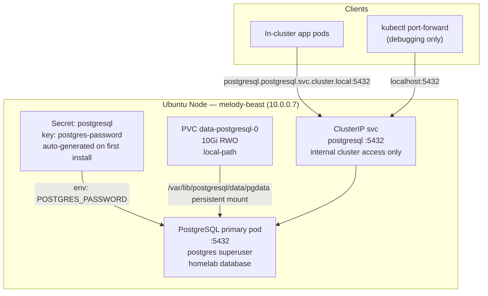

# Homelab PostgreSQL

> All scripts and manifests live in `~/src/home_infra/postgres/`

## Status

- [x] Deploy stack: `./install.sh`
- [x] All 32 Postgres core tests passing
- [x] Confirm write/read round-trip (INSERT → SELECT)
- [x] Confirm persistence across pod restart (data survives)
- [x] Validate teardown/reinstall reproducibility — 3 destructive cycles, 3 non-destructive cycles
- [ ] Postgres Metrics (exporter + Grafana dashboard) — future sub-project

---

## Stack

| Component | Role | Deploy Method | Image | App Version |
|---|---|---|---|---|
| **PostgreSQL** | Relational database | Raw kubectl manifests | `docker.io/library/postgres:17` | 17.x |

> Deployed via raw Kubernetes manifests (StatefulSet, ConfigMap, Services, Secret) — no Helm.
> Bitnami images became unavailable (paywall) in August 2025; official `postgres:17` Docker Hub image is used instead.
> Standalone mode (single primary, no replication, no HA) — appropriate for a single-node homelab.
> **In-cluster only**: PostgreSQL is exposed via ClusterIP only. No LoadBalancer, no NodePort, no Tailscale exposure.

---

## Architecture



### Data Flow

1. The **PostgreSQL pod** starts from the StatefulSet, reading the superuser password from the `postgresql` secret (key `postgres-password`)
2. On first boot, PostgreSQL creates the `homelab` database automatically (set via `POSTGRES_DB` env var)
3. Data is written to the PVC at `/var/lib/postgresql/data/pgdata` — this is the `PGDATA` directory (subdirectory avoids lost+found permission conflict), managed by PostgreSQL's WAL and checkpoint mechanism
4. The pod exposes port `5432` internally via two Services: `postgresql` (ClusterIP) and `postgresql-hl` (headless, for StatefulSet DNS)
5. **In-cluster access:** `postgresql.postgresql.svc.cluster.local:5432`
6. **Debug access (host):** `kubectl port-forward svc/postgresql 5432:5432 -n postgresql`

---

## PostgreSQL Configuration

### Resource Requests / Limits

| Resource | Request | Limit | Rationale |
|---|---|---|---|
| Memory | `512Mi` | `512Mi` | Guaranteed QoS; enough for homelab workloads; raise to 1Gi if needed |
| CPU | `100m` | `500m` | Shared host; allow burst without monopolizing the node |

> Memory request = limit (`512Mi`) gives a QoS class of **Guaranteed**, preventing the OOM killer from targeting Postgres under node memory pressure. For heavier workloads (e.g. analytics queries or many concurrent connections), consider raising to `1Gi`/`1Gi`.

### Persistence

| Parameter | Value | Rationale |
|---|---|---|
| PVC size | `10Gi` | Reasonable default for homelab; ample for most workloads |
| StorageClass | `local-path` | Built-in k3s provisioner; single-node; no replication needed |
| Access mode | `ReadWriteOnce` | Matches local-path provisioner capability; single-pod write |
| Mount path | `/var/lib/postgresql/data` | PVC root; `PGDATA` is a subdirectory (`pgdata/`) to avoid permission conflict with `lost+found` |

### Health Probes

| Probe | Command | Initial Delay | Period | Rationale |
|---|---|---|---|---|
| Liveness | `pg_isready -U postgres` | 30s | 10s | Detects hung Postgres process; longer initial delay for WAL replay on cold start |
| Readiness | `pg_isready -U postgres` | 5s | 5s | Gates traffic until Postgres is accepting connections |

> Both probes use `pg_isready` (ships in the official postgres image) rather than an authenticated query — this avoids needing to expose the password in probe config. The pod-local socket uses `trust` auth so probes work without credentials.

### PostgreSQL Settings (via `postgres-configmap.yaml`)

| Parameter | Value | Rationale |
|---|---|---|
| `max_connections` | `100` | Default; sufficient for homelab; reduce if memory is tight |
| `shared_buffers` | `128MB` | ~25% of memory limit; tune upward if raising memory |
| `log_timezone` | `UTC` | Consistent with cluster timezone |
| `timezone` | `UTC` | Consistent timestamps in logs and data |
| `listen_addresses` | `*` | Accept connections on all interfaces (gated by pg_hba.conf) |
| `hba_file` | `/etc/postgresql/pg_hba.conf` | Points to the ConfigMap-mounted HBA config |

---

## Namespace & Port Allocation

| Service | Namespace | Type | Port | Purpose |
|---|---|---|---|---|
| postgresql | postgresql | ClusterIP | 5432 | In-cluster access only |

> No external ports allocated. PostgreSQL is intentionally cluster-internal.

**Existing allocations (for reference — do not re-use):**

| Port | Service |
|---|---|
| 31900 | loki-external (LoadBalancer) |
| 31901 | prometheus-external (LoadBalancer) |
| 32300 | grafana-tailscale (NodePort) |
| 32301 | loki-tailscale (NodePort) |
| 32302 | prometheus-tailscale (NodePort) |

---

## Access Patterns

### In-cluster (primary access pattern)

```
postgresql.postgresql.svc.cluster.local:5432
```

This FQDN resolves from **any namespace** in the cluster — apps do not need to be in the `postgresql` namespace to connect.

### Get the password from k8s secret

```bash
kubectl get secret postgresql -n postgresql -o jsonpath="{.data.postgres-password}" | base64 -d; echo
```

### Debug access via port-forward (no external service needed)

```bash
kubectl port-forward svc/postgresql 5432:5432 -n postgresql &
PASS=$(kubectl get secret postgresql -n postgresql -o jsonpath="{.data.postgres-password}" | base64 -d)
PGPASSWORD="$PASS" psql -h 127.0.0.1 -p 5432 -U postgres -d homelab
```

### In-pod psql (used by test.sh — no psql required on host)

```bash
PASS=$(kubectl get secret postgresql -n postgresql -o jsonpath="{.data.postgres-password}" | base64 -d)
kubectl exec -n postgresql postgresql-0 -- \
  env PGPASSWORD="$PASS" psql -U postgres -d homelab -c "SELECT version();"
```

### Mounting the password into your application pod

The PostgreSQL password is stored in the `postgresql` secret in the `postgresql` namespace.

**Cross-namespace secret access:** Kubernetes does not natively support `secretKeyRef` across namespaces. Copy the secret into your app's namespace at deploy time.

**Copy the secret into your app's namespace:**

```bash
kubectl get secret postgresql -n postgresql -o json \
  | jq 'del(.metadata.namespace,.metadata.resourceVersion,.metadata.uid,.metadata.creationTimestamp)' \
  | kubectl apply -n <your-namespace> -f -
```

Then reference it in your pod spec:

```yaml
env:
  - name: POSTGRES_PASSWORD
    valueFrom:
      secretKeyRef:
        name: postgresql
        key: postgres-password
```

### Connection details summary

| Parameter | Value |
|---|---|
| **Host (FQDN)** | `postgresql.postgresql.svc.cluster.local` |
| **Port** | `5432` |
| **Superuser** | `postgres` |
| **Default database** | `homelab` |
| **Auth** | Password required — read from secret `postgresql`, key `postgres-password`, namespace `postgresql` |
| **TLS** | Not enabled |

### Example connection strings

**Python (psycopg2):**
```python
import psycopg2, os

conn = psycopg2.connect(
    host="postgresql.postgresql.svc.cluster.local",
    port=5432,
    user="postgres",
    password=os.environ["POSTGRES_PASSWORD"],
    dbname="homelab",
)
```

**Python (SQLAlchemy):**
```python
from sqlalchemy import create_engine
import os

engine = create_engine(
    f"postgresql+psycopg2://postgres:{os.environ['POSTGRES_PASSWORD']}"
    "@postgresql.postgresql.svc.cluster.local:5432/homelab"
)
```

**Go (pgx):**
```go
conn, err := pgx.Connect(ctx, fmt.Sprintf(
    "postgres://postgres:%s@postgresql.postgresql.svc.cluster.local:5432/homelab",
    os.Getenv("POSTGRES_PASSWORD"),
))
```

**Node.js (pg):**
```javascript
import { Pool } from "pg";

const pool = new Pool({
  host: "postgresql.postgresql.svc.cluster.local",
  port: 5432,
  user: "postgres",
  password: process.env.POSTGRES_PASSWORD,
  database: "homelab",
});
```

---

## Deploy / Teardown

```bash
cd ~/src/home_infra/postgres

# Install (idempotent); runs test.sh on success
./install.sh

# Dry run (prints what would be done)
./install.sh --dry-run

# Run tests standalone (32 tests)
./test.sh

# Smoke test only (fast, 5 tests)
./test.sh --smoke-test

# Diagnose (read-only state snapshot)
./diag.sh

# Tear down — keep PVC data intact
./uninstall.sh --force

# Tear down completely (deletes all data, removes namespace)
./uninstall.sh --delete-data --delete-namespace --force
```

---

## Repo Layout

```
home_infra/postgres/
├── install.sh                       # Deploy PostgreSQL; idempotent; runs test.sh on success
├── uninstall.sh                     # Tear down (--delete-data / --delete-namespace / --force)
├── test.sh                          # 32-test suite; --smoke-test for fast 5-test subset
├── diag.sh                          # Read-only diagnostics snapshot
└── manifests/
    ├── postgres-configmap.yaml      # postgresql.conf + pg_hba.conf (scram-sha-256 for TCP)
    ├── postgres-services.yaml       # ClusterIP svc + headless svc (postgresql-hl)
    └── postgres-statefulset.yaml    # StatefulSet: postgres:17, 512Mi, 10Gi PVC, config mounts
```

---

## Manifest Design Notes

### `postgres-configmap.yaml`

Mounts two files into the pod:
- **`postgresql.conf`** — sets `max_connections`, `listen_addresses`, timezone, `shared_buffers`, and `hba_file` path
- **`pg_hba.conf`** — local socket uses `trust` (needed for `pg_isready` probes); all TCP connections require `scram-sha-256`

Both files are mounted as `subPath` from a single ConfigMap volume so they coexist under `/etc/postgresql/`.

### `postgres-services.yaml`

Two services:
- **`postgresql`** (ClusterIP) — primary in-cluster access on port 5432
- **`postgresql-hl`** (headless ClusterIP, `clusterIP: None`) — required by the StatefulSet for stable pod DNS; created before the StatefulSet

### `postgres-statefulset.yaml`

Key design decisions:
- `PGDATA=/var/lib/postgresql/data/pgdata` — subdirectory of PVC mount avoids `lost+found` permission conflict on `local-path`
- `args: ["-c", "config_file=/etc/postgresql/postgresql.conf"]` — tells postgres to load custom config
- Both ConfigMap files mounted as `subPath` entries from the same volume
- `imagePullPolicy: IfNotPresent` — avoids unnecessary pulls from Docker Hub on reinstall

### Idempotency notes for `install.sh`

- Namespace created via `kubectl create namespace ... --dry-run=client -o yaml | kubectl apply -f -`
- Secret `postgresql` is only created if absent — password is **preserved across reinstalls**
- `kubectl apply -f` for ConfigMap, Services, StatefulSet — all idempotent
- `kubectl rollout status statefulset/postgresql` blocks until rolling update completes before running tests
- Services are applied **before** the StatefulSet so the headless DNS entry exists when pods start

---

## Test Suite (32 tests)

All tests use `kubectl exec` into the PostgreSQL pod — no `psql` on the host is required.

| Category | Count | What's Validated |
|---|---|---|
| **Prerequisites** | 2 | `kubectl` available, `openssl` available |
| **K8s Resources** | 5 | Namespace `postgresql` exists, PVC `data-postgresql-0` Bound, StatefulSet `postgresql` exists, ClusterIP service `postgresql` exists, Secret `postgresql` exists |
| **Image Version** | 1 | Pod is running image containing `postgres:17` |
| **Pod Health** | 3 | Pod Running, pod Ready, restart count ≤ 2 |
| **Postgres Process** | 3 | `pg_isready` returns `accepting connections`, `SELECT version()` returns `PostgreSQL 17`, `SELECT current_database()` returns `homelab` |
| **Config Verification** | 3 | `SHOW max_connections` = `100`, `SHOW log_timezone` = `UTC`, `SHOW data_directory` = `/var/lib/postgresql/data/pgdata` |
| **Data Pipeline** | 6 | CREATE TABLE, INSERT → SELECT match, bulk INSERT 100 rows, COUNT(*) = 101, DROP TABLE |
| **Persistence Survival** | 5 | Write canary row, verify before delete, delete pod, wait for pod Ready, verify canary row survived |
| **Auth** | 4 | Wrong-password connection returns auth error, authenticated connection succeeds, `homelab` in `pg_database`, `postgres` user is superuser |

> **Total: 32 tests**

### Smoke test subset (`--smoke-test` flag, 5 tests)

1. Pod Running + Ready
2. `pg_isready` returns `accepting connections` (via `kubectl exec`)
3. `SELECT 1` round-trip returns `1` (via `kubectl exec`)
4. `SELECT current_database()` returns `homelab`
5. ClusterIP service `postgresql` exists

---

## Teardown / Reinstall Validation Plan

Results are documented in [[Teardown Reinstall Validation - Postgres]].

### Destructive cycles (3 cycles — delete all data and namespace)

```bash
cd ~/src/home_infra/postgres

./uninstall.sh --delete-data --delete-namespace --force

# Residue check (all must return NotFound or empty):
kubectl get namespace postgresql 2>&1 | grep -q "not found" && echo "namespace clean"
kubectl get pvc -A 2>&1 | grep "postgresql" && echo "WARNING: orphaned PVC" || echo "PVC clean"

./install.sh
./test.sh   # must pass 32/32
```

### Non-destructive cycles (3 cycles — preserve PVC and data)

```bash
cd ~/src/home_infra/postgres

./uninstall.sh --force

# PVC check (must survive):
kubectl get pvc -n postgresql
# Expected: data-postgresql-0   Bound   ...   10Gi   RWO   local-path

./install.sh
./test.sh   # must pass 32/32

# Before each teardown, write a uniquely-tagged canary row.
# After each reinstall, query for all canary rows — they must all still be present.
```

### Cycle tracking table

| Cycle | Type | Date | Teardown clean | Tests | Data survived |
|---|---|---|---|---|---|
| 1 | Destructive | 2026-04-14 | ✅ | 32/32 | N/A |
| 2 | Destructive | 2026-04-14 | ✅ | 32/32 | N/A |
| 3 | Destructive | 2026-04-14 | ✅ | 32/32 | N/A |
| 4 | Non-destructive | 2026-04-14 | ✅ | 32/32 | ✅ |
| 5 | Non-destructive | 2026-04-14 | ✅ | 32/32 | ✅ |
| 6 | Non-destructive | 2026-04-14 | ✅ | 32/32 | ✅ |

---

## Prerequisites

1. **Bitnami Helm repo added:** `helm repo add bitnami https://charts.bitnami.com/bitnami && helm repo update` — `install.sh` does this automatically
2. **`kubectl` configured and cluster reachable:** `install.sh` checks this at startup
3. **`helm` installed:** `install.sh` checks this at startup
4. **`local-path` StorageClass available:** Required for PVC provisioning. Verify with `kubectl get storageclass`. k3s includes this by default
5. **Nothing else** — namespace, PVC, Helm release, and all k8s objects are created by `install.sh`. No `psql` needed on the host; all Postgres commands run via `kubectl exec`

---

## Possible Enhancements

| Enhancement | Priority | Notes |
|---|---|---|
| PostgreSQL Metrics Exporter | High | Deploy `postgres_exporter` as a standalone pod (same pattern as [[Redis Metrics]]); scrape via Alloy; Grafana dashboard |
| pgAdmin | Medium | Web UI for database management; deploy in-cluster with Traefik ingress or Tailscale NodePort |
| Additional databases | Medium | Add app-specific databases and dedicated users in `install.sh` via `primary.initdb.scripts` Helm value |
| Backup / restore | Medium | `pg_dump` CronJob to local path or object storage; `pg_restore` runbook |
| PgBouncer connection pooler | Medium | Recommended for high-connection workloads (>100 concurrent connections); deploy as sidecar or separate pod |
| Network Policy | Medium | Restrict PostgreSQL access to specific namespaces only (allowlist pattern) |
| Dedicated app users | Low | Create least-privilege roles per application rather than sharing the `postgres` superuser |
| TLS in-transit | Low | `tls.enabled: true` in Bitnami values; adds complexity, may not be needed in-cluster |
| Read replica | Low | Not needed on single-node homelab; revisit if cluster expands |
| WAL archiving | Low | Ship WAL to object storage for point-in-time recovery |

> **Connection pooling note:** If an application creates many short-lived connections, PostgreSQL's `max_connections = 100` can be exhausted quickly. PgBouncer in transaction-pooling mode allows hundreds of application connections to share a small number of actual server connections — recommended future enhancement before onboarding connection-heavy workloads.

---

## Troubleshooting

### Pod stuck in `Pending` after install

```
postgresql-0   0/1   Pending   0   30s
```

**Cause:** PVC cannot be provisioned — `local-path` StorageClass missing or capacity issue.
**Fix:**
```bash
kubectl describe pod postgresql-0 -n postgresql       # look for "unbound PVCs" event
kubectl get pvc -n postgresql                         # check if PVC is Pending
kubectl get storageclass                              # verify local-path exists
kubectl describe pvc data-postgresql-0 -n postgresql  # look for provisioner errors
```

### Pod stuck in `CrashLoopBackOff` after install

```
postgresql-0   0/1   CrashLoopBackOff   3   2m
```

**Cause:** PostgreSQL cannot write to `/var/lib/postgresql/data/pgdata` — PVC not mounted, wrong permissions, or corrupted data directory.
**Fix:**
```bash
kubectl logs postgresql-0 -n postgresql               # look for permission errors or "FATAL"
kubectl describe pod postgresql-0 -n postgresql       # check mount events
kubectl describe pvc data-postgresql-0 -n postgresql  # verify Bound status
```

### `password authentication failed` from in-cluster app

**Cause:** App is using wrong secret name, key, or namespace; or the secret was not copied into the app's namespace.
**Fix:**
```bash
kubectl get secret postgresql -n postgresql -o jsonpath="{.data.postgres-password}" | base64 -d; echo
kubectl get secret postgresql -n <your-namespace>
# If not found, copy it:
kubectl get secret postgresql -n postgresql -o json \
  | jq 'del(.metadata.namespace,.metadata.resourceVersion,.metadata.uid,.metadata.creationTimestamp)' \
  | kubectl apply -n <your-namespace> -f -
```

### `FATAL: database "homelab" does not exist`

**Cause:** `POSTGRES_DB` env var wasn't set, or pod redeployed against an existing `PGDATA` that was initialized without it.
**Fix:**
```bash
PASS=$(kubectl get secret postgresql -n postgresql -o jsonpath="{.data.postgres-password}" | base64 -d)
kubectl exec -n postgresql postgresql-0 -- env PGPASSWORD="$PASS" psql -U postgres -c "\l"
# If homelab is missing:
kubectl exec -n postgresql postgresql-0 -- env PGPASSWORD="$PASS" psql -U postgres -c "CREATE DATABASE homelab;"
```

### `test.sh` fails `PVC data-postgresql-0 is not Bound`

```bash
kubectl get pods -n kube-system | grep local-path   # provisioner must be Running
kubectl get storageclass local-path                 # must exist
kubectl describe pvc data-postgresql-0 -n postgresql
```

### Data not present after pod restart (persistence test fails)

```bash
kubectl exec -n postgresql postgresql-0 -- df -h /var/lib/postgresql/data
# Should show the PVC device, not tmpfs or overlay
kubectl describe pod postgresql-0 -n postgresql | grep -A 5 "Mounts"
# Should show: /var/lib/postgresql/data from data (rw)
```

### `homelab` database missing after reinstall

**Cause:** `POSTGRES_DB` only triggers database creation on the first pod boot (when `PGDATA` is empty). Expected behavior — the database persists in the PVC across reinstalls. Ensure you fully delete the PVC (`--delete-data`) before reinstalling if you need a clean state.

### `kubectl exec` fails with `container not running`

```bash
kubectl wait pod postgresql-0 -n postgresql --for=condition=Ready --timeout=120s
```

---

## See Also

- [[Redis]] — In-cluster Redis: companion in-cluster data store
- [[Metrics]] — Prometheus + Alloy base stack; future Postgres exporter will integrate here
- [[Logging]] — Grafana instance where a future Postgres dashboard will live
- [[Overview]] — Homelab overview and service registry
- [[Teardown Reinstall Validation - Postgres]] — Cycle results, test output, bugs found
