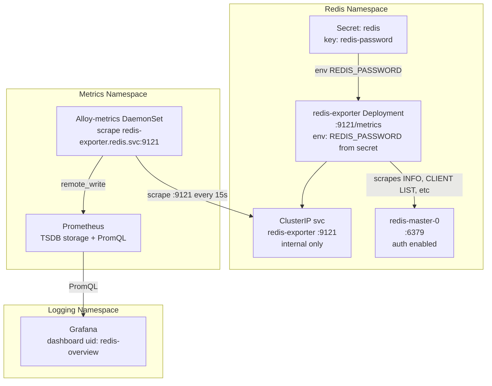

# Redis Metrics (redis_exporter + Prometheus + Grafana)

> Scripts and manifests: `~/src/home_infra/redis/metrics/`
> Extends the base metrics stack — see [[Metrics]]. Grafana lives in the logging namespace — see [[Logging]]. Redis is deployed in the `redis` namespace — see [[Redis]].

## Status

- [x] Deploy stack: `../install.sh` (consolidated with Redis core)
- [x] All 22 metrics tests passing (50/50 combined with Redis core)
- [x] redis_exporter /metrics endpoint returns Redis metrics (`redis_up = 1`)
- [x] Prometheus has `redis_up = 1` and `redis_memory_used_bytes` present
- [x] Alloy component `prometheus.scrape.redis` registered and active
- [x] Grafana dashboard uid `redis-overview` provisioned — title "Redis Overview"
- [x] Validate teardown/reinstall reproducibility — 3 destructive cycles, 50/50 each — 2026-04-13
- [x] Grafana dashboard revision pinned to v6 (was `latest`) — 2026-04-16
- [x] Diag.sh now queries Alloy component API (not Prometheus targets) — 2026-04-16

---

## Stack

| Component | Role | Helm Chart / Image | Version | Notes |
|---|---|---|---|---|
| **redis_exporter** | Translates Redis INFO to Prometheus metrics | `oliver006/redis_exporter` Docker image | `v1.67.0` | Standalone Deployment in `redis` ns; reads password from existing k8s secret |
| **Prometheus** | Metrics storage + PromQL engine | Already deployed in `metrics` ns | — | Alloy scrapes exporter and remote_writes to Prometheus |
| **Grafana Alloy** | Scraper — adds redis_exporter as a new target | Already deployed as `alloy-metrics` in `metrics` ns | — | ConfigMap patched with Redis scrape block, same pattern as GPU monitoring |
| **Grafana** | Dashboard visualization | Already deployed in `logging` ns | — | Dashboard uid `redis-overview` provisioned via Grafana HTTP API |

> `oliver006/redis_exporter` does not have a Helm chart in the standard repos that is well-maintained and widely pinned. The recommended approach is to deploy it as a plain k8s Deployment + Service using a versioned image tag. Chart version pinning via `helm search repo` is therefore not applicable here.

---

## Architecture



### Data Flow

1. `redis-exporter` Deployment runs in the `redis` namespace, co-located with the Redis pod
2. It calls `redis-master.redis.svc.cluster.local:6379` and issues `INFO`, `CLIENT LIST`, `SLOWLOG`, and `CONFIG GET` commands
3. The Redis password is injected as `REDIS_PASSWORD` env var, sourced from the existing `redis` secret (`redis-password` key) — never hardcoded
4. Alloy-metrics (in `metrics` ns) scrapes `redis-exporter.redis.svc.cluster.local:9121/metrics` on a 15s interval
5. Alloy remote_writes to Prometheus; Grafana queries via PromQL

---

## Why These Architectural Choices

### Standalone Deployment (not sidecar)

A sidecar would require modifying the Bitnami Redis Helm chart's pod template, which is complex and breaks on `helm upgrade`. A standalone Deployment in the same namespace keeps the Redis chart untouched, is independently restartable, and follows the same pattern as the DCGM exporter (a separate process that scrapes the target over the network).

### Password via secretKeyRef (not Bitnami `metrics.enabled`)

The Bitnami chart has a `metrics.enabled: true` flag that deploys redis_exporter as a sidecar. This was deliberately set to `false` in the Redis design doc. The standalone approach used here allows:
- Independent versioning of the exporter image
- Independent restarts and resource limits
- Password sourced from the existing secret without re-encoding it into chart values

The exporter Deployment uses:
```yaml
env:
  - name: REDIS_PASSWORD
    valueFrom:
      secretKeyRef:
        name: redis
        key: redis-password
```
This is the correct secure pattern — the secret is referenced, not copied or base64-decoded into any manifest.

### ServiceMonitor vs Alloy scrape config

The metrics stack uses Grafana Alloy as the scrape layer (not kube-prometheus-stack's built-in Prometheus operator). There is no ServiceMonitor CRD present. The existing GPU monitoring pattern — patching the Alloy ConfigMap with a new scrape block — is the correct approach here and maintains architectural consistency. No new CRDs are needed.

### Dashboard provisioning via Grafana HTTP API

The GPU monitoring project established that the Grafana HTTP API (`POST /api/dashboards/db`) is the standard provisioning method in this cluster. There is no `GrafanaDashboard` CRD and no Grafana Operator. A ConfigMap-mounted dashboard requires a Grafana sidecar (not deployed here). The API approach is idempotent (delete + re-upload), scriptable, and already proven in this cluster.

Dashboard choice: **Grafana dashboard ID 763** ("Redis Dashboard for Prometheus Redis Exporter" by Polinux) is the canonical dashboard for `oliver006/redis_exporter`. It surfaces all planned metrics out of the box. The JSON will be downloaded at install time from `grafana.com/api/dashboards/763/revisions/latest/download` and the datasource will be repointed to the local Prometheus datasource name before upload.

---

## Namespace & Port Allocation

| Service | Namespace | Type | Port | Purpose |
|---|---|---|---|---|
| redis-exporter | redis | ClusterIP | 9121 | Standard redis_exporter port; scraped by Alloy |

> No external (LoadBalancer / NodePort) ports allocated — the exporter is internal-only, scraped from within the cluster by Alloy.

**Existing allocations (do not reuse):**

| Port | Service |
|---|---|
| 31900 | loki-external (LoadBalancer) |
| 31901 | prometheus-external (LoadBalancer) |
| 32300 | grafana-tailscale (NodePort) |
| 32301 | loki-tailscale (NodePort) |
| 32302 | prometheus-tailscale (NodePort) |

Port 9121 is internal (ClusterIP); it does not require a NodePort allocation.

---

## Deploy / Teardown

> **Primary entry point is the parent project.** Use `~/src/home_infra/redis/install.sh` to deploy Redis + Metrics together. The scripts below are for metrics-only operations.

```bash
# Deploy everything (Redis + Metrics) — recommended
cd ~/src/home_infra/redis && ./install.sh

# Metrics-only operations (advanced)
cd ~/src/home_infra/redis/metrics

# Re-upload Grafana dashboard only (no k8s resource changes)
./install.sh --dashboard-only

# Run metrics tests standalone (22 tests)
./test.sh

# Smoke test only
./test.sh --smoke-test

# Capture metrics-only diagnostics
./diag.sh

# Metrics-only teardown (removes exporter, Alloy config, Grafana dashboard)
./uninstall.sh --force
```

---

## Repo Layout

```
home_infra/redis/                       # ← parent project; use install.sh here for full stack
├── install.sh                          # Orchestrates Redis core + Metrics; runs 50 combined tests
├── uninstall.sh                        # Tears down Metrics first, then Redis core
├── test.sh                             # 50 combined tests (delegates to core-test.sh + metrics/test.sh)
└── metrics/                            # Metrics sub-project
    ├── install.sh                      # --dry-run / --dashboard-only / --no-tests (parent orchestrator flag)
    ├── uninstall.sh                    # --force
    ├── test.sh                         # 22 metrics tests; --smoke-test
    ├── diag.sh                         # Read-only metrics diagnostics
    └── manifests/
        ├── redis-exporter-deployment.yaml  # oliver006/redis_exporter:v1.67.0; secretKeyRef password
        └── redis-exporter-service.yaml     # ClusterIP :9121 in redis namespace
```

> Note: `alloy-redis-snippet.alloy` is not a separate file — the Alloy scrape block is embedded directly in `metrics/install.sh` and patched into the `alloy-metrics-config` ConfigMap at install time using `# BEGIN redis` / `# END redis` sentinels for idempotency.

---

## Key Manifest Design Notes

### `redis-exporter-deployment.yaml`

```yaml
apiVersion: apps/v1
kind: Deployment
metadata:
  name: redis-exporter
  namespace: redis
spec:
  replicas: 1
  selector:
    matchLabels:
      app: redis-exporter
  template:
    metadata:
      labels:
        app: redis-exporter
    spec:
      containers:
        - name: redis-exporter
          image: oliver006/redis_exporter:v1.67.0
          args:
            - --redis.addr=redis://redis-master.redis.svc.cluster.local:6379
          env:
            - name: REDIS_PASSWORD
              valueFrom:
                secretKeyRef:
                  name: redis
                  key: redis-password
          ports:
            - containerPort: 9121
          resources:
            requests:
              cpu: 10m
              memory: 32Mi
            limits:
              cpu: 100m
              memory: 64Mi
```

> The image tag `v1.67.0` is pinned. The `--redis.addr` argument is passed as a flag (not via env `REDIS_ADDR`) so that it is visible in `kubectl describe` for debugging. `REDIS_PASSWORD` is sourced from the existing `redis` secret — the manifest does not contain any credential value.

### `alloy-redis-snippet.alloy`

```alloy
prometheus.scrape "redis" {
  targets = [{
    __address__ = "redis-exporter.redis.svc.cluster.local:9121",
  }]
  forward_to     = [prometheus.remote_write.default.receiver]
  scrape_interval = "15s"
  job_name       = "redis"
}
```

This block is appended to the existing `alloy-metrics-config` ConfigMap by `install.sh`, using the same idempotency check as the GPU monitoring project: grep for a sentinel comment before appending, and skip if already present.

---

## Key Metrics to Surface

| Metric | PromQL | Panel Type | Notes |
|---|---|---|---|
| Memory used vs maxmemory | `redis_memory_used_bytes`, `redis_config_maxmemory` | Gauge / time series | 2GB ceiling; alert if > 85% |
| Memory hit rate | `rate(redis_keyspace_hits_total[5m]) / (rate(redis_keyspace_hits_total[5m]) + rate(redis_keyspace_misses_total[5m]))` | Stat (%) | Low hit rate indicates cold cache or evictions |
| Connected clients | `redis_connected_clients` | Stat | Spike = connection leak |
| Commands/sec | `rate(redis_commands_processed_total[5m])` | Time series | Overall throughput |
| Evictions/sec | `rate(redis_evicted_keys_total[5m])` | Time series | Non-zero means maxmemory is being hit |
| Keyspace size | `redis_db_keys` | Stat per db | db0 key count |
| Expired keys/sec | `rate(redis_expired_keys_total[5m])` | Time series | TTL-based expiry rate |
| RDB last save age | `time() - redis_rdb_last_bgsave_time_sec` | Stat (seconds ago) | Alert if > 1h |
| AOF enabled | `redis_aof_enabled` | Stat (0/1) | Must be 1 |
| Uptime | `redis_uptime_in_seconds` | Stat | Detect unexpected restarts |
| Blocked clients | `redis_blocked_clients` | Stat | Non-zero = BLPOP/BRPOP blocked callers |
| Rejected connections | `rate(redis_rejected_connections_total[5m])` | Time series | maxclients limit hit |

All of the above are exposed natively by `oliver006/redis_exporter` from Redis `INFO all` — no custom instrumentation needed.

---

## Test Suite (22 tests)

All tests run via `kubectl exec` or `kubectl port-forward` — no in-cluster shell access required (exporter image is distroless). Metrics are fetched to a temp file via port-forward to avoid bash variable truncation of large outputs.

| Category | Count | What's Validated |
|---|---|---|
| **Prerequisites** | 2 | `kubectl` available, `python3` available |
| **K8s Resources** | 4 | Deployment `redis-exporter` exists, 1 ready replica, ClusterIP Service exists, type = ClusterIP |
| **Exporter Pod Health** | 3 | Pod phase = Running, Ready = True, restartCount ≤ 2 |
| **secretKeyRef Wiring** | 1 | `REDIS_PASSWORD` env sourced from `secretKeyRef.name=redis` (verified via jsonpath, not just env value) |
| **Exporter Metrics Endpoint** | 5 | `/metrics` returns data (port-forward), `redis_up = 1`, `redis_memory_used_bytes` present, `redis_connected_clients` present, `redis_commands_processed_total` present |
| **Alloy ConfigMap** | 2 | ConfigMap contains `# BEGIN redis` sentinel, block has `job_name = "redis"` |
| **Alloy Scrape + Prometheus** | 3 | Alloy component `prometheus.scrape.redis` registered (Alloy API), `redis_up = 1` in Prometheus (retried up to 6×), `redis_memory_used_bytes` present in Prometheus |
| **Grafana Dashboard** | 2 | Dashboard uid `redis-overview` found via Grafana API, UID exact match |

> **Total: 22 tests**

### Smoke test subset (--smoke-test flag, 5 tests)

1. Deployment `redis-exporter` exists and pod is Ready
2. `/metrics` returns HTTP 200 with `redis_up 1`
3. Prometheus target `job="redis"` is `up`
4. PromQL `redis_memory_used_bytes` returns a result
5. Grafana dashboard uid `redis-overview` exists

---

## install.sh Logic (step-by-step)

| Step | Action | Idempotent? |
|---|---|---|
| 1 | Check prerequisites: kubectl, cluster reachable, redis ns exists, redis secret exists | — |
| 2 | `kubectl apply -f manifests/redis-exporter-deployment.yaml` | Yes — apply is idempotent |
| 3 | `kubectl apply -f manifests/redis-exporter-service.yaml` | Yes |
| 4 | Wait up to 60s for exporter pod to become Ready | — |
| 5 | Probe `/metrics` endpoint via kubectl exec curl; verify `redis_up 1` | — |
| 6 | Check if Alloy ConfigMap already contains redis scrape block (grep sentinel `# BEGIN redis`); skip if present | Yes |
| 7 | Append `alloy-redis-snippet.alloy` to `alloy-metrics-config` ConfigMap in `metrics` ns | Yes (guarded by step 6) |
| 8 | Annotate the Alloy ConfigMap with `configChecksum` to trigger pod restart | Yes — annotation update is idempotent |
| 9 | Wait for Alloy DaemonSet rollout to complete | — |
| 10 | Wait up to 90s for Prometheus to show `job="redis"` target as `up` (retry loop, 15s sleep) | — |
| 11 | Download dashboard 763 JSON from `grafana.com/api/dashboards/763/revisions/latest/download` | — |
| 12 | Patch datasource in dashboard JSON to `Prometheus` (the local datasource name) and set uid to `redis-overview` | — |
| 13 | Upload dashboard via `POST /api/dashboards/db` to Grafana; overwrite if exists (`overwrite: true`) | Yes |
| 14 | Verify dashboard exists via `GET /api/dashboards/uid/redis-overview` | — |
| 15 | Run `./test.sh` | — |

---

## uninstall.sh Logic (step-by-step)

| Step | Action | Notes |
|---|---|---|
| 1 | Prompt for confirmation unless `--force` | — |
| 2 | Delete Grafana dashboard `redis-overview` via `DELETE /api/dashboards/uid/redis-overview` | Idempotent (404 is not an error) |
| 3 | Strip redis scrape block from Alloy ConfigMap (`# BEGIN redis` … `# END redis`) | Idempotent (no-op if block absent) |
| 4 | Annotate Alloy ConfigMap to trigger rollout; wait for rollout | — |
| 5 | `kubectl delete deployment redis-exporter -n redis --ignore-not-found` | Idempotent |
| 6 | `kubectl delete service redis-exporter -n redis --ignore-not-found` | Idempotent |
| 7 | Residue check: no redis-exporter pods running, ConfigMap has no redis block, Grafana dashboard 404 | — |

> The `redis` namespace itself and the Redis deployment are never touched by this script.

---

## Teardown / Reinstall Validation

Validated as part of the consolidated project using `~/src/home_infra/redis/uninstall.sh --delete-data --delete-namespace --force` followed by `./install.sh`. All 3 cycles passed 50/50 tests on 2026-04-13.

```bash
cd ~/src/home_infra/redis

# Full destructive cycle (Redis + Metrics)
./uninstall.sh --delete-data --delete-namespace --force
./install.sh   # 50/50 tests must pass
```

| Cycle | Date | Teardown clean | Tests |
|---|---|---|---|
| 1 | 2026-04-13 | Yes — no residue | 50/50 |
| 2 | 2026-04-13 | Yes — no residue | 50/50 |
| 3 | 2026-04-13 | Yes — no residue | 50/50 |

---

## Prerequisites

1. **Base metrics stack deployed:** `~/src/home_infra/metrics/install.sh` must have been run successfully. Alloy-metrics DaemonSet and Prometheus must be running in the `metrics` namespace.
2. **Grafana deployed and accessible:** Grafana must be running in the `logging` namespace and accessible at its ClusterIP (used by install.sh to upload the dashboard). The Prometheus datasource must already be configured in Grafana (done by the metrics stack install).
3. **Redis deployed with auth:** Release `redis` must exist in namespace `redis` with secret `redis` containing key `redis-password`. The `install.sh` verifies this at startup.
4. **Network access to grafana.com at install time:** `install.sh` downloads dashboard 763 JSON from `grafana.com/api/dashboards/763/revisions/latest/download`. If the cluster has no outbound internet, pre-download the JSON and place it at `manifests/dashboard-763.json`; `install.sh` will use the local file if present.
5. **Nothing else** — no manual Helm repo additions, no CRDs, no admin approvals. The exporter image is pulled from Docker Hub; k3s must have outbound internet access (it does).

---

## Possible Enhancements

| Enhancement | Priority | Notes |
|---|---|---|
| Alerting rules for Redis | High | Alert on memory > 85%, hit rate < 50%, redis_up = 0; requires Alertmanager (planned) |
| Custom dashboard panels for keyspace breakdown | Medium | Dashboard 763 shows aggregate; add per-db key count panels |
| Slow log monitoring | Medium | `redis_slowlog_last_id` and `redis_slowlog_length` — surface query latency spikes |
| TLS scraping (if Redis TLS is enabled) | Low | Add `--tls-client-cert-file` / `--tls-client-key-file` args to exporter |
| Multi-instance support | Low | If additional Redis deployments are added, parameterize the install script by release name |
| Exporter Helm chart | Low | `prometheus-community/prometheus-redis-exporter` chart exists; switch to it if versioned Helm management is preferred |

---

## Recent Changes (2026-04-16)

| Issue | Fix |
|---|---|
| Grafana password retrieval aborts install | Added `|| true` guard with warning message |
| `run()` helper used unsafe `eval "$*"` | Replaced with `"$@"` |
| Dashboard pinned to `latest` revision | Now pinned to revision 6 |
| Diag.sh queried wrong Prometheus API | Now queries Alloy `/api/v0/web/components` |
| Namespace guard missing on teardown | Added existence check before Alloy ConfigMap operations |

---

## Troubleshooting

### redis_up is 0 in Prometheus

```
redis_up{job="redis"} 0
```

**Cause:** Exporter cannot connect to Redis, or authentication failed.
**Fix:**
```bash
# Check exporter pod logs
kubectl logs deployment/redis-exporter -n redis

# Verify the secret value matches what Redis expects
kubectl get secret redis -n redis -o jsonpath="{.data.redis-password}" | base64 -d; echo

# Note: redis_exporter image is distroless — no shell available inside the container.
# Test connectivity from the host via port-forward instead:
kubectl port-forward -n redis svc/redis-exporter 19121:9121 &
curl -s http://localhost:19121/metrics | grep "^redis_up"
# Should return: redis_up 1
kill %1
```

### Prometheus target job="redis" not appearing

```
# GET /api/v1/targets shows no redis job
```

**Cause:** Alloy ConfigMap was not patched, or Alloy pod did not restart after the patch.
**Fix:**
```bash
# Verify ConfigMap has the redis block
kubectl get configmap alloy-metrics-config -n metrics -o jsonpath='{.data.config\.alloy}' | grep "BEGIN redis"

# If missing, re-run install.sh
# If present but target still absent, force Alloy restart
kubectl rollout restart daemonset alloy-metrics -n metrics
kubectl rollout status daemonset alloy-metrics -n metrics --timeout=120s
```

### Grafana dashboard panels show "No data"

**Cause 1:** Datasource name mismatch — dashboard JSON references a datasource name that does not match what is configured in Grafana.
**Fix:**
```bash
# Check datasource name in Grafana
kubectl port-forward svc/grafana 3000:80 -n logging
# Open http://localhost:3000/api/datasources — note the exact "name" field
# Re-run install.sh --dashboard-only after correcting the datasource name in the patching step
```

**Cause 2:** Prometheus has not yet scraped any Redis metrics (target was just added).
**Fix:** Wait 30–60s for the first scrape, then refresh the dashboard.

**Cause 3:** Dashboard was downloaded with a different job label than `redis`.
**Fix:**
```bash
# Verify the job label in Prometheus
kubectl port-forward svc/prometheus-server 9090:80 -n metrics
# Query: up{job="redis"}  — should return 1
# If the label is different, update the alloy snippet job_name field and re-run install.sh
```

### Exporter pod in CrashLoopBackOff

```
redis-exporter-<hash>   0/1   CrashLoopBackOff   3   2m
```

**Cause:** Image pull failure, wrong image tag, or missing secret.
**Fix:**
```bash
kubectl describe pod -l app=redis-exporter -n redis
# Look for: "Failed to pull image" → check Docker Hub connectivity and image tag
# Look for: "secret not found" → verify secret name is "redis" in namespace "redis"
kubectl get secret redis -n redis
```

### test.sh: "Secret reference check failed"

**Cause:** The Deployment's env var `REDIS_PASSWORD` does not use `secretKeyRef` (e.g. someone hardcoded it).
**Fix:**
```bash
kubectl get deployment redis-exporter -n redis \
  -o jsonpath='{.spec.template.spec.containers[0].env}'
# Verify secretKeyRef.name=redis, key=redis-password
# If wrong, re-apply manifests/redis-exporter-deployment.yaml
kubectl apply -f ~/src/home_infra/redis/metrics/manifests/redis-exporter-deployment.yaml
```

---

## See Also

- [[Redis]] — Redis deployment; `metrics.enabled: false` kept here; standalone exporter designed above
- [[Metrics]] — Prometheus + Alloy base stack; Alloy ConfigMap is patched by this project
- [[GPU Monitoring]] — Reference implementation for the Alloy ConfigMap patch pattern and Grafana API dashboard upload pattern
- [[Logging]] — Grafana instance used for dashboards lives here
- [[Teardown Reinstall Validation]] — Index of all validation reports
