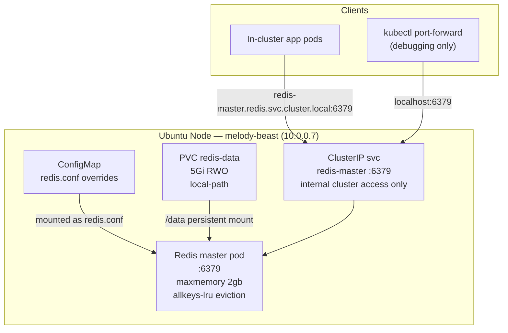

# Homelab Redis

> All scripts and manifests live in `~/src/home_infra/redis/`

## Status

- [x] Deploy stack: `./install.sh`
- [x] All 28 Redis core tests passing (50/50 combined with metrics)
- [x] Confirm write/read round-trip (SET → GET)
- [x] Confirm persistence across pod restart (AOF / RDB survives)
- [x] Validate teardown/reinstall reproducibility — 3 destructive cycles, 50/50 each — 2026-04-13
- [x] Redis Metrics (exporter + Grafana dashboard) — see [[Redis Metrics]]

---

## Stack

| Component | Role | Helm Chart | Chart Version | App Version |
|---|---|---|---|---|
| **Redis** | In-memory data store + persistence | bitnami/redis | 25.3.11 | 8.6.2 |

> Chart version pinned at `25.3.11` (latest stable as of 2026-04-13 via `helm search repo bitnami/redis`).  
> Single-master mode (no Sentinel / no Cluster) — appropriate for a single-node homelab.  
> Replica count set to 0 (standalone). Sentinel is disabled.  
> **In-cluster only**: Redis is exposed via ClusterIP only. No LoadBalancer, no NodePort, no Tailscale exposure.

---

## Architecture



### Data Flow

1. **Redis pod** starts with the `redis.conf` ConfigMap mounted at `/opt/bitnami/redis/mounted-etc/redis.conf`
2. `maxmemory 2gb` and `maxmemory-policy allkeys-lru` are enforced at the Redis process level
3. Data is persisted via **AOF** (appendonly yes) to the PVC at `/data`
4. **RDB** snapshots are also enabled (save 900 1 / 300 10 / 60 10000) as a secondary persistence layer
5. In-cluster access: `redis-master.redis.svc.cluster.local:6379`
6. Debug access (host): `kubectl port-forward svc/redis-master 6379:6379 -n redis`

---

## Redis Configuration

### maxmemory and eviction policy

| Parameter | Value | Rationale |
|---|---|---|
| `maxmemory` | `2gb` | Enforced at Redis process level — Redis will reject writes or evict keys when reached |
| `maxmemory-policy` | `allkeys-lru` | Evicts least-recently-used keys across all keyspaces; appropriate for a general-purpose cache |
| `maxmemory-samples` | `10` | Increase LRU approximation accuracy (default 5) |

> **`allkeys-lru` vs `volatile-lru`:** `allkeys-lru` evicts any key when memory is full, not just keys with TTLs. Use `volatile-lru` instead if you need to guarantee that keys without TTLs are never evicted (e.g. for persistent session storage).

### Persistence

| Mode | Config | Rationale |
|---|---|---|
| AOF | `appendonly yes`, `appendfsync everysec` | Durable: at most 1 second of data loss on crash |
| RDB | `save 900 1`, `save 300 10`, `save 60 10000` | Fast restore on cold start; complement to AOF |

### K8s Resource Requests/Limits

| Resource | Request | Limit |
|---|---|---|
| Memory | `2Gi` | `2Gi` |
| CPU | `100m` | `500m` |

> Memory request = limit (`2Gi`) to guarantee a QoS class of **Guaranteed**, preventing the OOM killer from targeting Redis under node memory pressure. `maxmemory 2gb` (2,147,483,648 bytes) matches the k8s limit of `2Gi`; for production, consider setting `maxmemory` to `1950mb` to leave headroom for Redis process overhead.

### Health Probes

| Probe | Command | Initial delay | Period |
|---|---|---|---|
| Liveness | `redis-cli -a $REDIS_PASSWORD ping` | 20s | 10s |
| Readiness | `redis-cli -a $REDIS_PASSWORD ping` | 10s | 5s |

---

## Namespace & Port Allocation

| Service | Type | Port | Purpose |
|---|---|---|---|
| redis-master | ClusterIP | 6379 | In-cluster access only |

> No external ports allocated. Redis is intentionally cluster-internal.

**Existing allocations (for reference — do not re-use):**

| Port | Service |
|---|---|
| 31900 | loki-external (LoadBalancer) |
| 31901 | prometheus-external (LoadBalancer) |
| 32300 | grafana-tailscale (NodePort) |
| 32301 | loki-tailscale (NodePort) |
| 32302 | prometheus-tailscale (NodePort) |

---

## Accessing Redis

**In-cluster (primary access pattern)**
```
redis-master.redis.svc.cluster.local:6379
```

**Get the password from k8s secret (needed by app pods)**
```bash
kubectl get secret redis -n redis -o jsonpath="{.data.redis-password}" | base64 -d; echo
```

**Debug access via port-forward (no external service needed)**
```bash
kubectl port-forward svc/redis-master 6379:6379 -n redis &
PASS=$(kubectl get secret redis -n redis -o jsonpath="{.data.redis-password}" | base64 -d)
redis-cli -h 127.0.0.1 -p 6379 -a "$PASS"
```

**In-pod redis-cli (used by test.sh — no redis-cli required on host)**
```bash
PASS=$(kubectl get secret redis -n redis -o jsonpath="{.data.redis-password}" | base64 -d)
kubectl exec -n redis redis-master-0 -- redis-cli -a "$PASS" PING
```

---

## Using Redis in Applications

### Connection details

| Parameter | Value |
|---|---|
| **Host (FQDN)** | `redis-master.redis.svc.cluster.local` |
| **Port** | `6379` |
| **Auth** | Password required — read from k8s secret `redis` / key `redis-password` in namespace `redis` |
| **TLS** | Not enabled |
| **DB** | `0` (default) |

The FQDN `redis-master.redis.svc.cluster.local` resolves from **any namespace** in the cluster — apps do not need to be in the `redis` namespace to connect.

### Mounting the password into your pod

The Redis password is stored in the `redis` secret in the `redis` namespace. Reference it as an environment variable in your pod spec:

```yaml
env:
  - name: REDIS_PASSWORD
    valueFrom:
      secretKeyRef:
        name: redis
        namespace: redis   # cross-namespace secret refs require same-namespace or RBAC
        key: redis-password
```

> **Cross-namespace secret access:** Kubernetes does not natively support `secretKeyRef` across namespaces. The recommended approach is to copy the secret into your app's namespace once at deploy time, or use an external secrets operator. See the copy pattern below.

**Copy the secret into your app's namespace (simplest approach):**

```bash
kubectl get secret redis -n redis -o json \
  | jq 'del(.metadata.namespace,.metadata.resourceVersion,.metadata.uid,.metadata.creationTimestamp)' \
  | kubectl apply -n <your-namespace> -f -
```

Then reference it normally in your pod:

```yaml
env:
  - name: REDIS_PASSWORD
    valueFrom:
      secretKeyRef:
        name: redis
        key: redis-password
```

### Example connection strings

**Python (redis-py):**
```python
import redis, os

r = redis.Redis(
    host="redis-master.redis.svc.cluster.local",
    port=6379,
    password=os.environ["REDIS_PASSWORD"],
    decode_responses=True,
)
r.ping()  # raises ConnectionError if unreachable
```

**Node.js (ioredis):**
```javascript
import Redis from "ioredis";

const redis = new Redis({
  host: "redis-master.redis.svc.cluster.local",
  port: 6379,
  password: process.env.REDIS_PASSWORD,
});
```

**Go (go-redis):**
```go
rdb := redis.NewClient(&redis.Options{
    Addr:     "redis-master.redis.svc.cluster.local:6379",
    Password: os.Getenv("REDIS_PASSWORD"),
    DB:       0,
})
```

### Key design considerations

**Eviction policy is `allkeys-lru`** — Redis will silently evict any key (regardless of TTL) when memory reaches 2GB. Design implications:
- Always treat Redis as a **cache** — your app must handle a cache miss gracefully by re-fetching from source
- Do not store data in Redis that cannot be reconstructed (use a persistent database for that)
- If you need guaranteed retention of certain keys, set `maxmemory-policy volatile-lru` (evicts only TTL'd keys) — but this requires re-deploying Redis with updated `redis-values.yaml`

**Always set TTLs on keys** — even under `allkeys-lru`, explicit TTLs prevent stale data from accumulating and give you predictable expiry:
```python
r.set("session:abc123", value, ex=3600)   # expires in 1 hour
```

**Keyspace naming convention** — use colon-separated namespaces to avoid collisions between apps:
```
<app>:<entity>:<id>      e.g.  myapp:session:user123
<app>:<feature>:<key>    e.g.  myapp:ratelimit:ip:10.0.0.1
```

**Connection pooling** — reuse a single Redis client instance per process; don't create a new connection per request.

---

## Deploy / Teardown

```bash
cd ~/src/home_infra/redis

# Install everything (Redis + Metrics + Grafana dashboard); runs 50 combined tests on success
./install.sh

# Dry run (prints what would be done)
./install.sh --dry-run

# Run combined tests standalone (28 Redis + 22 Metrics = 50 total)
./test.sh

# Smoke test only (fast)
./test.sh --smoke-test

# Diagnose (read-only state snapshot for both Redis and Metrics)
./diag.sh

# Tear down everything — Metrics first, then Redis (keeps PVC data)
./uninstall.sh --force

# Tear down completely (deletes all data, removes namespace)
./uninstall.sh --delete-data --delete-namespace --force
```

---

## Repo Layout

```
home_infra/redis/
├── install.sh                          # Deploy Redis + Metrics; idempotent; runs combined test.sh
├── uninstall.sh                        # Tear down Metrics then Redis (--delete-data / --delete-namespace / --force)
├── test.sh                             # Combined 50-test suite (Redis core + Metrics)
├── diag.sh                             # Combined read-only diagnostics (Redis + Metrics)
├── core-test.sh                        # Redis-only 28 tests (called by test.sh)
├── core-diag.sh                        # Redis-only diagnostics (called by diag.sh)
├── manifests/
│   └── redis-values.yaml               # Bitnami Redis Helm values (standalone, 2Gi, AOF, auth)
└── metrics/                            # Redis Metrics sub-project — see [[Redis Metrics]]
    ├── install.sh                      # Metrics-only install (--no-tests when called from parent)
    ├── uninstall.sh                    # Metrics-only teardown
    ├── test.sh                         # Metrics-only 22 tests
    ├── diag.sh                         # Metrics-only diagnostics
    └── manifests/
        ├── redis-exporter-deployment.yaml
        └── redis-exporter-service.yaml
```

---

## Manifest Design Notes

### `redis-values.yaml` key fields

```yaml
architecture: standalone          # Single master, no replicas, no Sentinel
auth:
  enabled: true
  # password auto-generated by Bitnami chart on first install; stored in secret "redis"
  # retrieve with: kubectl get secret redis -n redis -o jsonpath="{.data.redis-password}" | base64 -d; echo
  # password is preserved across helm upgrade (Bitnami uses lookup() to detect existing secret)

master:
  count: 1
  service:
    type: ClusterIP               # In-cluster only; no external exposure
  resources:
    requests:
      memory: 2Gi
      cpu: 100m
    limits:
      memory: 2Gi
      cpu: 500m
  persistence:
    enabled: true
    size: 5Gi
    storageClass: local-path
  livenessProbe:
    enabled: true
    initialDelaySeconds: 20
    periodSeconds: 10
  readinessProbe:
    enabled: true
    initialDelaySeconds: 10
    periodSeconds: 5

commonConfiguration: |-
  maxmemory 2gb
  maxmemory-policy allkeys-lru
  maxmemory-samples 10
  appendonly yes
  appendfsync everysec
  save 900 1
  save 300 10
  save 60 10000

metrics:
  enabled: false    # Bitnami sidecar metrics disabled — standalone redis_exporter deployed separately (see [[Redis Metrics]])
```

### Idempotency notes for `install.sh`

- `helm upgrade --install redis bitnami/redis --version 25.3.11 -n redis --create-namespace -f manifests/redis-values.yaml`
- No external service manifests to apply (ClusterIP only; service is managed by the Helm chart)
- The Bitnami chart generates an auth secret on first install and preserves it on `helm upgrade` (it uses `lookup()` to check for existing secret); the password does **not** rotate on re-install

---

## Test Suite (28 tests)

All tests use `kubectl exec` into the Redis pod — no `redis-cli` on the host is required.

| Category | Count | What's Validated |
|---|---|---|
| **Prerequisites** | 2 | `helm` available, `kubectl` available |
| **K8s Resources** | 4 | Namespace `redis` exists, PVC `redis-data` Bound, StatefulSet `redis-master` exists, ClusterIP service `redis-master` exists |
| **Helm Version** | 1 | Release `redis` at pinned chart version `25.3.11` (exact match) |
| **Pod Health** | 3 | Master pod Running, pod Ready (1/1), no restarts in last 5 minutes |
| **Redis Process** | 3 | `PING` returns `PONG`, `INFO server` returns `redis_version`, `INFO memory` returns `maxmemory` field |
| **Memory Config** | 3 | `CONFIG GET maxmemory` = `2147483648`, `CONFIG GET maxmemory-policy` = `allkeys-lru`, `CONFIG GET maxmemory-samples` = `10` |
| **Persistence Config** | 3 | `CONFIG GET appendonly` = `yes`, `CONFIG GET appendfsync` = `everysec`, `CONFIG GET save` contains `900 1` |
| **Data Pipeline** | 4 | SET key → GET key round-trip, no-TTL key persists (not auto-expired), SET 100 keys → DBSIZE >= 100, DEL cleans up test keys |
| **Persistence Survival** | 3 | Write canary key, delete pod (kubectl delete pod), wait for pod ready, GET key returns original value |
| **Auth** | 2 | Unauthenticated `PING` returns `NOAUTH` error, authenticated connection succeeds with secret-retrieved password |

> **Total: 28 tests**

### Smoke test subset (--smoke-test flag, 5 tests)

1. Pod Running + Ready
2. `PING` returns `PONG` (via `kubectl exec`)
3. SET/GET round-trip (via `kubectl exec`)
4. `CONFIG GET maxmemory` = `2147483648`
5. ClusterIP service `redis-master` exists

---

## Teardown / Reinstall Validation Plan

### Destructive (3 cycles)

```bash
./uninstall.sh --delete-data --delete-namespace --force
# Residue check:
#   - namespace "redis" gone: kubectl get namespace redis 2>&1 | grep "not found"
#   - PVC gone: kubectl get pvc -A 2>&1 | grep "redis" should return nothing
#   - No orphaned ClusterRole/ClusterRoleBinding with "redis" prefix
./install.sh
./test.sh  # must pass 28/28
```

### Actual results (3 destructive cycles — 2026-04-13)

| Cycle | Date | Teardown clean | Tests |
|---|---|---|---|
| 1 | 2026-04-13 | Yes — no residue | 50/50 |
| 2 | 2026-04-13 | Yes — no residue | 50/50 |
| 3 | 2026-04-13 | Yes — no residue | 50/50 |

> Non-destructive cycles (preserve PVC) not required — the persistence survival test in `core-test.sh` covers data durability across pod restarts within a live installation.

---

## Prerequisites

1. **Bitnami Helm repo added:** `helm repo add bitnami https://charts.bitnami.com/bitnami && helm repo update` — `install.sh` does this automatically (checks with `helm repo list` first).
2. **`kubectl` configured and cluster reachable:** `install.sh` checks this at startup.
3. **`helm` installed:** `install.sh` checks this at startup.
4. **`local-path` StorageClass available:** Required for PVC provisioning. Verify with `kubectl get storageclass`. k3s includes this by default.
5. **Nothing else** — namespace, PVC, Helm release, and all k8s objects are created by `install.sh`. No `redis-cli` needed on the host; all Redis commands run via `kubectl exec`.

---

## Possible Enhancements

| Enhancement | Priority | Notes |
|---|---|---|
| ~~Redis Exporter (Prometheus metrics)~~ | ~~High~~ | Done — see [[Redis Metrics]] |
| ~~Grafana Redis dashboard~~ | ~~Medium~~ | Done — dashboard ID 763 provisioned, uid `redis-overview` |
| Network Policy | Medium | Restrict Redis access to specific namespaces only (allowlist pattern) |
| maxmemory tuning (1950mb) | Low | Leave 50mb headroom for Redis overhead below k8s 2Gi limit |
| TLS in-transit | Low | `tls.enabled: true` in bitnami values; adds complexity, may not be needed in-cluster |
| Sentinel / HA mode | Low | Not needed on single-node homelab; revisit if cluster expands |
| Redis Cluster mode | Low | Would require multiple nodes; overkill for homelab |

---

## Troubleshooting

### Pod stuck in CrashLoopBackOff after install

```
redis-master-0   0/1   CrashLoopBackOff   3   2m
```

**Cause:** Redis cannot write to `/data` — PVC not mounted or wrong permissions.  
**Fix:**
```bash
kubectl describe pod redis-master-0 -n redis   # look for "Permission denied" or mount errors
kubectl describe pvc redis-data -n redis       # check Bound status
# If PVC is Pending, check StorageClass:
kubectl get storageclass
```

### `NOAUTH Authentication required` from in-cluster app

**Cause:** App is not passing the Redis password, or is using a wrong secret reference.  
**Fix:**
```bash
# Retrieve the actual password from the secret
kubectl get secret redis -n redis -o jsonpath="{.data.redis-password}" | base64 -d; echo
# Verify your app's env var or secret reference matches secret name "redis", key "redis-password"
# Mount the secret as an env var in the app pod:
#   env:
#     - name: REDIS_PASSWORD
#       valueFrom:
#         secretKeyRef:
#           name: redis
#           key: redis-password
```

### Redis accepts connections but OOM-kills keys unexpectedly

```
OOM command not allowed when used memory > 'maxmemory'
```

**Cause:** `maxmemory-policy` is `noeviction` (or not set), so Redis rejects writes when full instead of evicting.  
**Fix:**
```bash
PASS=$(kubectl get secret redis -n redis -o jsonpath="{.data.redis-password}" | base64 -d)
kubectl exec -n redis redis-master-0 -- redis-cli -a "$PASS" CONFIG GET maxmemory-policy
# Should return: allkeys-lru
# If wrong, check that commonConfiguration in values.yaml is applied and re-run install.sh
```

### Data not persisting across pod restarts (AOF disabled)

**Cause:** `appendonly` was not applied from the ConfigMap — Helm values `commonConfiguration` block was not merged correctly.  
**Fix:**
```bash
PASS=$(kubectl get secret redis -n redis -o jsonpath="{.data.redis-password}" | base64 -d)
kubectl exec -n redis redis-master-0 -- redis-cli -a "$PASS" CONFIG GET appendonly
# Should return: yes
# If "no": re-apply Helm release with corrected values.yaml and restart pod
kubectl rollout restart statefulset redis-master -n redis
```

### test.sh fails "maxmemory not 2147483648"

**Cause:** `maxmemory 2gb` in `commonConfiguration` is interpreted as `2147483648` bytes (2 × 1024^3). If Redis returns a different value, the ConfigMap may not be mounted.  
**Fix:**
```bash
PASS=$(kubectl get secret redis -n redis -o jsonpath="{.data.redis-password}" | base64 -d)
kubectl exec -n redis redis-master-0 -- redis-cli -a "$PASS" CONFIG GET maxmemory
kubectl describe pod redis-master-0 -n redis | grep -A 10 "Mounts"
kubectl get configmap -n redis
```

### kubectl exec fails with "container not running"

**Cause:** Pod is not yet Ready (still initializing after install or pod restart).  
**Fix:**
```bash
kubectl get pod redis-master-0 -n redis -w   # wait for Running/Ready
# Or wait with timeout:
kubectl wait pod redis-master-0 -n redis --for=condition=Ready --timeout=120s
```

---

## See Also

- [[Redis Metrics]] — redis_exporter, Alloy scraping, Grafana dashboard `redis-overview`
- [[Metrics]] — Prometheus + Alloy base stack; Alloy ConfigMap patched by Redis Metrics
- [[Logging]] — Grafana instance where the Redis Overview dashboard lives
- [[Overview]] — Homelab overview and service registry
