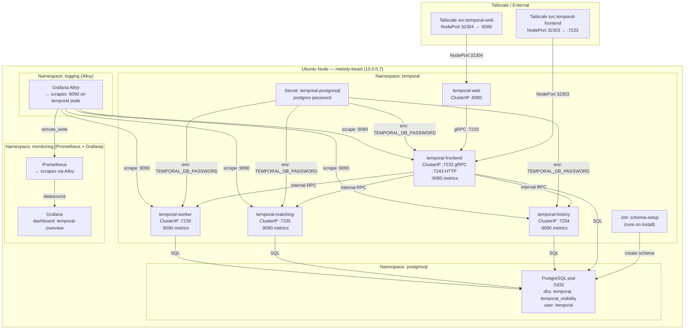

# Homelab Temporal

> All scripts and manifests live in `~/src/home_infra/temporal/`

## Status

- [ ] Create Temporal databases and user in PostgreSQL (`temporal`, `temporal_visibility`)
- [ ] Add Helm repo `https://go.temporal.io/helm-charts`
- [ ] Pin chart version; document it in this file
- [ ] Configure Helm values for external PostgreSQL persistence
- [ ] Deploy stack: `./install.sh`
- [ ] Verify all 4 services Running + Ready (frontend, history, matching, worker)
- [ ] Verify schema jobs completed successfully
- [ ] Confirm Temporal Web UI accessible at `http://temporal-web.homelab.local`
- [ ] Confirm gRPC API reachable on port 7233 in-cluster
- [ ] Verify `temporal-metrics` Alloy scrape target is UP in Prometheus
- [ ] Import Temporal Grafana dashboard; confirm panels populate
- [ ] All automated tests passing (`./test.sh`)
- [ ] Validate teardown/reinstall reproducibility (3 destructive + 3 non-destructive cycles)
- [ ] Expose Web UI on Tailscale NodePort 32304

---

## Stack

| Component | Role | Deploy Method | Image | App Version |
|---|---|---|---|---|
| **Temporal Frontend** | gRPC API entrypoint for workers and clients | Helm `temporal/temporal` | `temporalio/server` | pin to latest stable |
| **Temporal History** | Workflow state machine execution | Helm `temporal/temporal` | `temporalio/server` | same as above |
| **Temporal Matching** | Task queue management, worker polling | Helm `temporal/temporal` | `temporalio/server` | same as above |
| **Temporal Worker** | Internal system workflows | Helm `temporal/temporal` | `temporalio/server` | same as above |
| **Temporal Web UI** | Browser-based workflow management console | Helm `temporal/temporal` | `temporalio/ui` | bundled with chart |
| **Admin Tools** | Schema migration and CLI tooling | Helm `temporal/temporal` | `temporalio/admin-tools` | bundled with chart |
| **PostgreSQL** | Persistence backend (external, already deployed) | Pre-existing in-cluster | `postgres:17` | 17.x |

> Deployed via the official `temporalio/temporal` Helm chart pointed at the pre-existing in-cluster PostgreSQL.
> Bundled Cassandra, MySQL, and PostgreSQL sub-charts are disabled.
> Elasticsearch/Cassandra advanced visibility is replaced by the PostgreSQL visibility driver.
> Single-replica mode throughout — appropriate for a single-node homelab.

---

## Architecture



### Data Flow

1. **Clients and workers** connect to `temporal-frontend` via gRPC (port 7233) — either in-cluster by FQDN or from Tailscale via NodePort 32303
2. **Frontend** routes workflow start/signal/query requests and task dispatching to the `history` and `matching` services
3. **History** owns the authoritative state machine for every workflow execution; persists events to the `temporal` PostgreSQL database
4. **Matching** owns task queues; routes tasks to available workers polling via frontend
5. **Worker** runs Temporal's internal system workflows (e.g. archival, tiered storage migrations)
6. **All services** write to the `temporal_visibility` PostgreSQL database for workflow list/search queries
7. **Web UI** is a browser SPA that communicates with frontend over gRPC-Web (proxied by the chart's nginx sidecar)
8. **Schema setup Job** runs `temporal-sql-tool` on install to create and migrate both database schemas
9. **Metrics** are scraped from each service's `:9090/metrics` endpoint by Alloy, forwarded to Prometheus, and visualized in Grafana

---

## PostgreSQL Setup (Pre-deploy Step)

Temporal requires two databases on the pre-existing `postgresql.postgresql.svc.cluster.local` instance. Create them before running `install.sh`:

```bash
PGPASS=$(kubectl get secret postgresql -n postgresql \
  -o jsonpath="{.data.postgres-password}" | base64 -d)

kubectl exec -n postgresql postgresql-0 -- \
  env PGPASSWORD="$PGPASS" psql -U postgres <<'SQL'
-- Dedicated user
CREATE USER temporal WITH PASSWORD '<generate-a-strong-password>';

-- Main persistence database
CREATE DATABASE temporal OWNER temporal;
GRANT ALL PRIVILEGES ON DATABASE temporal TO temporal;

-- Visibility database
CREATE DATABASE temporal_visibility OWNER temporal;
GRANT ALL PRIVILEGES ON DATABASE temporal_visibility TO temporal;
SQL
```

Store the Temporal user password as a Kubernetes secret before running `install.sh`:

```bash
kubectl create namespace temporal --dry-run=client -o yaml | kubectl apply -f -

kubectl create secret generic temporal-postgresql \
  --namespace temporal \
  --from-literal=password='<temporal-user-password>' \
  --dry-run=client -o yaml | kubectl apply -f -
```

> **Schema init:** The Temporal Helm chart runs a `schema-setup` Job via `temporal-sql-tool` on the first install. This Job creates all tables and indices in both databases. Subsequent `install.sh` runs use the `schema-update` Job which is a no-op when already up-to-date — making reinstalls idempotent.

---

## Helm Configuration

### Add the Helm repo

```bash
helm repo add temporal https://go.temporal.io/helm-charts
helm repo update
helm search repo temporal/temporal   # identify latest chart version; pin it below
```

### `values.yaml` (save to `~/src/home_infra/temporal/values.yaml`)

```yaml
# Disable all bundled datastores — use external PostgreSQL
cassandra:
  enabled: false

mysql:
  enabled: false

postgresql:
  enabled: false

elasticsearch:
  enabled: false

# Schema management — let the chart run init/update Jobs
schema:
  setup:
    enabled: true
  update:
    enabled: true

# Admin tools pod (for tctl and schema commands)
admintools:
  enabled: true

# Web UI
web:
  enabled: true
  replicaCount: 1
  service:
    type: ClusterIP
    port: 8080
  resources:
    requests:
      cpu: 50m
      memory: 128Mi
    limits:
      cpu: 200m
      memory: 256Mi

# All server services share these persistence settings
server:
  replicaCount: 1

  config:
    persistence:
      default:
        driver: "sql"
        sql:
          driver: "postgres12"
          host: "postgresql.postgresql.svc.cluster.local"
          port: 5432
          database: "temporal"
          user: "temporal"
          # Password injected from Secret; see secretName below
          existingSecret: "temporal-postgresql"
          existingSecretKey: "password"
          maxConns: 20
          maxIdleConns: 20
          maxConnLifetime: "1h"
          tls:
            enabled: false

      visibility:
        driver: "sql"
        sql:
          driver: "postgres12"
          host: "postgresql.postgresql.svc.cluster.local"
          port: 5432
          database: "temporal_visibility"
          user: "temporal"
          existingSecret: "temporal-postgresql"
          existingSecretKey: "password"
          maxConns: 10
          maxIdleConns: 10
          maxConnLifetime: "1h"
          tls:
            enabled: false

  frontend:
    replicaCount: 1
    resources:
      requests:
        cpu: 100m
        memory: 256Mi
      limits:
        cpu: 500m
        memory: 512Mi
    metrics:
      annotations:
        enabled: true   # adds prometheus.io/scrape: "true" on pod
      prometheus:
        timerType: "histogram"

  history:
    replicaCount: 1
    resources:
      requests:
        cpu: 100m
        memory: 256Mi
      limits:
        cpu: 500m
        memory: 512Mi
    metrics:
      annotations:
        enabled: true
      prometheus:
        timerType: "histogram"

  matching:
    replicaCount: 1
    resources:
      requests:
        cpu: 100m
        memory: 256Mi
      limits:
        cpu: 500m
        memory: 512Mi
    metrics:
      annotations:
        enabled: true
      prometheus:
        timerType: "histogram"

  worker:
    replicaCount: 1
    resources:
      requests:
        cpu: 50m
        memory: 128Mi
      limits:
        cpu: 200m
        memory: 256Mi
    metrics:
      annotations:
        enabled: true
      prometheus:
        timerType: "histogram"
```

> **Chart version pinning:** Once the stable version is identified via `helm search repo`, add `--version <X.Y.Z>` to the `helm upgrade --install` call in `install.sh` and document the version in this section.

---

## Namespace & Port Allocation

| Service | Namespace | Type | Port | Purpose |
|---|---|---|---|---|
| temporal-frontend | temporal | ClusterIP | 7233 | gRPC API (in-cluster) |
| temporal-frontend | temporal | ClusterIP | 7243 | HTTP API (in-cluster) |
| temporal-frontend | temporal | NodePort 32303 | 7233 | gRPC API (Tailscale external) |
| temporal-history | temporal | ClusterIP | 7234 | Internal inter-service RPC |
| temporal-matching | temporal | ClusterIP | 7235 | Internal inter-service RPC |
| temporal-worker | temporal | ClusterIP | 7239 | Internal inter-service RPC |
| temporal-web | temporal | ClusterIP | 8080 | Web UI (in-cluster) |
| temporal-web | temporal | NodePort 32304 | 8080 | Web UI (Tailscale external) |
| temporal-\* (metrics) | temporal | ClusterIP | 9090 | Prometheus scrape (all services) |

**Full port allocation table (including pre-existing — do not re-use):**

| Port | Service |
|---|---|
| 31900 | loki-external (LoadBalancer) |
| 31901 | prometheus-external (LoadBalancer) |
| 32300 | grafana-tailscale (NodePort) |
| 32301 | loki-tailscale (NodePort) |
| 32302 | prometheus-tailscale (NodePort) |
| 32303 | temporal-frontend-tailscale (NodePort) ← new |
| 32304 | temporal-web-tailscale (NodePort) ← new |

---

## Access Patterns

### Web UI

```bash
# In-cluster port-forward (debugging)
kubectl port-forward svc/temporal-web 8080:8080 -n temporal
# Open: http://localhost:8080

# LAN access (add to /etc/hosts: 10.0.0.7 temporal.homelab.local)
# http://temporal.homelab.local:32304

# Tailscale (after NodePort + tailscale serve config)
# https://temporal-web.tailc98a25.ts.net
```

### gRPC API (tctl / Temporal CLI)

```bash
# In-cluster port-forward
kubectl port-forward svc/temporal-frontend 7233:7233 -n temporal

# Using the Temporal CLI (tctl or temporal)
temporal workflow list --address localhost:7233 --namespace default

# From a worker pod in-cluster
# TEMPORAL_GRPC_ENDPOINT=temporal-frontend.temporal.svc.cluster.local:7233
```

### Admin tools pod

```bash
# Open a shell into the admin tools pod (for tctl and schema commands)
kubectl exec -it deploy/temporal-admintools -n temporal -- bash

# Register a new namespace
tctl --ns default namespace register --global_namespace false

# List namespaces
tctl namespace list
```

### Connection details summary

| Parameter | Value |
|---|---|
| **Frontend gRPC (in-cluster)** | `temporal-frontend.temporal.svc.cluster.local:7233` |
| **Frontend HTTP (in-cluster)** | `temporal-frontend.temporal.svc.cluster.local:7243` |
| **Web UI (in-cluster)** | `temporal-web.temporal.svc.cluster.local:8080` |
| **Default Namespace** | `default` (registered by chart on install) |
| **Auth** | None (mTLS not enabled; add if exposing publicly) |

---

## Observability

### Prometheus Scraping (via Alloy)

Each Temporal service pod is annotated with `prometheus.io/scrape: "true"` and `prometheus.io/port: "9090"` when `metrics.annotations.enabled: true` is set in values. Alloy's existing pod annotation scrape job in the `logging` namespace will pick these up automatically.

**Verify scraping is active:**

```bash
# Check Alloy has discovered the targets
kubectl logs -n logging deploy/alloy | grep temporal

# Check Prometheus has the targets
kubectl port-forward svc/prometheus 9090:9090 -n monitoring
# Open: http://localhost:9090/targets — look for job="kubernetes-pods" with temporal namespace
```

**Key Temporal metrics to watch:**

| Metric | Description |
|---|---|
| `temporal_request_total` | Total gRPC requests by service and operation |
| `temporal_request_latency_ms` | gRPC request latency histogram |
| `temporal_workflow_task_schedule_to_start_latency` | Time from task schedule to worker pick-up |
| `temporal_activity_schedule_to_start_latency` | Activity task queue latency |
| `temporal_persistence_requests_total` | Database call counts |
| `temporal_persistence_latency_ms` | Database call latency histogram |
| `go_goroutines` | Goroutine count per service |
| `process_resident_memory_bytes` | RSS memory per service |

### Grafana Dashboard

Import the community Temporal dashboard or build a custom one:

- Community dashboard IDs are published at [https://grafana.com/grafana/dashboards/](https://grafana.com/grafana/dashboards/) — search "Temporal"
- Commit the chosen dashboard JSON to `~/src/home_infra/temporal/grafana/temporal-overview.json`
- Dashboard UID: `temporal-overview`
- `install.sh` should apply the dashboard via the Grafana API or a ConfigMap-mounted provision

---

## Deploy / Teardown

```bash
cd ~/src/home_infra/temporal

# Pre-req: create DBs and secret (one-time — see PostgreSQL Setup section above)

# Install (idempotent); runs test.sh on success
./install.sh

# Dry run (prints what would be done)
./install.sh --dry-run

# Run tests standalone
./test.sh

# Smoke test only (fast)
./test.sh --smoke-test

# Diagnose (read-only state snapshot)
./diag.sh

# Tear down — keep PVCs and databases intact
./uninstall.sh --force

# Tear down completely (drops temporal/temporal_visibility databases, removes namespace)
./uninstall.sh --delete-data --delete-namespace --force
```

---

## Repo Layout

```
home_infra/temporal/
├── install.sh                        # Deploy Temporal; idempotent; runs test.sh on success
├── uninstall.sh                      # Tear down (--delete-data / --delete-namespace / --force)
├── test.sh                           # Test suite; --smoke-test for fast subset
├── diag.sh                           # Read-only diagnostics snapshot
├── values.yaml                       # Helm values (external PG, resource limits, metrics)
└── grafana/
    └── temporal-overview.json        # Grafana dashboard (committed, applied by install.sh)
```

---

## Script Design Notes

### `install.sh`

```bash
#!/usr/bin/env bash
set -euo pipefail

# 1. Prerequisite checks (kubectl, helm, postgres reachable)
# 2. Create namespace (idempotent)
# 3. Assert temporal-postgresql secret exists (fail fast if not created yet)
# 4. helm repo add temporal https://go.temporal.io/helm-charts && helm repo update
# 5. helm upgrade --install temporal temporal/temporal \
#      --namespace temporal \
#      --version <PINNED_VERSION> \
#      --values values.yaml \
#      --wait --timeout 5m
# 6. Wait for schema setup/update Jobs to complete
# 7. kubectl rollout status deploy -n temporal (all 5 deployments)
# 8. Apply Grafana dashboard via Grafana API or ConfigMap
# 9. Run test.sh; exit non-zero if any test fails
```

### `uninstall.sh`

```bash
#!/usr/bin/env bash
# --force required (no interactive prompts in CI)
# Default: helm uninstall temporal -n temporal; delete namespace if --delete-namespace
# --delete-data: additionally drops temporal + temporal_visibility DBs and the temporal user
#   (connect via kubectl exec into postgresql-0 with superuser credentials)
```

### Idempotency guarantees

- Helm `upgrade --install` is safe to re-run
- Schema Jobs are idempotent (`temporal-sql-tool` is a no-op when schema is current)
- Secret `temporal-postgresql` is created by the operator before `install.sh` — `install.sh` asserts it exists but does not create it (avoids overwriting a rotated password)
- Grafana dashboard applied via Grafana provisioning API with `overwrite: true`

---

## Test Suite (target: 40+ tests)

| Category | Count | What's Validated |
|---|---|---|
| **Prerequisites** | 3 | `kubectl` available, `helm` available, `temporal` or `tctl` CLI available |
| **K8s Resources** | 8 | Namespace `temporal` exists; Deployments for frontend/history/matching/worker/web exist; Secret `temporal-postgresql` exists; Schema Jobs completed |
| **Helm Version** | 1 | Deployed chart version matches pinned version in `install.sh` |
| **Pod Health** | 10 | Each of 5 pods Running + Ready; restart count ≤ 2 per pod |
| **Schema** | 2 | `temporal` database contains expected tables; `temporal_visibility` database contains expected tables |
| **gRPC API** | 4 | `temporal workflow list` returns no error; default namespace exists; `temporal namespace describe default` succeeds; register test namespace succeeds |
| **Web UI** | 2 | `/health` endpoint returns 200; UI root returns HTML |
| **Observability** | 4 | Frontend metrics endpoint returns 200; Prometheus has `temporal` targets UP; Grafana dashboard `temporal-overview` exists; at least one metric panel has data |
| **Workflow Smoke Test** | 4 | Start a short-running test workflow; poll until completed; verify execution history written; verify visibility record queryable |
| **Networking** | 3 | In-cluster DNS resolves `temporal-frontend.temporal.svc.cluster.local`; gRPC reachable in-cluster on 7233; NodePort 32304 reachable on host |

> **Total target: 41 tests**

### Smoke test subset (`--smoke-test` flag, 5 tests)

1. All 5 pods Running + Ready
2. gRPC API returns no error for `temporal namespace list`
3. Web UI `/health` returns 200
4. Prometheus has ≥ 1 temporal target UP
5. `temporal` database reachable (SELECT 1 via kubectl exec into postgresql pod)

---

## Teardown / Reinstall Validation Plan

Results will be documented in [[Teardown Reinstall Validation - Temporal]].

### Destructive cycles (3 cycles — drop databases, delete namespace)

```bash
cd ~/src/home_infra/temporal

./uninstall.sh --delete-data --delete-namespace --force

# Residue check (all must return NotFound or empty):
kubectl get namespace temporal 2>&1 | grep -q "not found" && echo "namespace clean"

# Re-create databases and secret (idempotent script)
./setup-postgres.sh   # creates temporal user, databases, and k8s secret

./install.sh
./test.sh   # must pass 41/41
```

### Non-destructive cycles (3 cycles — preserve databases)

```bash
cd ~/src/home_infra/temporal

./uninstall.sh --force

# Verify databases still present:
PGPASS=$(kubectl get secret postgresql -n postgresql \
  -o jsonpath="{.data.postgres-password}" | base64 -d)
kubectl exec -n postgresql postgresql-0 -- \
  env PGPASSWORD="$PGPASS" psql -U postgres -c "\l" | grep temporal

./install.sh
./test.sh   # must pass 41/41

# Before each teardown, start a long-running workflow.
# After each reinstall, verify the workflow resumes and completes successfully.
```

### Cycle tracking table

| Cycle | Type | Date | Teardown clean | Tests | Workflows survived |
|---|---|---|---|---|---|
| 1 | Destructive | TBD | — | — | N/A |
| 2 | Destructive | TBD | — | — | N/A |
| 3 | Destructive | TBD | — | — | N/A |
| 4 | Non-destructive | TBD | — | — | — |
| 5 | Non-destructive | TBD | — | — | — |
| 6 | Non-destructive | TBD | — | — | — |

---

## Prerequisites

1. **k3s cluster running** on `melody-beast` with `kubectl` configured
2. **Helm installed** — `install.sh` checks this
3. **PostgreSQL deployed** in namespace `postgresql` — [[Postgres]]
4. **Temporal databases created** — run setup step in [[#PostgreSQL Setup (Pre-deploy Step)]] before `install.sh`
5. **`temporal-postgresql` secret created** in namespace `temporal` — manual pre-deploy step
6. **Grafana running** — [[Metrics]] / Grafana in `logging` namespace for dashboard import
7. **Alloy running** — [[Metrics]] Alloy in `logging` namespace for metrics scraping
8. **Temporal CLI** (`temporal` binary) installed on host — used by `test.sh` for gRPC validation
   ```bash
   # Install temporal CLI
   curl -sSf https://temporal.download/cli.sh | sh
   # Or via package manager — pin the version
   ```

---

## Possible Enhancements

| Enhancement | Priority | Notes |
|---|---|---|
| Tailscale serve for Web UI | High | Expose Web UI at `https://temporal-web.tailc98a25.ts.net` via `tailscale serve` + NodePort 32304 |
| mTLS between services | Medium | Temporal supports mTLS for inter-service and client auth; not needed in-cluster homelab but good security posture |
| Namespace isolation | Medium | Create separate Temporal namespaces per application (instead of sharing `default`) |
| Workflow archival | Medium | Archive completed workflow history to local path or S3-compatible storage |
| Alerting rules | Medium | Add Prometheus alertmanager rules for task queue backlog, schedule latency spikes, DB error rates |
| Multiple Temporal namespaces | Low | Register application-specific namespaces with retention policies |
| Codec server | Low | For payload encryption if workflows carry sensitive data |
| Worker autoscaling | Low | KEDA-based autoscaling on task queue depth metrics |

---

## Troubleshooting

### Schema setup Job fails

```bash
kubectl get jobs -n temporal
kubectl logs job/temporal-schema-setup -n temporal
# Common cause: cannot connect to PostgreSQL
# - verify temporal user credentials in Secret
# - verify temporal/temporal_visibility databases exist
# - check PG connection: kubectl exec -n postgresql postgresql-0 -- \
#     env PGPASSWORD=<pass> psql -U temporal -d temporal -c "SELECT 1;"
```

### `temporal-frontend` pod in CrashLoopBackOff

```bash
kubectl logs deploy/temporal-frontend -n temporal
# Look for: "Failed to connect to persistence layer" or "unable to reach history service"
# Common causes:
# - DB not yet ready or wrong credentials
# - Schema not initialized (run schema-setup Job manually)
kubectl describe pod -l app.kubernetes.io/component=frontend -n temporal
```

### Web UI shows "Unable to connect to server"

```bash
# Verify frontend is healthy
kubectl get deploy temporal-frontend -n temporal
# Web UI expects gRPC endpoint at temporal-frontend:7233
# Check web UI config
kubectl get configmap -n temporal | grep web
kubectl logs deploy/temporal-web -n temporal
```

### `temporal workflow list` returns "context deadline exceeded"

```bash
# Verify port-forward is active
kubectl port-forward svc/temporal-frontend 7233:7233 -n temporal &
# Try with explicit namespace
temporal workflow list --address localhost:7233 --namespace default
# Check frontend logs for throttling
kubectl logs deploy/temporal-frontend -n temporal | grep -i "rate\|throttle\|deadline"
```

### Prometheus shows temporal targets as DOWN

```bash
# Verify pod annotations are present
kubectl get pod -n temporal -o jsonpath='{range .items[*]}{.metadata.name}{"\t"}{.metadata.annotations}{"\n"}{end}' \
  | grep prometheus

# Verify Alloy can reach pods
kubectl logs -n logging deploy/alloy | grep -i "temporal\|scrape"

# Verify metrics endpoint manually
kubectl port-forward deploy/temporal-frontend 9090:9090 -n temporal
curl http://localhost:9090/metrics | head -20
```

### `temporal-postgresql` secret missing or wrong

```bash
# Recreate (safe — Helm values reference existingSecret, not create it)
kubectl create secret generic temporal-postgresql \
  --namespace temporal \
  --from-literal=password='<correct-password>' \
  --dry-run=client -o yaml | kubectl apply -f -

# Restart services to pick up new secret
kubectl rollout restart deploy -n temporal
```

---

## See Also

- [[Postgres]] — Pre-existing PostgreSQL; Temporal's persistence backend
- [[Postgres Metrics]] — postgres_exporter + Grafana; Temporal's DB metrics visible here
- [[Metrics]] — Prometheus + Alloy base stack; Temporal metrics feed into this
- [[Logging]] — Grafana instance where the Temporal dashboard will live
- [[Overview]] — Homelab overview and service registry
- [[Teardown Reinstall Validation]] — Index of all teardown validation reports
