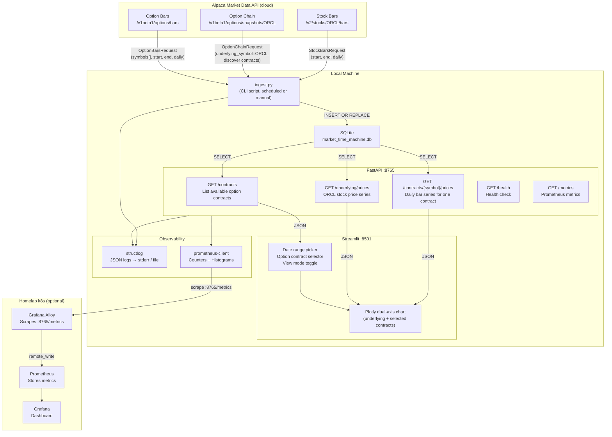

# Market Time Machine — MVP Architecture

> MVP scope: visualize how ORCL options prices and the underlying stock price evolved over time. Single stock, Alpaca paper trading API as data source, local-first SQLite storage, Streamlit single-page UI.

---

## Status

- [x] Phase 1: repo scaffold, virtualenv, `.env` wiring, `setup.sh`
- [x] Phase 2: data ingestion — `ingest.py` fetches ORCL stock bars + option chain from Alpaca, stores in SQLite
- [x] Phase 3: FastAPI backend — `/contracts`, `/contracts/{symbol}/prices`, `/underlying/prices` endpoints
- [x] Phase 4: Streamlit frontend — date range picker, contract selector, Plotly dual-axis chart
- [x] Phase 5: observability — structured logging (structlog), Prometheus metrics endpoint, health check
- [x] Phase 6: test suite — 57/57 tests passing
- [x] Phase 7: teardown/reinstall validation — cycle 1 complete (57/57 tests)

---

## Stack

| Component | Role | Package / Image | Version | Notes |
|---|---|---|---|---|
| **Python** | Runtime | system / pyenv | 3.12+ | All components run in one virtualenv |
| **alpaca-py** | Alpaca API client | `alpaca-py` | 0.43.2 | Official SDK; `OptionHistoricalDataClient` + `StockHistoricalDataClient` |
| **FastAPI** | Backend REST API | `fastapi[standard]` | 0.136.1 | Serves contract list + price series to Streamlit |
| **Uvicorn** | ASGI server | `uvicorn` | bundled with fastapi[standard] | Dev: `--reload`; prod: single worker |
| **Streamlit** | Frontend UI | `streamlit` | 1.56.0 | Single-page app; avoids separate JS build toolchain |
| **Plotly** | Charting | `plotly` | 6.7.0 | `go.Figure` with dual y-axes; used via `st.plotly_chart` |
| **SQLite** | Local data store | stdlib `sqlite3` | bundled | Single `.db` file; no server required |
| **structlog** | Structured logging | `structlog` | latest stable | JSON log output; consistent across ingestion + API |
| **prometheus-client** | Metrics exposition | `prometheus-client` | 0.25.0 | `/metrics` endpoint on FastAPI for Alloy scrape |
| **pytest** | Test runner | `pytest` | latest stable | All test categories run via `pytest -v` |
| **python-dotenv** | Env management | `python-dotenv` | latest stable | Loads `ALPACA_API_KEY` / `ALPACA_SECRET_KEY` from `.env` |

**Data availability note:** Alpaca historical options data is available from February 2024 onward. The MVP fetches the past 6 months (~November 2025–April 2026), which falls fully within range.

**Alpaca feed note:** The free tier uses the `indicative` feed (15-minute delayed; sufficient for historical replay). `opra` feed requires a paid subscription. The `feed` parameter is configurable in `.env`.

---

## Architecture



### Data Flow Narrative

1. **Ingestion (one-time + periodic):** `ingest.py` is a CLI script run manually or via cron. It calls `get_option_chain(ORCL)` to discover all live ORCL contract symbols, then calls `get_option_bars` with each symbol and a date range to pull daily OHLCV bars. Separately, it calls `get_stock_bars(ORCL)` for daily underlying price history. All results are upserted into SQLite.

2. **API:** FastAPI reads only from SQLite — no live Alpaca calls at query time. This keeps the UI fast and the data source stable.

3. **Frontend:** Streamlit calls the FastAPI backend via HTTP. The date range picker and contract selector filter what data is returned. The Plotly chart renders underlying price as a solid line on the left y-axis, and each selected option contract's midpoint price as a separate line on the right y-axis, from the contract's first available date to expiry.

4. **Observability:** FastAPI exposes `/metrics` with counters for API calls per endpoint and histograms for response latency. Alloy can scrape this if the homelab is running, but the app runs fine without Alloy present.

---

## Data Layer

### Alpaca API approach

**Key constraint:** `get_option_chain` returns only the current live snapshot — it does not accept a historical date. To reconstruct how an option's price evolved over time, the correct approach is:

1. Call `get_option_chain(ORCL)` once to enumerate all contract symbols (strike, expiry, type) that Alpaca knows about.
2. For each contract symbol, call `get_option_bars(symbol, start=T-6mo, end=today, timeframe=1Day)` to get daily OHLCV for that contract over its life.
3. Store both the contract metadata and the daily bar series in SQLite.

**Rate limits:** Free tier = 200 requests/minute. With potentially hundreds of ORCL contracts, the ingestion script must batch requests and respect rate limits (sleep between pages, target <150 req/min to leave headroom).

**Pagination:** `get_option_chain` returns up to 1000 snapshots per page via `next_page_token`. For ORCL with 6 months of history, expect ~200–600 active contracts at any snapshot; pagination is handled.

**Option bars batching:** `get_option_bars` accepts up to 100 symbols per request. Ingestion batches contract symbols in groups of 50 (conservative) and paginates each batch.

**Re-run safety (idempotency):** All inserts use `INSERT OR REPLACE` on the primary key. Re-running ingestion fetches incremental data and upserts — no duplicates, no data loss.

### Storage: SQLite

Single file at `data/market_time_machine.db`. No server, no migration tooling needed at MVP scale. Schema managed in `db/schema.sql`; applied at startup with `CREATE TABLE IF NOT EXISTS`.

---

## Data Model (SQLite Schema)

### Table: `underlying_bars`

Daily OHLCV for ORCL stock.

| Column | Type | Notes |
|---|---|---|
| `date` | TEXT (YYYY-MM-DD) | Primary key component |
| `symbol` | TEXT | Always `ORCL` for MVP |
| `open` | REAL | |
| `high` | REAL | |
| `low` | REAL | |
| `close` | REAL | Canonical price for charting |
| `volume` | INTEGER | |
| `vwap` | REAL | Nullable; volume-weighted avg price |
| `trade_count` | INTEGER | Nullable |
| `ingested_at` | TEXT | ISO-8601 timestamp of last ingest |

Primary key: `(date, symbol)`

### Table: `option_contracts`

Metadata for each known ORCL contract. Populated from `get_option_chain`.

| Column | Type | Notes |
|---|---|---|
| `symbol` | TEXT | Primary key; Alpaca OCC symbol e.g. `ORCL250516C00110000` |
| `underlying_symbol` | TEXT | Always `ORCL` |
| `expiration_date` | TEXT (YYYY-MM-DD) | |
| `strike_price` | REAL | |
| `option_type` | TEXT | `call` or `put` |
| `discovered_at` | TEXT | ISO-8601; when ingestion first saw this contract |
| `last_seen_at` | TEXT | ISO-8601; updated on every ingestion run |

### Table: `option_bars`

Daily OHLCV bar for each option contract.

| Column | Type | Notes |
|---|---|---|
| `date` | TEXT (YYYY-MM-DD) | Primary key component |
| `symbol` | TEXT | FK → `option_contracts.symbol` |
| `open` | REAL | Option open price |
| `high` | REAL | |
| `low` | REAL | |
| `close` | REAL | Canonical price for charting |
| `volume` | INTEGER | |
| `vwap` | REAL | Nullable |
| `trade_count` | INTEGER | Nullable |
| `ingested_at` | TEXT | ISO-8601 |

Primary key: `(date, symbol)`

### Table: `option_snapshots` (future, not MVP)

Daily end-of-day snapshot with greeks and IV. Not populated in MVP because `get_option_chain` only returns current data and Greeks are not available in `get_option_bars`. Placeholder for post-MVP enrichment.

| Column | Type | Notes |
|---|---|---|
| `snapshot_date` | TEXT | |
| `symbol` | TEXT | |
| `bid` | REAL | |
| `ask` | REAL | |
| `mid` | REAL | Computed `(bid + ask) / 2` |
| `iv` | REAL | Implied volatility (nullable) |
| `delta` | REAL | Nullable |
| `gamma` | REAL | Nullable |
| `theta` | REAL | Nullable |
| `vega` | REAL | Nullable |

**Greeks note:** Alpaca's `OptionsSnapshot` model provides Greeks via `greeks.delta`, `greeks.gamma`, `greeks.theta`, `greeks.vega`, `greeks.rho` and `implied_volatility` — but only for the current live snapshot, not historical bars. The MVP uses daily OHLCV from `get_option_bars` for charting. Greeks enrichment is a post-MVP enhancement.

---

## Backend API

FastAPI app at `src/api/main.py`. Reads from SQLite only; no live Alpaca calls.

### Endpoints

| Method | Path | Description | Key Query Params |
|---|---|---|---|
| `GET` | `/health` | Health check; returns `{"status": "ok", "db": "connected"}` | — |
| `GET` | `/metrics` | Prometheus metrics exposition | — |
| `GET` | `/contracts` | List all known ORCL option contracts | `type` (call/put), `expiration_date`, `strike_gte`, `strike_lte`, `active_on` (date — contracts with bars on that date) |
| `GET` | `/contracts/{symbol}` | Contract metadata for one symbol | — |
| `GET` | `/contracts/{symbol}/prices` | Daily bar series for one contract | `start`, `end` (YYYY-MM-DD) |
| `GET` | `/underlying/prices` | Daily ORCL stock bar series | `start`, `end` (YYYY-MM-DD) |

### Response shapes (abbreviated)

**`GET /contracts`**
```json
[
  {
    "symbol": "ORCL250516C00110000",
    "expiration_date": "2025-05-16",
    "strike_price": 110.0,
    "option_type": "call",
    "bar_count": 45
  }
]
```

**`GET /contracts/{symbol}/prices`**
```json
{
  "symbol": "ORCL250516C00110000",
  "expiration_date": "2025-05-16",
  "strike_price": 110.0,
  "option_type": "call",
  "bars": [
    {"date": "2025-03-01", "open": 2.10, "high": 2.45, "low": 1.95, "close": 2.30, "volume": 1200}
  ]
}
```

**`GET /underlying/prices`**
```json
{
  "symbol": "ORCL",
  "bars": [
    {"date": "2025-03-01", "open": 108.5, "high": 110.2, "low": 107.8, "close": 109.4, "volume": 5800000}
  ]
}
```

---

## Frontend

**Choice rationale:** Streamlit is chosen over a React + Recharts stack because:
- This is a personal tool — no user accounts, no public deployment
- Streamlit eliminates the JS build toolchain entirely
- Plotly (`st.plotly_chart`) produces interactive, publication-quality charts with dual y-axes
- The entire frontend is `~150 lines of Python`

**Core UX flow:**
1. User browses/searches available ORCL option contracts (filterable by type, strike, expiry)
2. User selects one or more contracts to track (checkbox or "Add to chart" button)
3. User sets a time range (start date / end date)
4. Chart renders: ORCL stock price + one price line per selected contract, all on the same time axis

**Single-page layout (`src/ui/app.py`):**

```
[ Sidebar ]                          [ Main panel ]
────────────────────────────────    ─────────────────────────────────────
 Time Range                          [ Plotly chart ]
   Start: [date picker]               - ORCL stock price (left y-axis, solid)
   End:   [date picker]               - Each tracked contract (right y-axis,
                                         one dashed line per contract,
 Contract Browser                        distinct color, terminates at expiry)
   Type:   [Call | Put | Both]
   Strike: [min] to [max]
   Expiry: [date range]
   [searchable / sortable table]
   [☑ checkbox to add/remove]

 Tracked Contracts
   [list of selected contracts]
   [✕ remove per contract]
   [Clear all]
```

**Chart behavior:**
- ORCL price: solid line, left y-axis, blue
- Each tracked option contract: dashed line, right y-axis, distinct color, labeled `{type} ${strike} exp {expiry}`
- X-axis: the user-selected time range; option lines only appear within the dates they have bar data (i.e. they terminate at expiry and start when first traded)
- Hover tooltip: date, ORCL close price, and close price for each visible contract
- If no contracts are selected, the chart shows only the ORCL stock price line

---

## Observability

This is a local personal app, not a k8s service, but observability is built in from day one per project conventions.

### Logging (structlog)

- All components (ingest, API, startup) emit structured JSON logs via `structlog`
- Log events include: `event`, `level`, `timestamp`, `component` (ingest/api), and relevant fields (e.g. `symbol`, `bar_count`, `duration_ms`, `endpoint`, `status_code`)
- API request logs: method, path, status code, latency
- Ingest logs: symbol batch size, API call count, rows upserted, total duration
- Errors: full exception info with traceback via `structlog`'s `format_exc_info`
- Log output: stderr during dev; redirectable to file via shell redirect

**Log events taxonomy:**

| Component | Event | Fields |
|---|---|---|
| Ingest | `ingest.start` | `start_date`, `end_date`, `feed` |
| Ingest | `ingest.contracts_discovered` | `count` |
| Ingest | `ingest.batch_fetched` | `batch_idx`, `symbol_count`, `bars_fetched` |
| Ingest | `ingest.complete` | `total_contracts`, `total_bars`, `duration_ms` |
| Ingest | `ingest.rate_limit_sleep` | `sleep_seconds` |
| Ingest | `ingest.error` | `symbol`, `error` |
| API | `api.request` | `method`, `path`, `status_code`, `duration_ms` |
| API | `api.db_query` | `query_name`, `duration_ms`, `row_count` |
| API | `api.startup` | `db_path`, `contract_count` |

### Metrics (prometheus-client)

FastAPI exposes `/metrics` via the prometheus-client WSGI app mounted at that path.

| Metric | Type | Labels | Description |
|---|---|---|---|
| `mtm_api_requests_total` | Counter | `endpoint`, `method`, `status` | Total API requests |
| `mtm_api_request_duration_seconds` | Histogram | `endpoint` | Response latency |
| `mtm_db_query_duration_seconds` | Histogram | `query_name` | SQLite query latency |
| `mtm_ingest_contracts_total` | Counter | — | Total contracts ever ingested |
| `mtm_ingest_bars_total` | Counter | `symbol_type` (stock/option) | Total bars rows upserted |
| `mtm_ingest_run_duration_seconds` | Histogram | — | Full ingest run time |
| `mtm_ingest_api_calls_total` | Counter | `endpoint` | Alpaca API calls made |
| `mtm_db_row_count` | Gauge | `table` | Current row count per table (set at startup) |

### Alloy scrape (optional)

If the homelab Alloy is running, it can scrape `http://localhost:8765/metrics` directly (no k8s involved — Alloy can scrape host processes). Add a static scrape target to the Alloy ConfigMap using the sentinel pattern:

```alloy
# BEGIN market-time-machine
prometheus.scrape "market_time_machine" {
  targets = [{"__address__" = "localhost:8765"}]
  forward_to = [prometheus.remote_write.default.receiver]
}
# END market-time-machine
```

This is optional for MVP — the app works fine without it.

### Health check

`GET /health` returns `{"status": "ok", "db": "connected", "contract_count": N, "bar_count": N}`. Used by test suite and for manual validation.

---

## Port Allocations

This is a local app, not a k8s service, so no NodePort/LoadBalancer allocations are needed.

| Port | Component | Access | Notes |
|---|---|---|---|
| `8765` | FastAPI (Uvicorn) | localhost | Backend API + `/metrics` endpoint |
| `8501` | Streamlit | localhost | Frontend UI |

**Conflict check against homelab:**
- Homelab occupied ports: 31900, 31901, 32300, 32301, 32302, 9090, 9100, 8080, 3000
- 8765 and 8501 are not in use by any homelab service
- Both ports are only bound to localhost (`127.0.0.1`) by default — no LAN exposure

---

## Deploy / Teardown

```bash
cd ~/src/market_time_machine

# First-time setup
./setup.sh                    # Create virtualenv, install deps, create SQLite schema

# Fetch data (run once, then periodically)
python -m src.ingest.ingest   # Fetches ORCL stock + options bars for past 6 months
# Or with explicit date range:
python -m src.ingest.ingest --start 2025-11-01 --end 2026-04-27

# Start backend
uvicorn src.api.main:app --host 127.0.0.1 --port 8765 --reload

# Start frontend (separate terminal)
streamlit run src/ui/app.py --server.port 8501

# Run tests
pytest tests/ -v

# Teardown (soft — keeps data)
# Just kill the uvicorn and streamlit processes

# Teardown (hard — wipes data)
./teardown.sh --delete-data   # Removes SQLite DB and resets to clean state

# Reinstall from scratch
./teardown.sh --delete-data
./setup.sh
python -m src.ingest.ingest
pytest tests/ -v
```

---

## Repo Layout

```
market_time_machine/
├── setup.sh                            # Create venv, pip install, apply schema
├── teardown.sh                         # --delete-data flag wipes SQLite DB
├── requirements.txt                    # Pinned dependencies (pip freeze output)
├── .env.example                        # Template: ALPACA_API_KEY, ALPACA_SECRET_KEY, ALPACA_FEED, DB_PATH
├── .env                                # Actual secrets — gitignored
├── .gitignore                          # Ignores .env, data/, __pycache__, .venv/
│
├── data/
│   └── market_time_machine.db          # SQLite database (gitignored)
│
├── db/
│   └── schema.sql                      # CREATE TABLE IF NOT EXISTS for all tables
│
├── src/
│   ├── __init__.py
│   ├── config.py                       # Loads .env; exports API keys, DB_PATH, FEED
│   │
│   ├── ingest/
│   │   ├── __init__.py
│   │   ├── ingest.py                   # CLI entrypoint: discover contracts → fetch bars → upsert
│   │   ├── alpaca_client.py            # Thin wrapper around alpaca-py; handles pagination + rate limits
│   │   └── db_writer.py                # SQLite upsert helpers: write_underlying_bars, write_option_bars
│   │
│   ├── api/
│   │   ├── __init__.py
│   │   ├── main.py                     # FastAPI app: mounts routes + /metrics + lifespan
│   │   ├── db.py                       # SQLite connection pool (thread-local); query helpers
│   │   ├── routes/
│   │   │   ├── contracts.py            # GET /contracts, GET /contracts/{symbol}, GET /contracts/{symbol}/prices
│   │   │   └── underlying.py           # GET /underlying/prices
│   │   └── metrics.py                  # prometheus-client Counter/Histogram definitions
│   │
│   └── ui/
│       ├── __init__.py
│       └── app.py                      # Streamlit app: sidebar controls + Plotly chart
│
└── tests/
    ├── conftest.py                      # Shared fixtures: test DB, sample data, API test client
    ├── test_schema.py                   # Schema: all tables exist, columns correct
    ├── test_ingest.py                   # Ingestion: contract discovery, bar fetch, upsert idempotency
    ├── test_alpaca_client.py            # Alpaca client: pagination, rate limit sleep, error handling
    ├── test_api_contracts.py            # API /contracts endpoints: list, filter, single contract
    ├── test_api_prices.py               # API /prices endpoints: bar series, date range filtering
    ├── test_api_health.py               # Health check: DB connected, counts accurate
    ├── test_chart_transforms.py         # Chart data transforms: dual-axis data prep, date alignment
    └── test_observability.py            # Metrics: counters increment, /metrics endpoint returns valid text
```

---

## Test Suite

All tests run via `pytest tests/ -v`. Tests use a separate in-memory SQLite test database — they never touch `data/market_time_machine.db`.

| Category | Count | What's Validated |
|---|---|---|
| **Schema** | 4 | All three tables exist; columns, types, and primary keys match schema |
| **Ingestion — contract discovery** | 5 | `get_option_chain` response parsed; contract metadata extracted; `option_contracts` upserted correctly; idempotent re-run does not duplicate rows |
| **Ingestion — bar fetch** | 6 | Stock bars fetched and stored; option bars fetched for a batch; bars for expired contracts stored; date range respected; `ingested_at` updated on re-run |
| **Ingestion — rate limit** | 3 | Sleep called when approaching rate limit; batch size ≤ 50 symbols; pagination loop terminates correctly |
| **Ingestion — idempotency** | 4 | Re-running ingest twice yields identical row count; `INSERT OR REPLACE` on same PK does not grow table; `ingested_at` is updated, not duplicated |
| **Alpaca client** | 4 | Client initializes with env credentials; pagination token followed across pages; `OptionBarsRequest` parameters set correctly; error on HTTP 422 raises descriptive exception |
| **API — contracts list** | 6 | `GET /contracts` returns list; `type=call` filter works; `strike_gte` + `strike_lte` filter works; `expiration_date` filter works; empty result returns `[]` not 500; response shape matches schema |
| **API — contract detail** | 3 | `GET /contracts/{symbol}` returns contract; unknown symbol returns 404; response includes `bar_count` |
| **API — option prices** | 5 | `GET /contracts/{symbol}/prices` returns bars array; `start`/`end` date params filter correctly; unknown symbol returns 404; empty date range returns `{"bars": []}`; bars sorted ascending by date |
| **API — underlying prices** | 4 | `GET /underlying/prices` returns ORCL bars; date range filtering works; bars sorted ascending; response includes all OHLCV fields |
| **API — health check** | 3 | `/health` returns 200 with `status: ok`; `db: connected`; counts are non-negative integers |
| **Chart transforms** | 5 | `align_series_to_date_range` pads missing dates with nulls; dual-axis data prep produces two separate y-axis datasets; contract line terminates at expiry date; mid-price computed as `(open + close) / 2` when bid/ask unavailable; date strings sort correctly |
| **Observability — metrics** | 4 | `/metrics` endpoint returns HTTP 200; response is valid Prometheus text format; `mtm_api_requests_total` increments on each API call; `mtm_db_row_count` gauge reflects actual row counts |

**Total: ~56 tests**

---

## Teardown / Reinstall Validation

Three destructive cycles using top-level scripts. Each cycle must pass all tests.

```bash
cd ~/src/market_time_machine

# Destructive cycle (repeat 3 times)
./teardown.sh --delete-data
# Verify: data/market_time_machine.db does not exist
./setup.sh
# Verify: venv created, schema applied, DB file exists with correct tables
python -m src.ingest.ingest --start 2025-11-01 --end 2026-04-27
# Verify: ingest completes without errors, logs show contract count and bar count
pytest tests/ -v
# Verify: all N/N tests pass
```

**Residue check after `./teardown.sh --delete-data`:**
- `data/market_time_machine.db` — must not exist
- `.venv/` — kept (teardown does not remove venv by default; add `--delete-venv` flag to wipe fully)

**Validation results table (fill in after implementation):**

| Cycle | Date | Teardown clean | Ingest rows | Tests |
|---|---|---|---|---|
| 1 | 2026-04-27 | ✓ (no residue) | 83,407 daily + 338,596 hourly option bars; 4,908 contracts; 124 underlying daily + 661 hourly | 57/57 |
| 2 | — | — | — | — |
| 3 | — | — | — | — |

---

## Prerequisites

1. **Alpaca API credentials:** Log in at `app.alpaca.markets`, navigate to "Paper Trading" → "API Keys", and generate a key/secret pair. Set in `.env` as `ALPACA_API_KEY` and `ALPACA_SECRET_KEY`. This cannot be automated.
2. **Python 3.12+:** Must be available as `python3` on the system PATH. Install via `pyenv` or system package manager if not present.
3. **Alpaca data tier:** The free account with the `indicative` feed is sufficient for MVP. If Greeks and real-time OPRA data are needed later, upgrade to the paid data subscription at `alpaca.markets`.
4. **No other infrastructure required:** This is a fully local app — no Docker, no k8s, no cloud resources.

---

## Open Questions

### Blocking

**Q1 — Alpaca options data availability for ORCL (blocking)**
The Alpaca docs state historical options data is available from February 2024 onward. Verify that ORCL contracts with reasonable strike/expiry variety exist for the target 6-month window. Run before implementation:
```bash
pip install alpaca-py python-dotenv
python3 -c "
from alpaca.data.historical.option import OptionHistoricalDataClient
from alpaca.data.requests import OptionChainRequest
import os; from dotenv import load_dotenv; load_dotenv()
client = OptionHistoricalDataClient(os.getenv('ALPACA_API_KEY'), os.getenv('ALPACA_SECRET_KEY'))
chain = client.get_option_chain(OptionChainRequest(underlying_symbol='ORCL', feed='indicative'))
print(f'Contracts found: {len(chain)}')
first = list(chain.items())[0]
print(f'Sample contract: {first[0]}, fields: {first[1]}')
"
```

**Q2 — Option bars date range for expired contracts (blocking)**
Verify that `get_option_bars` returns historical bars for contracts that have already expired (i.e., contracts with `expiration_date` in the past). Run:
```bash
python3 -c "
from alpaca.data.historical.option import OptionHistoricalDataClient
from alpaca.data.requests import OptionBarsRequest
from alpaca.data.timeframe import TimeFrame, TimeFrameUnit
from datetime import date
import os; from dotenv import load_dotenv; load_dotenv()
client = OptionHistoricalDataClient(os.getenv('ALPACA_API_KEY'), os.getenv('ALPACA_SECRET_KEY'))
# Replace with an actual expired ORCL symbol from Q1
req = OptionBarsRequest(
    symbol_or_symbols=['ORCL250117C00110000'],
    timeframe=TimeFrame(1, TimeFrameUnit.Day),
    start=date(2024, 11, 1),
    end=date(2025, 01, 17),
)
bars = client.get_option_bars(req)
print(bars)
"
```

### Advisory

**Q3 — Alpaca feed tier (advisory, default: `indicative`)**
The free paper trading account uses the `indicative` feed (15-minute delayed). For MVP visualization this is fine — the data is historical so delay is irrelevant. Default is `indicative`. If the user has a paid data subscription, set `ALPACA_FEED=opra` in `.env`.

**Q4 — Ingestion schedule (advisory, default: manual)**
For MVP, ingestion is run manually via `python -m src.ingest.ingest`. A cron job can be added later to keep data current. Default: no cron.

**Q5 — Greeks availability (advisory, not blocking)**
Greeks and IV are available in `OptionSnapshot` (current data) but not in historical bars. For MVP, charts show OHLCV-based mid-price only. Post-MVP enhancement: run a daily cron that captures the live snapshot (including Greeks) and appends to `option_snapshots` table.

---

## Possible Enhancements

| Enhancement | Priority | Notes |
|---|---|---|
| Greeks overlay on chart (delta, theta, IV) | High | Requires daily live snapshot collection via cron; `option_snapshots` table already planned |
| Multi-stock support (beyond ORCL) | High | Parametrize ingest + UI by underlying symbol; minimal schema changes |
| P&L simulation overlay | High | Core long-term goal: given entry date + contract, show P&L curve over time |
| Strategy builder (spreads, straddles, condors) | High | Post-MVP: select multiple contracts and sum their P&L curves |
| Automated daily ingestion (cron or systemd timer) | Medium | Run ingest nightly to keep 6-month rolling window fresh |
| Bid/ask spread visualization | Medium | Show bid/ask as a shaded band around mid; requires snapshot data |
| Volume bars sub-chart | Medium | Plotly subplot below main chart |
| Contract search by moneyness (ATM, ITM, OTM) | Medium | Filter contracts by distance from current underlying price |
| Export to CSV | Low | Allow downloading the chart data |
| Dockerize | Low | Not needed for personal use but useful for portability |
| Grafana dashboard for ingest/API metrics | Low | Define dashboard JSON if Alloy scrape is enabled |

---

## Troubleshooting

### Ingest returns 0 contracts for ORCL

```
contracts_discovered count=0
```

**Cause:** `get_option_chain` returns the current live snapshot. If ORCL has no active options (e.g. market closed, holiday, or feed issue), this can return empty.

**Fix:** Run during market hours or on a recent trading day. Verify your API key is a valid paper trading key with data access. Check the `feed` parameter — `indicative` vs `opra` may behave differently.

### `get_option_bars` returns empty for an expired contract

```
BarSet for ORCL250117C00110000: {}
```

**Cause:** Alpaca may not have bar data for all expired contracts, particularly those with very low volume or contracts discovered only via the current chain.

**Fix:** This is a data availability issue at the Alpaca level. The ingest script should log a warning and continue — not fail. Contracts with no bar data will have `bar_count=0` and will be filtered out of the contract picker in the UI (`active_on` filter).

### Streamlit shows "Connection refused" when calling the API

```
requests.exceptions.ConnectionRefusedError: [Errno 111] Connection refused (localhost:8765)
```

**Cause:** The FastAPI backend is not running.

**Fix:** Start the backend in a separate terminal: `uvicorn src.api.main:app --host 127.0.0.1 --port 8765`. The Streamlit app and FastAPI must both be running simultaneously.

### SQLite `database is locked` error

```
sqlite3.OperationalError: database is locked
```

**Cause:** Both the ingest script and the API server are trying to write to SQLite at the same time, or a previous process left the database in a locked state.

**Fix:** Do not run `ingest.py` while the API server is under load. For MVP this is acceptable. If it becomes a problem, add a 30-second busy timeout via `sqlite3.connect(db_path, timeout=30)`.

### Rate limit exceeded during ingestion

```
alpaca.common.exceptions.APIError: 429 Too Many Requests
```

**Cause:** Ingesting a large number of contracts exceeded the 200 requests/minute free tier limit.

**Fix:** The ingest script has a built-in rate limiter that targets <150 req/min. If this still triggers, increase the sleep interval in `alpaca_client.py`. For large re-ingestion runs (full 6-month history), prefer running during off-hours and allow the script to run to completion.

### Plotly chart shows flat line for an option near expiry

**Cause:** Options near expiry have low volume and may have only 1–2 bars of data. Plotly renders this as a nearly invisible horizontal line.

**Fix:** This is expected behavior for low-liquidity contracts. The contract picker table shows `bar_count` — use it to filter out contracts with fewer than 5 bars. Post-MVP: add a minimum bar count filter in the sidebar.

---

## See Also

- [[Market Time Machine/Overview|Market Time Machine Overview]]
- [[Homelab/Metrics|Homelab Metrics]] — Prometheus + Alloy, if scraping the FastAPI `/metrics` endpoint
- [[Homelab/Overview|Homelab Overview]] — infrastructure context
